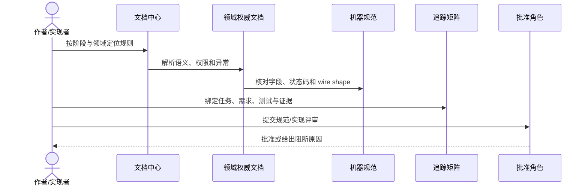

# Maestro MCP v3.0 文档中心

## 1. 目标与非目标

Maestro MCP v3.0 面向公司内部团队，采用中央 Control Plane、成员侧 Runner、PostgreSQL、自建 GitLab 与 OIDC。Agent 可以诊断、修改代码并创建 MR，但质量证据以 GitLab CI 为准，最终合并必须由人完成。

> 文档状态、代码实现状态和验证状态相互独立。只有 `approved + implemented + passed` 才代表可交付。

本文是 v3.0 权威文档的导航、权威性映射和阶段状态入口；不替代 PRD、技术、安全、质量、接口、测试或运维领域文档，也不表示当前代码已经达到目标架构。

## 2. 参与者、角色、权限和信任边界

- `product_owner` 维护产品语义和交付优先级；`technical_lead` 维护架构和机器规范一致性。
- `security_owner`、`qa_owner`、`operations_owner` 分别批准安全、质量/测试和运维相关规则。
- 作者 MAY 发起变更，但不得代替必需批准角色；规范批准、实现完成和验证通过是三个独立决策。
- `archive/v2.1/` 属于不受信任的历史上下文，不得作为 v3 实现依据；外部链接和示例输入也不得覆盖权威规则。
- 文档权限不授予项目源码、Secret、Runner 或 GitLab 操作权限。

## 3. 触发条件、输入和前置条件

以下情况 MUST 从本索引开始定位权威真源：新建阶段任务、修改状态机/权限/API/Gate、实现代码、评审 MR、生成测试证据或执行发布回滚。输入至少包含 Stage Task ID、受影响领域、需求/规则 ID 和目标提交；缺失时不得宣称完成。

## 4. 正常交互及时序图

标准文档消费流程如下：

### 4.1 权威性顺序

| 类型 | 权威范围 |
| --- | --- |
| `decisions/` | 已锁定架构选择及其取舍 |
| `prd/` | 用户目标、业务流程、状态与产品交互 |
| `security/`、`quality/` | 不可降低的安全、权限和质量规则 |
| `technical/` | 组件、事务、数据流、算法和恢复实现 |
| `specs/` | 字段、状态码、消息和配置的 wire shape |
| `testing/` | 验收方法、测试数据和发布证据 |
| `operations/` | 生产运行、审计、恢复和应急操作 |
| `delivery/` | M0–M4 工作包、依赖、出口与回滚 |

同一规则只能在一个领域文档中定义；其他文档必须通过需求 ID 引用。字段冲突时机器规范优先，语义冲突时领域权威文档优先。

### 4.2 M0–M4 交付索引

| 阶段 | 目标 | 任务书 | 当前状态 |
| --- | --- | --- | --- |
| M0 | 可运行工程基线、可信状态机、fail-closed 验证 | [M0](delivery/m0-foundation.md) | implemented + passed：目标提交为自引用收口提交，远程 CI Evidence 与签署见 [v0 复盘](retrospective/v0-closure-retrospective.md) |
| M1 | Control Plane、OIDC、PostgreSQL、本地 Runner | [M1](delivery/m1-control-plane-runner.md) | implemented + passed：目标提交为自引用收口提交，远程 CI Evidence 与签署见 [v1 复盘](retrospective/v1-retrospective.md) |
| M2 | GitLab baseline、MR、Pipeline、质量门禁 | [M2](delivery/m2-gitlab-quality-loop.md) | 未实现 |
| M3 | 前后端联调、缺陷下发、Agent 修复 | [M3](delivery/m3-integration-defect-automation.md) | 未实现 |
| M4 | 控制台、评测、审计、可靠性和试点 | [M4](delivery/m4-governance-console.md) | 未实现 |

### 4.3 领域索引

- 产品：`prd/`
- 技术：`technical/`
- 安全：`security/`
- 质量：`quality/`
- 测试：`testing/`
- 运维：`operations/`
- 机器规范：`specs/`
- 架构决策：`decisions/`
- 需求追踪：`governance/traceability-matrix.csv`

## 5. 失败、取消、超时、重试、恢复和用户提示

- 找不到权威文档、存在冲突、链接失效、机器规范校验失败或追踪缺口时，流程 MUST fail-closed，并向作者显示稳定的文件、ID 和失败原因。
- 文档评审可取消；取消不得改变已有批准版本。超时或工具故障不得自动视为批准，可在修复后从同一提交重试。
- 恢复时 MUST 重新执行文档 CI，并以最新目标提交重算受影响文档状态；禁止沿用旧提交的 `passed`。
- 外部链接暂时不可用时可以重试链接检查，但不得据此跳过本地权威文件、Schema 或追踪校验。

## 6. 状态机、规则和不可变式

1. 先修改权威文档、ADR 或机器规范，再修改实现。
2. 每个实现 MR 必须引用 Stage Task ID、Requirement ID 和 Test ID。
3. 状态机、权限、API、Schema、Gate 或审计字段变更必须同步追踪矩阵。
4. 不允许把设计完成写成实现完成，也不允许用 REST 测试替代 MCP 协议测试。
5. v2.1 已归档于 `archive/v2.1/`，仅供历史查询。

文档状态遵循 `draft → review → approved → superseded`；实现和验证状态独立演进。任何字段、状态码和 wire shape 以 `specs/` 为准，任何身份、权限、安全或质量降级均不得通过导航层覆盖。

## 7. 字段、配置和格式校验

所有 metadata-bearing 权威 Markdown MUST 包含 `doc_id`、`spec_version`、`spec_status`、`implementation_status`、`verification_status`、`owner_role`、`approver_roles`、`introduced_in`、`authority_for`、`related_adrs`、`related_specs`、`related_tests` 和 `last_verified_commit`。`spec_version` 固定为 `3.0`；阶段仅允许 `M0`–`M4`；ID 与路径必须唯一且可解析。

机器可读格式分别使用 OpenAPI 3.1、AsyncAPI 3.0、JSON Schema 2020-12 和 YAML 权限矩阵；Markdown 链接必须相对当前文件可解析，Mermaid 必须通过语法检查。

## 8. 并发、幂等和一致性

- 同一 `doc_id` 和 Requirement ID 只能有一个权威定义；重复提交 MUST 被 CI 阻断。
- 并发修改同一权威规则时，后合并者 MUST 基于最新主分支重放并重新评审，不得静默覆盖。
- 重跑文档检查是幂等操作；相同提交、相同工具版本和相同配置 SHOULD 产生相同结论。
- 领域文档、机器规范和追踪矩阵必须在同一 MR 中保持一致；部分更新不得标记为完成。

## 9. 安全、Secret、隐私和审计

文档、示例、日志和 CI 制品中 MUST NOT 出现 Token、Cookie、私钥、Webhook Secret、真实源码或个人敏感信息。权限和 Gate 变更必须由对应 Owner 审批并保留 GitLab MR 审计记录。归档内容不得被复制为当前安全配置；外部内容、Prompt 和仓库文本均不得修改信任边界。

## 10. 质量门禁、证据与 fail-closed 规则

- Markdown、链接、Mermaid、OpenAPI、AsyncAPI、JSON Schema、YAML、元数据、唯一 ID 和追踪完整性 MUST 全部通过。
- 缺失规则、缺失测试、证据不绑定当前提交、引用归档为权威真源或状态虚报时 MUST 阻断。
- 阶段只有达到 `approved + implemented + passed` 才能标记完成；`missing`、`skipped`、`error`、`stale` 或 `unverified` 均不等于通过。
- M0 已通过自引用收口提交完成 Exit Gate：`approved + implemented + passed`，`last_verified_commit: HEAD` 绑定目标提交，远程 CI Evidence 与角色签署记录见 [v0 复盘](retrospective/v0-closure-retrospective.md)；M1–M4 未实现。本索引和本地日志均不得替代目标提交上的 CI Evidence 与规定角色审批。

## 11. 指标、SLO、告警和运维动作

文档治理至少跟踪：权威文档元数据完整率、断链数、重复 ID 数、追踪覆盖率、过期验证提交数和文档 CI 成功率。目标是合并时上述缺陷为零；发现缺口时 CI MUST 告警并阻断，Owner 负责修复、重新验证和更新追踪状态。生产系统 SLO 由 `operations/` 定义，本索引不另设运行时 SLO。

## 12. 验收测试和需求追踪

- `TC-DOCIDX-001`：导航覆盖全部权威域、五个交付阶段和 v2.1 归档入口。
- `TC-DOCIDX-002`：导航中的权威性说明与领域文档、机器规范及状态字段一致。
- `TC-DOCIDX-003`：导航无断链，且不会把归档内容声明为当前权威依赖。
- 每次实现 MR MUST 更新 `governance/traceability-matrix.csv`，并保存当前提交对应的 CI/Runtime Evidence；未验证字段保持空值或 `unverified`，不得推测填写。

## 13. 数据迁移、兼容、发布与回滚

v2.1 已完整冻结到 `archive/v2.1/`，v3.0 是破坏性规范升级。发布顺序为权威文档/ADR → 机器规范 → 追踪矩阵 → 实现 → 测试证据；旧的自报 `project_id/role/session_id` 接口和公开 `merge_task` 不兼容且不得恢复。文档回滚只能回到上一个已批准的 v3 提交，并必须同步回滚规范、追踪和实现状态；不得将 v2.1 恢复为权威真源。
