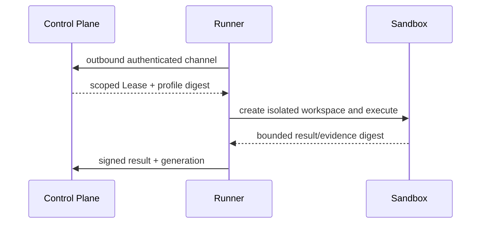

# ADR-001：Control Plane 与本地 Runner 分离

> 决策状态：已评审接受（I1 契约冻结 sprint；签署以契约 PR 评审批准记录为准）。当前仓库仍是本地 SQLite 单进程原型，目标架构尚未实现。

## 1. 目标与非目标

决定代码、凭据与执行环境的信任边界。目标是中央统一治理而不集中托管源码；非目标是 M1 即建设多区域微服务或 Kubernetes。

## 2. 参与者、角色、权限和信任边界

Control Plane 处理身份、授权、状态、策略、审计与 GitLab 集成；Runner 是可吊销设备身份，只在绑定项目的 rootless 沙箱执行；Agent 权限是用户∩项目∩Runner∩Tool 的交集。中央服务 MUST NOT 挂载项目代码、Docker Socket、SSH 或宿主 HOME。

## 3. 触发条件、输入和前置条件

需要同时支持公司 VM 中央治理、成员设备项目代码、2–5 个 Go/TypeScript 仓库，并关闭宿主任意命令风险。Runner 注册前置 OIDC 管理员批准、一次性注册码和设备密钥。

## 4. 正常交互及时序图

连接只由 Runner 出站建立；Control Plane 不反向连接成员设备。

## 5. 失败、取消、超时、重试、恢复和用户提示

Runner 离线时不立即重派可能仍执行的 Lease，等待到期/对账；吊销后停止新 Lease并取消现有执行。通道重试为有界指数退避，用户看到最后心跳、Lease 到期与接管动作。

## 6. 状态机、规则和不可变式

Runner `pending_approval→approved→online→suspect→offline/draining→revoked`；Lease 使用 `offered/accepted/active/completed/failed/cancelled/expired`。一个 Task 最多一个 active Lease；旧 generation 结果不能推进新 Task；Runner 结果不能直接标 `done`。

## 7. 字段、配置和格式校验

Runner 消息含 protocol version、runner/project/lease、nonce、generation、profile digest、correlation/causation ID；未知版本、过期 nonce、project binding 不符拒绝。Command 只引用版本化 profile，不含任意 shell string。

## 8. 并发、幂等和一致性

通过 PostgreSQL Lease 唯一约束、expected version 和 Outbox/Inbox 实现至少一次消息下的一次业务效果；不尝试跨 DB/Runner 两阶段提交。

## 9. 安全、Secret、隐私和审计

Runner 设备密钥在系统 Keychain，短期凭据可吊销；沙箱 rootless、网络默认关闭、资源硬限制。注册、批准、连接、Lease、取消、越界和吊销必须审计。

## 10. 质量门禁、证据与 fail-closed 规则

中央容器出现源码/socket 挂载、Runner 能访问其他项目、过期 Lease 可提交或 Command 可携任意命令时门禁失败。本地 Evidence 只作诊断。

## 11. 指标、SLO、告警和运维动作

记录 Runner 在线率、心跳延迟、Lease accept/expire、执行/取消、scope violation；被吊销 Runner 请求或沙箱逃逸立即告警并隔离。

## 12. 验收测试和需求追踪

`TC-ADR-001-01` 验证中央无源码；`TC-ADR-001-02` 验证离线/分区不双派；`TC-ADR-001-03` 验证文件/环境/网络/进程/容器隔离。追踪到 `TECH-ARCH-001`、`TECH-CON-001`、`TECH-WT-001`。

## 13. 数据迁移、兼容、发布与回滚

先修 M0 单进程基线，再 shadow Runner，最后关闭中央执行。旧 worktree 不直接复用。回滚必须先排空 Lease；不得回到宿主任意命令或中央源码挂载。

### 决策、备选与后果

选择“中央 Control Plane + 本地 Runner”。拒绝继续单体（无法建立企业身份/一致状态与隔离）、中央挂载所有仓库（扩大源码/凭据爆炸半径）以及 Agent 直接调用 GitLab（难以统一权限、幂等、审计）。代价是需要设备生命周期、离线恢复和协议兼容；收益是中央治理与本地代码信任边界清晰。
