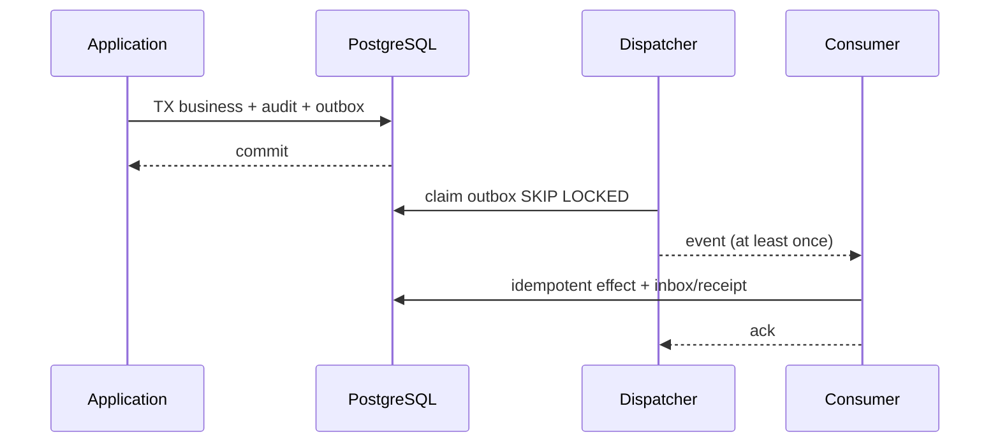

# ADR-002：PostgreSQL + Transactional Outbox/Inbox

> 决策状态：已评审接受（I1 契约冻结 sprint；签署以契约 PR 评审批准记录为准）。M0 当前使用 SQLite schema v5 承载单机 Lease、状态和本地 Evidence 基线，并在 GitLab 验签事实落地前禁止本地 `done` 转换；尚无 PostgreSQL、复合租户约束、Inbox/Outbox、DLQ 或 PITR，不满足中央控制面的一致性与恢复目标。

## 1. 目标与非目标

为多用户、多 Runner、Webhook 与后台流程提供并发安全、可恢复的中央事实源。非目标是用数据库实现外部 GitLab/Runner 的强分布式事务或立即引入独立消息总线。

## 2. 参与者、角色、权限和信任边界

Application Service 是业务写入者；migration role 独立；dispatcher/consumer 为服务身份；GitLab/Runner/客户端不得直连 DB。Audit/Evidence 只追加。

## 3. 触发条件、输入和前置条件

SQLite 单写者与本地事务无法支撑中央控制面并发、项目复合隔离、可靠事件和 PITR。前置是 PostgreSQL 备份/WAL、schema migration 与 SQLite 导入工具。

## 4. 正常交互及时序图

Webhook 则先验真并 INSERT Inbox，提交后才响应 2xx，由 consumer 处理业务。

## 5. 失败、取消、超时、重试、恢复和用户提示

Outbox/Inbox 使用 lease、指数退避+jitter、最大尝试、DLQ 与受权重放。DB commit 未确认时客户端以 Idempotency-Key 查询。无法写 audit/outbox 时整个业务事务失败。

## 6. 状态机、规则和不可变式

Outbox `pending→sending→delivered`，失败 `retry_wait→sending`，超限 `dead_letter`；Inbox `received→processing→processed/retry_wait/dead_letter`。同事件 ID 只产生一次业务效果；外部副作用不得在 DB 事务内发生。

## 7. 字段、配置和格式校验

事件使用统一 envelope：id/type/version/source/project/subject/time/correlation/causation/digest/sensitivity/payload。payload 先过 schema；unknown major 进 DLQ。业务子表使用 project 复合 FK与 version。

## 8. 并发、幂等和一致性

消费者 `FOR UPDATE SKIP LOCKED`；sending lease 超时可回收；event ID/aggregate version/idempotency 唯一约束防重。顺序敏感聚合按 project+aggregate 串行，其他可并行。

## 9. 安全、Secret、隐私和审计

事件不含 token/Secret/源码，仅引用加密 artifact；重放是高权限审计操作。DB 使用 TLS、独立 roles、备份加密与 PITR。

## 10. 质量门禁、证据与 fail-closed 规则

crash-point 测试必须证明业务/审计/outbox 原子性、重复投递一次效果、DLQ 可审计重放。审计或 Outbox insert 失败不得继续业务写。

## 11. 指标、SLO、告警和运维动作

监控 queue depth/lag/attempt/DLQ、DB lock/deadlock/WAL/backup。DLQ>0、lag>30s、备份超过24h或审计写失败告警。

## 12. 验收测试和需求追踪

`TC-ADR-002-01` 每个 crash point；`TC-ADR-002-02` 重复/乱序；`TC-ADR-002-03` PITR 后对账。追踪 `TECH-DATA-001`、`TECH-SVC-001`、`TECH-REC-001`。

## 13. 数据迁移、兼容、发布与回滚

SQLite 只读 dry-run/import/checksum/shadow read 后 cutover，禁止双主。Schema 按 expand/backfill/contract。cutover 后回滚依赖 PostgreSQL PITR/兼容二进制，不能恢复写 SQLite。

### 决策、备选与后果

选择 PostgreSQL 与同库 Outbox/Inbox。拒绝继续 SQLite（并发、HA/备份和中央化不足）、直接上消息总线但无事务 Outbox（会丢/重事件）、两阶段提交（复杂且外部系统不支持）。代价是运维 PostgreSQL、最终一致和幂等消费者；收益是清晰事务事实、恢复与审计。
