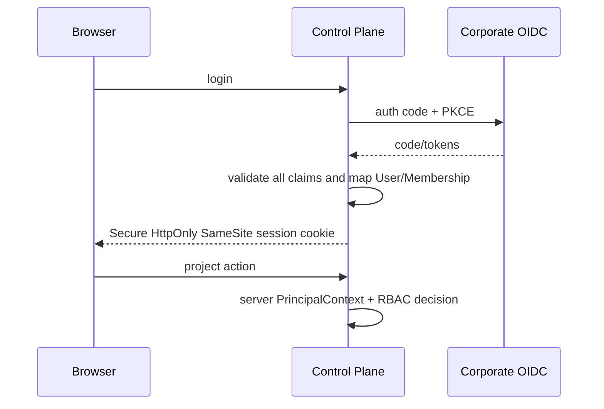

# ADR-003：OIDC Principal + 默认拒绝的项目 RBAC

> 决策状态：已评审接受（I1 契约冻结 sprint；签署以契约 PR 评审批准记录为准）。M0 已使全局 Bearer 在未配置时对非健康端点 fail-closed，并默认禁止远程写；但共享 Token 无法提供个人归责、Membership/RBAC、委托交集权限或撤权传播，仍不满足本决策。

## 1. 目标与非目标

建立人、Agent 委托、Runner、GitLab Bot 与后台服务的可审计身份，并统一 REST/MCP/WS/Job 授权。非目标是自建密码库或允许平台管理员默认读取项目源码。

## 2. 参与者、角色、权限和信任边界

人类角色为 platform_admin/project_admin/coordinator/developer/verifier/viewer；Agent 继承委托权限交集；Runner 使用设备身份；Bot/后台使用独立 service principal。请求 payload 中 role/project/session 不可信。

## 3. 触发条件、输入和前置条件

Browser 使用 OIDC Authorization Code + PKCE；远程 API/MCP 使用面向 Maestro audience 的 access token。必须验证 signature、iss、aud、exp、nbf、scope 与 token status；失败不降级。

## 4. 正常交互及时序图

## 5. 失败、取消、超时、重试、恢复和用户提示

未认证 401；已认证缺权限 403；无项目可见性 404。OIDC/policy 不可用时写入 fail-closed，不使用陈旧 allow。Access Token 默认 15 分钟；logout/revoke/membership 变更使 session 失效。

## 6. 状态机、规则和不可变式

Session `active→expired/revoked`；Runner 使用 `pending_approval/approved/online/suspect/offline/draining/revoked`。默认 deny；同一人不得审批自己的 waiver，developer 不验证自己变更，Agent 不自审/豁免/合并。PrincipalContext 仅服务端构造且不可被参数覆盖。

## 7. 字段、配置和格式校验

OIDC issuer/audience/redirect URI 精确匹配；JWKS key rotation按 kid并有短缓存。Browser Cookie Secure/HttpOnly/SameSite，CSRF/Origin 校验。Runner 注册码一次性、10 分钟过期；设备私钥保存在 OS Keychain。

## 8. 并发、幂等和一致性

Membership/role/token/session 有 version/revoked_at；高风险写提交前重验。撤权通过 Outbox 失效 cache/connection/Lease，幂等 revoke。短期 deny cache可用，不能在依赖失败时复用 allow。

## 9. 安全、Secret、隐私和审计

禁止 token passthrough；Maestro access token 与 GitLab Bot token 分离。日志仅 token/runner hash。登录、失败、deny、role/membership/session/Runner 变更与所有权限决策审计。

## 10. 质量门禁、证据与 fail-closed 规则

错误 issuer/audience/过期/未来 nbf/签名/scope、伪造 role/project/session、撤销 Runner、跨项目枚举必须拒绝。REST/MCP/Resource/WS/Job 权限结果必须一致。

## 11. 指标、SLO、告警和运维动作

监控 auth success/failure reason、policy latency/deny、session/revoke propagation、Runner registration。签名失败激增、撤销后继续访问、跨项目 deny 激增告警。

## 12. 验收测试和需求追踪

`TC-ADR-003-01` OIDC claim 矩阵；`TC-ADR-003-02` 权限矩阵与自审限制；`TC-ADR-003-03` 多协议一致性；`TC-ADR-003-04` 401/403/404 防枚举。追踪 `TECH-ISO-001` 与 `TECH-API-001`。

## 13. 数据迁移、兼容、发布与回滚

创建 User/Team/Membership/Principal 后，旧 token 只允许短期只读迁移提示，随后全部吊销。旧 session/worker 无可验证身份则 expired。回滚不得重新启用空 token/共享 token 认证。

### 决策、备选与后果

选择公司 OIDC + 服务端 Principal + project RBAC。拒绝共享 token（不可归责/撤销/隔离）、信任客户端角色（可伪造）、仅依赖 GitLab 权限（无法覆盖 Runner/MCP/平台动作）。代价是 OIDC/RBAC 数据和撤权传播复杂度；收益是统一最小权限与审计。
