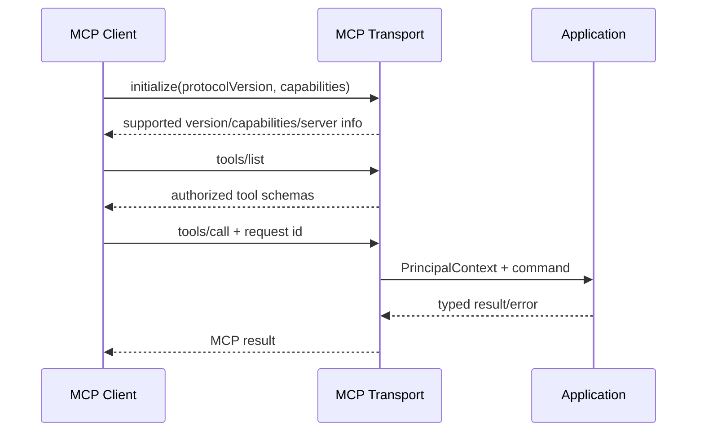

# ADR-004：本地 stdio + 远程 Streamable HTTP MCP

> 决策状态：待评审接受。M0 真实 binary 已装配 stdio 与 Streamable HTTP，并通过 `initialize/tools/list/ping` 真实字节流测试；HTTP MCP 继承 Bearer、Origin 与默认只读控制。OAuth/OIDC resource token、服务端 Principal/Project 绑定、按权限裁剪目录和完整取消/恢复兼容仍属 M1；旧 SSE 不是 v3 目标。

## 1. 目标与非目标

同时支持本地开发客户端与中央团队客户端，遵循项目锁定的 MCP 2025-11-25 transport/authorization profile。非目标是继续维护旧 SSE transport、匿名远程 MCP 或为 REST 替代测试背书。

## 2. 参与者、角色、权限和信任边界

stdio 进程继承已授权本地用户/Runner context；Streamable HTTP 客户端使用 OAuth resource token；MCP Handler 与 REST 共用 Application/RBAC。MCP session ID 不是身份或权限来源。

## 3. 触发条件、输入和前置条件

客户端先 `initialize` 协商协议/能力，再 `tools/list`/resource；远程端点要求 TLS、正确 audience、Origin allowlist 与项目可见性。本地 stdio 需要显式项目或唯一 cwd mapping。

## 4. 正常交互及时序图

## 5. 失败、取消、超时、重试、恢复和用户提示

不支持版本返回明确 incompatibility；token/Origin/session 失败不降级。Cancellation 传播 context/tool/Workflow；已 commit 操作可凭幂等键查询。断线重连创建/恢复受控 session，但不重放未知写请求。

## 6. 状态机、规则和不可变式

连接 `initializing→active→draining→closed`；未 initialize 不得调用 Tool。Tool 列表按权限/项目裁剪，但服务器仍在 call 时重新授权。`merge_task` 不注册；Agent 不能通过资源 URI 跨项目扫描。

## 7. 字段、配置和格式校验

Tool input/output 使用 JSON Schema 2020-12、reject unknown；request ID/size/depth/timeout受限。Streamable HTTP 验证 Content-Type/Accept/session/Origin；stdio stdout 只写协议帧，日志走 stderr。

## 8. 并发、幂等和一致性

并发 request 各自 context；写 Tool 必需 Idempotency-Key/expected version字段或 transport metadata。session 断开不等于取消已 commit Workflow。通知至少一次，客户端不得据通知覆盖 resource version。

## 9. 安全、Secret、隐私和审计

远程 MCP 使用 OAuth access token，不在 URL；精确 CORS/Origin 与速率限制。Prompt/Tool 参数视不可信，Secret/源码不进日志。initialize、Tool/Resource allow/deny、取消与 session 生命周期审计。

## 10. 质量门禁、证据与 fail-closed 规则

真实 stdio 与 Streamable HTTP 必须分别测试 initialize/list/call/error/cancel/auth；禁止以 REST equivalent 冒充 MCP。匿名、错误 audience、跨项目 Resource、未初始化调用必须失败。

## 11. 指标、SLO、告警和运维动作

监控连接数、initialize/version mismatch、Tool latency/error/cancel、auth deny、backpressure。连接/错误异常、跨项目 deny 或未知版本激增告警。

## 12. 验收测试和需求追踪

`TC-ADR-004-01` stdio 帧完整性；`TC-ADR-004-02` Streamable HTTP OAuth/Origin；`TC-ADR-004-03` 多请求/取消/断线；`TC-ADR-004-04` Tool schema 与权限。追踪 `TECH-API-001`。

## 13. 数据迁移、兼容、发布与回滚

新 transport 与 v3 Tool name/schema 并行灰度；旧 SSE 宣布 superseded 并关闭写。客户端必须重新授权，旧 session 不迁移。回滚仅可停远程 transport，不能恢复匿名 SSE/不安全 Tool。

### 决策、备选与后果

选择 stdio+Streamable HTTP。拒绝仅 stdio（无法中央多客户端）、旧 SSE（不作为 v3 目标）、自定义 WebSocket MCP（偏离标准）。代价是两 transport contract tests 与 OAuth session 管理；收益是本地易用、远程标准化且共享业务语义。
