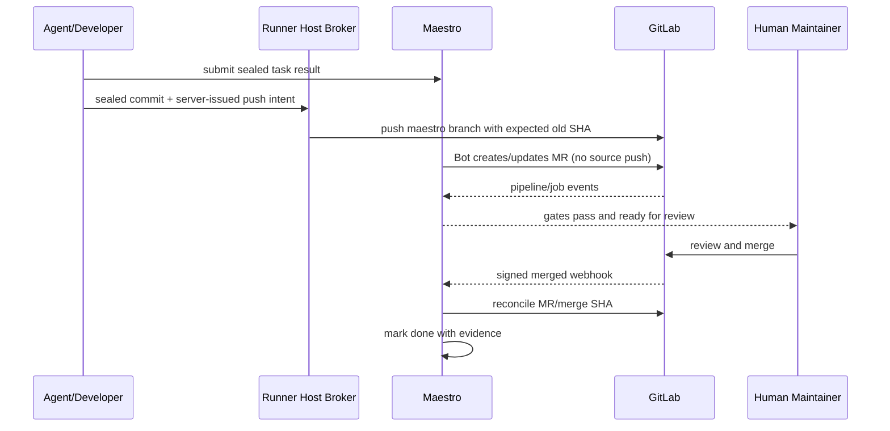

# ADR-005：GitLab 中由人最终合并

> 决策状态：已评审接受（I2 契约冻结 sprint；签署以契约 PR 评审批准记录为准）。M0 已从公开 MCP 目录移除 `merge_task`，Service 层 `MergeTask` 固定返回禁用错误，无 v3 幂等契约的 merge-conflict follow-up 也被 fail-closed 禁用。GitLab MR/Pipeline/Webhook 尚未实现，`done` 的 merged webhook/对账真源仍属 M2，因此本 ADR 仍为 `not_started/unverified`。

## 1. 目标与非目标

在自动创建分支/MR/修复与严格 Gate 的同时，保留最终代码变更的人类责任与 GitLab 原生保护。非目标是自动 merge、平台本地 merge 或替代 GitLab approval/protected branch。

## 2. 参与者、角色、权限和信任边界

Agent 只在沙箱修改任务工作区；Runner 宿主 Git broker 使用 OS Keychain 中成员既有 GitLab credential，只能 push 服务端生成的 `maestro/*` 分支；GitLab Bot 只创建/更新 MR并读取状态，不具备源码 push 或 merge capability。Verifier/Coordinator 可查看 Gate但不最终合并；有 GitLab 权限且通过组织规则的人执行 merge。

## 3. 触发条件、输入和前置条件

MR 进入 `ready_for_human_merge` 前需精确 source/target SHA、Required Gate全部 passed/有效 waived、无冲突、GitLab pipeline/approval状态可见。最终人类 merge 在 GitLab UI/API（用户身份）发生。

## 4. 正常交互及时序图

## 5. 失败、取消、超时、重试、恢复和用户提示

SHA 漂移、Gate stale、pipeline error、冲突、MR closed 均撤销 ready 状态。GitLab 不可用时不允许标 ready/done。漏 webhook 由对账确认；平台不重试 merge，因为没有该 capability。用户提示显示阻断 Gate、SHA、审批/冲突和 GitLab MR 链接。

## 6. 状态机、规则和不可变式

MR mirror `open→merged/closed`；WorkItem `validating→ready_for_human_merge→done`，任何 SHA/policy 变化使 `ready_for_human_merge→validating` 并将旧 Gate/Evidence 标 `stale`。`done` 只由 merged webhook或 reconcile；MR 创建、pipeline success、Verifier approve都不等于 done。

## 7. 字段、配置和格式校验

记录 instance/project、MR IID、source/target branch+SHA、merge SHA、pipeline、observed_at、source event。分支名固定 `maestro/<project-key>/<task-id>`。Bot scope/Protected Branch capability在 onboarding 时实测并定期对账。

## 8. 并发、幂等和一致性

合并前 UI/状态重新读取 GitLab current SHA/Gate，避免 TOCTOU；merged event 按 event ID/MR IID/merge SHA 幂等。乱序 open/running 事件不得覆盖 merged 终态。

## 9. 安全、Secret、隐私和审计

Bot token 与成员 GitLab credential 分离且不 passthrough；成员 credential 只存在 Runner OS Keychain，由宿主 broker 使用且不进入沙箱/控制面。平台不模拟用户。broker push、MR/Gate ready、Webhook merged、reconcile和 done 全审计，记录人类 GitLab actor（可用时）但不存 token。

## 10. 质量门禁、证据与 fail-closed 规则

GitLab sandbox 必须证明 Bot 无源码 push/merge capability、broker 拒绝非任务分支，且 GitLab 保护分支可阻止纵深绕过。source/target/Gate/approval/冲突任一未知或 stale 阻断；身份/SHA/Webhook authenticity不可豁免。

## 11. 指标、SLO、告警和运维动作

监控 ready→merge 时长、SHA stale、MR closed、reconcile drift、Bot/broker forbidden 操作。发现 Bot 具有 source push/merge capability，或 broker 可写非任务 ref，立即吊销 credential并阻止新操作。

## 12. 验收测试和需求追踪

`TC-ADR-005-01` 人工 merge happy path；`TC-ADR-005-02` Bot 权限拒绝；`TC-ADR-005-03` SHA/Gate TOCTOU；`TC-ADR-005-04` webhook漏失对账。追踪 `TECH-GL-001`、`TECH-EVD-001`。

## 13. 数据迁移、兼容、发布与回滚

关闭/删除旧 `merge_task` 与 REST local merge；现有 ready/done 任务不得自动映射，需与 GitLab MR/merge SHA人工对账。回滚不得恢复 local merge。未来若需自动合并，必须新 ADR、独立高权限 Bot和显式项目策略。

### 决策、备选与后果

选择人类最终 merge。拒绝 Maestro 本地 merge（绕过远端保护/Gate）、共享 Bot 自动 merge（权限爆炸半径与自审风险）、由 Agent merge（职责冲突）。代价是多一个人工等待点；收益是明确责任、最小 Bot 权限和 GitLab 原生治理。
