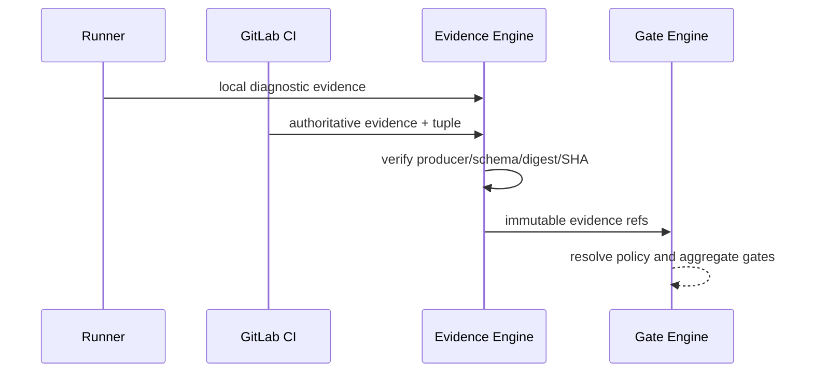

# ADR-006：GitLab CI Evidence 是合并门禁权威

> 决策状态：已评审接受（I2 契约冻结 sprint；签署以契约 PR 评审批准记录为准）。当前仅有宿主本地 ValidationRun，不具备 CI authority、SHA tuple或 Gate 引擎。

## 1. 目标与非目标

统一回答“什么证据可允许进入人工合并”，避免 Agent/Runner 本地环境自证。非目标是否定本地快速反馈；本地 Evidence仍用于诊断，但不能满足 merge Gate。

## 2. 参与者、角色、权限和信任边界

GitLab CI job/workload identity 是 merge authority producer；Runner是 diagnostic producer；Evidence/Gate Engine验签、绑定和聚合；人类可在有限规则申请/审批 waiver，但不能改写 Evidence。Agent无签发权。

## 3. 触发条件、输入和前置条件

Pipeline/job 事件已验签并映射项目/MR；Evidence含精确 source/target SHA、pipeline/job、policy version、producer、digest。producer、artifact与当前 GitLab状态必须可验证。

## 4. 正常交互及时序图

## 5. 失败、取消、超时、重试、恢复和用户提示

Evidence 缺失/解析/producer/SHA错误为 missing/error，不降级使用本地。Pipeline取消/skipped不算 passed。Webhook漏失通过GitLab API对账；artifact暂不可用可幂等重试。UI区分 diagnostic/merge_gate authority并显示stale原因。

## 6. 状态机、规则和不可变式

Gate `pending/running/passed/failed/error/stale/waived`。source/target SHA或policy version变更令旧Evidence/Gate stale。Evidence append-only；Required Gate只有passed或有效waived满足。

## 7. 字段、配置和格式校验

固定 tuple 为 `source_sha,target_sha,pipeline_id,job_id,policy_version,producer,digest`，还含check/attempt/status/time/authority/artifact ref。authority只能由producer registry赋值，客户端字段无效。

## 8. 并发、幂等和一致性

按producer external job/check/attempt幂等；同标识不同digest是安全冲突。Gate以tuple+effective policy digest唯一。合并前重读当前GitLab SHA和Gate消除TOCTOU。

## 9. 安全、Secret、隐私和审计

CI producer最小身份，artifact加密/按项目访问，日志脱敏。Evidence ingest/reject、authority decision、Gate/stale/waiver全审计；Secret Finding payload受限。

## 10. 质量门禁、证据与 fail-closed 规则

默认 Required覆盖build/unit/lint/type/integration/contract/Secret等适用检查；缺失、skipped、error、stale全部阻断。身份隔离、SHA一致、策略完整、Webhook真实性不可豁免。

## 11. 指标、SLO、告警和运维动作

监控CI Evidence摄取延迟/错误、missing/stale、producer conflict、Gate重评。Required Evidence长期缺失、digest冲突或本地Evidence误满足Gate立即告警。

## 12. 验收测试和需求追踪

`TC-ADR-006-01` 本地pass+CI fail仍阻断；`TC-ADR-006-02` SHA/policy漂移；`TC-ADR-006-03` producer/digest伪造；`TC-ADR-006-04`重复/乱序。追踪 `TECH-VAL-001`、`TECH-EVD-001`。

## 13. 数据迁移、兼容、发布与回滚

旧 ValidationRun标 `legacy_local/diagnostic`，永不满足v3 Gate。先shadow摄取CI Evidence，再warning，最后Required。回滚Gate Engine时保持error/冻结，不得用旧本地pass替代。

### 决策、备选与后果

选择GitLab CI为merge authority，本地Runner为diagnostic。拒绝只信Runner（环境/身份可被Agent影响）、Control Plane中央执行（违反源码边界）、Agent自报（不可验证）。代价是依赖GitLab可用性和CI时延；收益是与待合并SHA一致、可审计、复现性更高。
