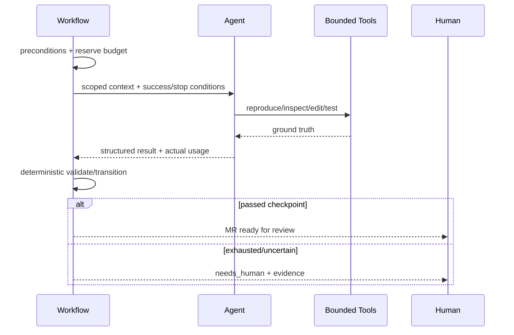

# ADR-007：确定性 Workflow 管控制，Agent 管灵活诊断与修改

> 决策状态：待评审接受。现有Task状态机可作为部分基础，但没有受控Agent loop、真实预算记账或handoff。

## 1. 目标与非目标

以最简单可预测机制处理规则明确的步骤，只在动态判断确有收益时使用Agent。非目标是“全自主”平台、LLM定义权限/门禁/重试，或把固定流程包装成Agent。

## 2. 参与者、角色、权限和信任边界

Workflow Engine负责状态、授权、预算、重试、timer、Gate和HITL；Agent负责复现、假设、代码修改与在允许工具内选择下一步；Runner执行profile；人处理高风险、低置信度、无法复现与最终merge。

## 3. 触发条件、输入和前置条件

只有`auto_remediable`、有复现Evidence、非不可豁免安全问题、有明确`budget_tokens`/deadline/attempt limit/委托/Runner时启动Agent。否则确定性路由到`needs_human`。

## 4. 正常交互及时序图

## 5. 失败、取消、超时、重试、恢复和用户提示

默认最多3次、30分钟；每次模型调用前原子reserve，调用后真实usage记账。无法复现、预算耗尽、上下文不足、连续失败、工具越权、低置信度立即handoff。取消终止模型和工具进程；重启从checkpoint恢复，不重复MR等副作用。

## 6. 状态机、规则和不可变式

RemediationRun 使用 `eligibility_check→reproducing→diagnosing→modifying→local_verifying→mr_created→ci_verifying→awaiting_human`，失败循环经 `retrying`，任一允许节点可转 `needs_human/stopped`。`resolved` 属于 Defect Workflow，只能在人工 merge 与权威复验证据后发生。Agent 输出不能直接改变状态；每步须有 Tool Evidence。Agent 不能自审、豁免或 merge。

## 7. 字段、配置和格式校验

Workflow definition/version、budget/used/reserved、deadline、attempt、checkpoint、delegation、profile均持久化。Agent输出为结构化schema并引用真实Evidence ID；Tool仅接受版本化profile与受限参数，未知字段/路径拒绝。

## 8. 并发、幂等和一致性

每Workflow单写者+version；step/command ID幂等；budget reservation防并发透支；timer/outbox至少一次。并行只用于真正独立的检查，并共享总预算和取消上下文。

## 9. 安全、Secret、隐私和审计

Prompt/仓库/Issue/日志均不可信，不能更改Tool/网络/Secret/项目scope。Context just-enough并有预算；Prompt/output/tool trace脱敏加密30天。模型、usage、tool、决策、停止/handoff审计。

## 10. 质量门禁、证据与 fail-closed 规则

无预算/复现/权限不启动；Prompt injection、跨项目、任意命令、Secret外泄、自审、资源耗尽红队必须通过。Agent MR走与人工相同CI Gate；无法复现不得声称修复。

## 11. 指标、SLO、告警和运维动作

监控attempt/success/handoff、token reserve/used、tool failure、reproduction、CI修复率。预算透支、越权工具、重复active workflow或卡住超时立即暂停自动化并告警。

## 12. 验收测试和需求追踪

`TC-ADR-007-01`预算前置/真记账；`TC-ADR-007-02`停止条件/handoff；`TC-ADR-007-03`crash幂等；`TC-ADR-007-04`Prompt injection/tool abuse；`TC-ADR-007-05`不可复现不输出“已修复”。追踪 `TECH-WF-001`。

## 13. 数据迁移、兼容、发布与回滚

先suggest-only，再shadow、人工确认，最后allowlist自动MR。旧Task无法证明step时进入needs_reconcile。Definition不可原地修改；新版本显式迁移。回滚停止新Agent、排空并保留checkpoint，绝不把未验证任务标resolved。

### 决策、备选与后果

选择“确定性Workflow + 有界Agent”。拒绝全自主Agent（成本/误差/权限面不可控）与全部硬编码（诊断和多文件修复缺乏弹性）。代价是要维护状态机、工具ACI、预算与评测；收益是灵活性集中在值得使用模型的环节，控制面保持可预测、透明、可审计。
