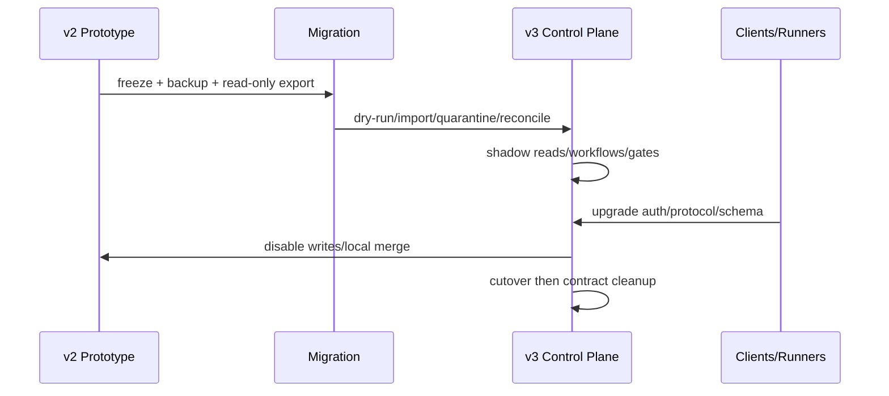

# ADR-008：v3 采用显式破坏性迁移

> 决策状态：待评审接受。v2.1 文档已归档到 `docs/archive/v2.1/`；M0 已移除部分不安全兼容路径，但 OIDC/PostgreSQL/Runner/GitLab/Gate 等 M1–M4 迁移尚未完成。文档为 `review`、本地测试通过都不等价于获得审批和目标提交 Evidence。

## 1. 目标与非目标

允许删除v2不安全的身份、接口、状态与部署假设，避免兼容层长期保留绕过。非目标是让所有旧客户端/SQLite数据无损自动升级或维持双主。

## 2. 参与者、角色、权限和信任边界

技术负责人管接口/schema迁移，产品/安全/QA/运维共同批准；项目管理员执行onboarding/数据确认；客户端/Runner必须按兼容窗口升级。旧客户端不得因“兼容”绕过OIDC/RBAC/Gate。

## 3. 触发条件、输入和前置条件

触发因素：请求自报project/role/session、可选共享token、SQLite单机、旧SSE、本地HEAD/merge、任意命令/fail-open验证。前置是v2.1只读归档、v3机器规范、追踪矩阵、导入/回滚方案与试点仓库。

## 4. 正常交互及时序图

## 5. 失败、取消、超时、重试、恢复和用户提示

导入校验不一致则停在dry-run/quarantine，不静默修正。Cutover前可取消并恢复v2只读/受控写窗口；cutover后使用PostgreSQL forward-fix/PITR，不把新事实同步回SQLite。客户端收到明确unsupported version/migration URL。

## 6. 状态机、规则和不可变式

迁移`planned→frozen→imported→shadow_verified→cutover→contracted`，失败`blocked/rolled_back(before cutover)`。v3安全不变量不可由compat flag关闭；`done`只来自GitLab merged；旧Evidence不获CI authority。

## 7. 字段、配置和格式校验

破坏变化包括：移除自报可信字段、移除`merge_task`/local merge、SSE→Streamable HTTP、SQLite→PostgreSQL、任意command→profile、全局session→Principal/project复合scope。Import report含source digest、row counts、ID mapping、quarantine、invariant checks和verified commit。

## 8. 并发、幂等和一致性

导入有migration ID并幂等；cutover使用写冻结与单一事实源，禁止SQLite/PostgreSQL双写。客户端写必须Idempotency-Key/expected version。事件/Runner协议兼容当前与前一minor，不兼容时拒绝。

## 9. 安全、Secret、隐私和审计

旧token/session全部吊销，Secret不从明文配置直接迁移，只建新secret_ref。导入文件加密、最小权限、用后销毁。冻结、导入、quarantine、cutover、客户端/Runner拒绝与rollback全审计。

## 10. 质量门禁、证据与 fail-closed 规则

文档达到review不等于发布；阶段只有`approved + implemented + passed`完成。Clean build、真实协议、权限隔离、数据对账、GitLab/CI Gate、恢复演练、试点验收必须通过；无法迁移的危险路径默认关闭。

## 11. 指标、SLO、告警和运维动作

监控客户端/Runner版本分布、旧API调用、import对账/隔离、shadow mismatch、cutover error。旧写调用、数据摘要不一致、双主迹象或不兼容Runner反复请求立即告警。

## 12. 验收测试和需求追踪

`TC-ADR-008-01`SQLite dry-run/import/对账/quarantine；`TC-ADR-008-02`旧自报身份/merge/SSE被拒；`TC-ADR-008-03`cutover/rollback边界；`TC-ADR-008-04`客户端/Runner版本兼容。所有v3 Requirement必须在追踪矩阵有迁移与测试证据。

## 13. 数据迁移、兼容、发布与回滚

执行顺序：归档v2.1→M0可信基线→PostgreSQL/OIDC/Runner→GitLab/CI Gate→Defect/Agent→治理试点。使用expand/backfill/shadow/cutover/contract；旧写逐项feature flag关闭。回滚仅在schema/protocol兼容范围，绝不恢复匿名、自报scope、任意命令、fail-open或local merge。

### 决策、备选与后果

选择显式v3 breaking migration。拒绝无限兼容v2（保留安全漏洞与双重语义）和一次性big-bang无shadow（不可验证/难回滚）。代价是客户端升级、数据导入和试点周期；收益是可以建立单一、安全、可测试的v3契约，而不是在原型上叠加绕过。
