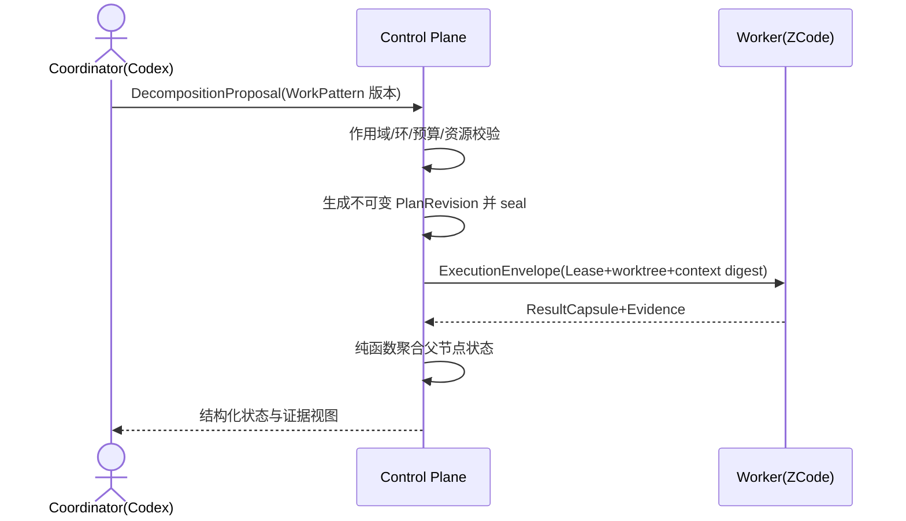

# ADR-009：采用分层类型化 Work Graph 与版本化 WorkPattern

> 决策状态：draft，尚未评审。本决策只锁定建模方向与存储选型；实现未开始。当前代码中 Task 的 ParentTaskID 与 RelationType 仍是唯一存在的任务关系，且创建时不校验层级语义。
>
> 实现处置（2026-08-31，owner 决策）：M1-WGP/WGM/WGS 三任务整体移交 V2；V1 以单层任务闭环形态收敛（认证/Runner/领取/执行/验证/部署/备份已实测）。M0.5 阻断清单 #2（ZCode Adapter）/#6（会话-任务绑定）/#7（父子聚合）随本决策在 V2 销号，登记于 V1 复盘。

## 1. 目标与非目标

用一个可版本化、类型化的工作图统一表达"归属层级、执行依赖、产物传递和执行血缘"四种关系，支撑 Codex 编排、Maestro 分层调度、ZCode 并行执行、会话续接、独立评价和父任务汇总。非目标：不引入图数据库作为权威写库，不引入完整 HTN 自动规划求解器，不允许 Agent 即时任意改写计划结构，不用一棵树或一个通用 DAG 承担全部语义。

## 2. 参与者、角色、权限和信任边界

technical_lead 拥护模型一致性；product_owner 批准计划语义与聚合策略；qa_owner 批准 Gate 与评价语义；security_owner 批准会话绑定和上下文边界；operations_owner 批准调度与恢复参数。Coordinator（人或编排 Agent）只能提交 DecompositionProposal；服务端独占校验、封板、改图和状态投影。Codex/ZCode 会话是运行时连接事实，不是任务身份。

## 3. 触发条件、输入和前置条件

触发因素：目标跨能力域或跨仓库、需要父子编排与 fan-out/join、需要会话与任务持续绑定、需要独立评价或现有平面任务队列无法表达的关系。前置条件：BusinessProblem 与 OutcomeContract 已定义、机器规范同步、阶段任务与追踪矩阵行已规划；缺失时计划只能保存为 draft。

## 4. 正常交互及时序图

## 5. 失败、取消、超时、重试、恢复和用户提示

拆分校验失败停留在 proposal 并返回稳定错误码，不静默修正。运行中重规划必须创建新 PlanRevision；已有 ExecutionAttempt 始终绑定旧 NodeRevision 与其 spec_digest。失败按 failure_policy 传播，取消按 cancel_policy 级联或分离；恢复只能续接原 Attempt 绑定，禁止把 Agent 会话重新绑定到无关任务。UI 展示当前责任方、证据链接和下一动作。

## 6. 状态机、规则和不可变式

计划生命周期为 draft → proposed → sealed → executing → aggregating → satisfied/failed/needs_human，另有 replanned 分支。父节点状态只能由子 outcome、JoinPolicy 与 Evidence 通过版本化纯函数投影，Agent 不可直接标记完成；sealed Revision 不可原地修改；contains 树、requires DAG、consumes/produces 产物流和 retry/followup/replacement 血缘四类关系分表分语义。完整不变量由 work-graph-model 文档持有。

## 7. 字段、配置和格式校验

实体 ID 使用 UUIDv7；人类可读编号 MST-WP-/MST-WI- 不携带父路径与能力语义；slot_key 在 plan_revision、parent_node 与 slot 三元组内唯一；spec_digest 只用于 stale 判断，不作为实体 ID。work_node_id、node_revision_id、execution_attempt_id 与 idempotency_key 四类标识不得相互复用；semantic_fingerprint 只产生重复告警，不自动合并任务。

## 8. 并发、幂等和一致性

图结构变更使用 expected_graph_version，节点状态变更使用 expected_node_version，均为 CAS；每个 WorkItem 同时最多一个 active Attempt/Lease；图变更、AuditEvent 与 Outbox 事件同事务提交。上游 spec、artifact、policy 或 SHA 变化必须使全部下游 Context 与 Evidence 标记 stale；聚合是幂等纯函数，事件重放必须得到相同结果。

## 9. 安全、Secret、隐私和审计

子任务只接收最小必要 ContextSet（精确 SHA、目录边界、直接依赖产物、验收条件和预算），父任务默认不继承子会话原始 transcript。Attempt 固定绑定 principal/project/role、session、worker、worktree 与 context_digest 并全审计。跨 WorkPlan 依赖只导入不可变外部 Artifact Snapshot，不得建立可传播取消的实时边。

## 10. 质量门禁、证据与 fail-closed 规则

父节点成功必须包含独立 Integration/Evaluation 证据，不能只计算"子节点都已结束"。评价顺序固定为确定性测试与 Gate → 独立 Evaluator → 可选 LLM Judge → 必要时人工；执行 Agent 不得自审，Judge 必须有 rubric 版本、证据和置信度。Evidence 缺失、过期或 digest 不匹配一律 fail-closed 回到阻塞。

## 11. 指标、SLO、告警和运维动作

跟踪拆分到封板时长、fan-out 并发度、join 等待时长、stale 率、重规划次数、Attempt 恢复时长和 needs_human 停留时长。join 长期阻塞、stale 洪峰、恢复失败或聚合重放不一致必须告警；持续饥饿的任务触发公平性巡检。

## 12. 验收测试和需求追踪

验收以三份设计文档的用例族为准：prd/work-planning-and-orchestration.md、technical/work-graph-model.md 与 technical/work-graph-scheduler.md 中的 TC-WGP、TC-WGM、TC-WGS 系列。对应阶段任务与追踪矩阵行必须在 M1 任务书更新时一并登记；登记之前本文与三份设计保持 draft，不得作为实现完成或验证通过的依据。

## 13. 数据迁移、兼容、发布与回滚

现有 Feature 迁为 WorkPlan 并补录 synthetic Problem/Outcome，Task 迁为原子 WorkItem；采用 expand/contract：新增表 → 影子构图 → 双读对账 → 切换写入 → 删除旧字段。ParentTaskID 仅在确认是结构关系后迁入 containment，语义不明的进入 needs_reconcile，不得猜测；RelationType 的 followup/retry 迁入 lineage 边。回滚只能回到上一个已批准 v3 提交，不得恢复无校验的父子字段或自报身份路径。

### 决策、备选与后果

选择分层类型化 Work Graph：用树回答"属于谁"，用 DAG 回答"先做什么"，用 Artifact Contract 回答"传递什么"，用 Attempt 回答"谁在哪个会话执行过"，用 Evidence 回答"为什么可以通过"。拒绝的备选：纯树（无法表达跨分支依赖与多对多能力映射）；纯 DAG（无唯一父节点、上下文边界和责任归属）；完整 HTN 规划器（复杂且允许 Agent 改写方法时不可预测，仅取其模板化分解与封板机制）；BPMN 全量建模（过重且动态重规划困难，仅取其并行/汇聚语义）；Petri Net（仅用于离线验证状态机与汇聚规则）；Property Graph 或图数据库作为权威写库（缺乏业务不变量、复合外键与事务原子性，仅作只读投影）。代价是实体与表数量增加、迁移周期变长；收益是关系语义不混杂、状态可重放、模型可维护且可预测。
