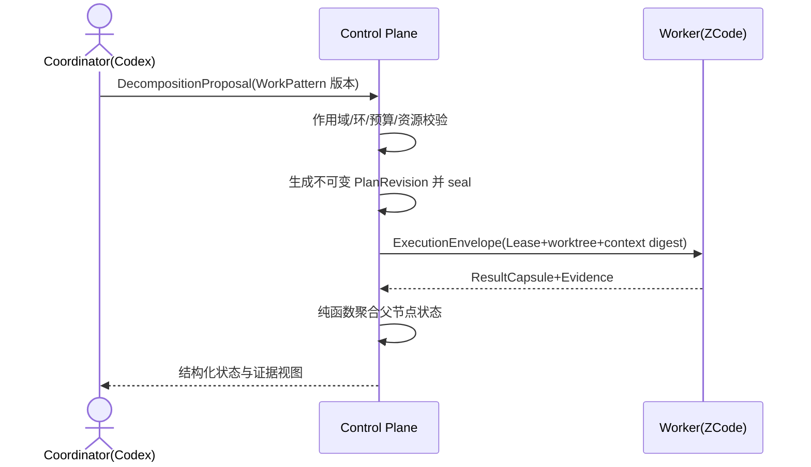

# ADR-009：采用分层类型化 Work Graph 与版本化 WorkPattern

> 决策状态：approved（2026-09-10 四方批准，记录见文末"评审记录"）。切片回收进度：J2a 已落模型与存储层（迁移 0017）；J2b 已落拆解协议与调度（迁移 0019 + internal/workgraph 纯协议包）；J2c（本 MR）落 MCP 工具面与控制台视图（工具目录 3.2：六件 J2c 工具 + /api/v3 work-graph/资产台账/seal HITL 面）。追踪矩阵行按 §12 在 V4 收敛仪式统一翻转，翻转前不作为实现完成或验证通过的依据。当前代码中 Task 的 ParentTaskID 与 RelationType 仍是既有路径上的任务关系，Work Graph 新表自迁移 0017 起并存。
>
> 实现处置（2026-08-31，owner 决策）：M1-WGP/WGM/WGS 三任务整体移交 V2；V1 以单层任务闭环形态收敛（认证/Runner/领取/执行/验证/部署/备份已实测）。M0.5 阻断清单 #2（ZCode Adapter）/#6（会话-任务绑定）/#7（父子聚合）随本决策在 V2 销号，登记于 V1 复盘。
>
> 实现处置更新（2026-09-09，owner 决策）：W4.5 提前激活本决策（里程碑级），移交项按 J2a（模型+存储+资产台账）→ J2b（拆解协议/封板/聚合/调度）→ J2c（MCP 面+控制台）切片回收；试点（企业学堂平台双仓）为首个消费方，V4 相应顺延约 3–4 周。

## 1. 目标与非目标

用一个可版本化、类型化的工作图统一表达"归属层级、执行依赖、产物传递和执行血缘"四种关系，支撑 Codex 编排、Maestro 分层调度、ZCode 并行执行、会话续接、独立评价和父任务汇总。非目标：不引入图数据库作为权威写库，不引入完整 HTN 自动规划求解器，不允许 Agent 即时任意改写计划结构，不用一棵树或一个通用 DAG 承担全部语义。

## 2. 参与者、角色、权限和信任边界

technical_lead 拥护模型一致性；product_owner 批准计划语义与聚合策略；qa_owner 批准 Gate 与评价语义；security_owner 批准会话绑定和上下文边界；operations_owner 批准调度与恢复参数。Coordinator（人或编排 Agent）只能提交 DecompositionProposal；服务端独占校验、封板、改图和状态投影。Codex/ZCode 会话是运行时连接事实，不是任务身份。

## 3. 触发条件、输入和前置条件

触发因素：目标跨能力域或跨仓库、需要父子编排与 fan-out/join、需要会话与任务持续绑定、需要独立评价或现有平面任务队列无法表达的关系。前置条件：BusinessProblem 与 OutcomeContract 已定义、机器规范同步、阶段任务与追踪矩阵行已规划；缺失时计划只能保存为 draft。

## 4. 正常交互及时序图

## 5. 失败、取消、超时、重试、恢复和用户提示

拆分校验失败停留在 proposal 并返回稳定错误码，不静默修正。运行中重规划必须创建新 PlanRevision；已有 ExecutionAttempt 始终绑定旧 NodeRevision 与其 spec_digest。失败按 failure_policy 传播，取消按 cancel_policy 级联或分离；恢复只能续接原 Attempt 绑定，禁止把 Agent 会话重新绑定到无关任务。UI 展示当前责任方、证据链接和下一动作。

## 6. 状态机、规则和不可变式

计划生命周期为 draft → proposed → sealed → executing → aggregating → satisfied/failed/needs_human，另有 replanned 分支。父节点状态只能由子 outcome、JoinPolicy 与 Evidence 通过版本化纯函数投影，Agent 不可直接标记完成；sealed Revision 不可原地修改；contains 树、requires DAG、consumes/produces 产物流和 retry/followup/replacement 血缘四类关系分表分语义。完整不变量由 work-graph-model 文档持有。

## 7. 字段、配置和格式校验

实体 ID 使用 UUIDv7；人类可读编号 MST-WP-/MST-WI- 不携带父路径与能力语义；slot_key 在 plan_revision、parent_node 与 slot 三元组内唯一；spec_digest 只用于 stale 判断，不作为实体 ID。work_node_id、node_revision_id、execution_attempt_id 与 idempotency_key 四类标识不得相互复用；semantic_fingerprint 只产生重复告警，不自动合并任务。

## 8. 并发、幂等和一致性

图结构变更使用 expected_graph_version，节点状态变更使用 expected_node_version，均为 CAS；每个 WorkItem 同时最多一个 active Attempt/Lease；图变更、AuditEvent 与 Outbox 事件同事务提交。上游 spec、artifact、policy 或 SHA 变化必须使全部下游 Context 与 Evidence 标记 stale；聚合是幂等纯函数，事件重放必须得到相同结果。

## 9. 安全、Secret、隐私和审计

子任务只接收最小必要 ContextSet（精确 SHA、目录边界、直接依赖产物、验收条件和预算），父任务默认不继承子会话原始 transcript。Attempt 固定绑定 principal/project/role、session、worker、worktree 与 context_digest 并全审计。跨 WorkPlan 依赖只导入不可变外部 Artifact Snapshot，不得建立可传播取消的实时边。

## 10. 质量门禁、证据与 fail-closed 规则

父节点成功必须包含独立 Integration/Evaluation 证据，不能只计算"子节点都已结束"。评价顺序固定为确定性测试与 Gate → 独立 Evaluator → 可选 LLM Judge → 必要时人工；执行 Agent 不得自审，Judge 必须有 rubric 版本、证据和置信度。Evidence 缺失、过期或 digest 不匹配一律 fail-closed 回到阻塞。

## 11. 指标、SLO、告警和运维动作

跟踪拆分到封板时长、fan-out 并发度、join 等待时长、stale 率、重规划次数、Attempt 恢复时长和 needs_human 停留时长。join 长期阻塞、stale 洪峰、恢复失败或聚合重放不一致必须告警；持续饥饿的任务触发公平性巡检。

## 12. 验收测试和需求追踪

验收以三份设计文档的用例族为准：prd/work-planning-and-orchestration.md、technical/work-graph-model.md 与 technical/work-graph-scheduler.md 中的 TC-WGP、TC-WGM、TC-WGS 系列。对应阶段任务与追踪矩阵行按 W4.5 J 系列任务书登记（J2a：模型与台账存储；J2b：协议与调度；J2c：MCP 面），矩阵行在 V4 收敛仪式统一翻转；登记与翻转之前不得作为实现完成或验证通过的依据。

## 13. 数据迁移、兼容、发布与回滚

现有 Feature 迁为 WorkPlan 并补录 synthetic Problem/Outcome，Task 迁为原子 WorkItem；采用 expand/contract：新增表 → 影子构图 → 双读对账 → 切换写入 → 删除旧字段。ParentTaskID 仅在确认是结构关系后迁入 containment，语义不明的进入 needs_reconcile，不得猜测；RelationType 的 followup/retry 迁入 lineage 边。回滚只能回到上一个已批准 v3 提交，不得恢复无校验的父子字段或自报身份路径。

### 决策、备选与后果

选择分层类型化 Work Graph：用树回答"属于谁"，用 DAG 回答"先做什么"，用 Artifact Contract 回答"传递什么"，用 Attempt 回答"谁在哪个会话执行过"，用 Evidence 回答"为什么可以通过"。拒绝的备选：纯树（无法表达跨分支依赖与多对多能力映射）；纯 DAG（无唯一父节点、上下文边界和责任归属）；完整 HTN 规划器（复杂且允许 Agent 改写方法时不可预测，仅取其模板化分解与封板机制）；BPMN 全量建模（过重且动态重规划困难，仅取其并行/汇聚语义）；Petri Net（仅用于离线验证状态机与汇聚规则）；Property Graph 或图数据库作为权威写库（缺乏业务不变量、复合外键与事务原子性，仅作只读投影）。代价是实体与表数量增加、迁移周期变长；收益是关系语义不混杂、状态可重放、模型可维护且可预测。

### 评审记录（W4.5 提前激活，2026-09-10）

> draft→approved 的评审请求件与批准记录，批准后随同一 MR 翻转 frontmatter。评审请求件由 J2a 会话起草；四方批准角色：product_owner / security_owner / qa_owner / operations_owner（owner 一人四帽时按角色逐项确认）。模板锁定 13 个编号节，本记录挂为无编号小节。

#### 评审对象与激活背景

原决策于 2026-08-31 整体移交 V2；2026-09-09 owner 决策提前激活（W4.5 能力波次），试点需要 Work Graph 承载制品 Gate（详设未 approved 不得开工）与后续分层拆解。本次评审批准三件事：

1. **原决策方向重申**：分层类型化 Work Graph + PostgreSQL 关系库为唯一权威写库；上文"决策、备选与后果"维持不变，无新增备选。
2. **提前激活的切片边界**：J2a 落模型与存储层（四类关系分表、不变量、CAS、资产台账、存量摄取命令），不含拆解协议与调度（J2b）与 MCP/控制台面（J2c）；切片间以冻结的存储接口衔接。
3. **资产台账进入权威层**：ARTIFACT-STANDARDS（工作层，plans/prep/pilot/）§1–§5 的台账语义（frontmatter 字段目录、15 类类型码、生命周期与四类审计事件、Gate 绑定、存量摄取三模式）随本 ADR 激活进入权威范围；制品内容文件的存放位置按"写实决策"第 1 条裁决。

#### 四域自检（product / security / qa / operations）

**product**：批准即接受计划生命周期（draft→proposed→sealed→executing→aggregating→satisfied/failed/needs_human）与聚合纯函数语义为试点期权威方向；PRD-WORK-PLANNING 文档本身保持 draft 随 J2b 定稿，本次不批 PRD 文档。资产生命期 draft→reviewed→approved→superseded 与试点 PLAYBOOK 阶段 Gate 绑定（locked_gate 制品是下游开工前置）。已知代价：expand 阶段平面 work_items 与 Work Graph 双模型并存，产品语义暂时两套；缓解：0017 只增不改既有表，试点桥接走 work_items 上的资产 Gate 绑定，切换写入是后续契约仪式的独立决策，本文不预设。

**security**：sealed 不可变由数据库触发器兜底（plan_revisions 封板后禁 UPDATE/DELETE；node_revisions 全程仅插入），不依赖应用层自觉。sensitivity 三级（public/internal/confidential）为列 CHECK；confidential 存量（会话记录）仅摘要+文件指针+digest 入账，正文既不入库也不入 git assets 目录。source_digest 由台账在注册时对内容文件计算，拒绝自报。asset.registered / asset.reviewed / asset.approved / asset.superseded 四类审计事件与状态变更同事务提交，进 append-only 审计链，可随既有审计导出/验证端点全量核验。台账不存内容 blob，控制面不新增敏感数据驻留面。

**qa**：机检规则双层——数据库层（类型目录 CHECK、digest 格式 CHECK、状态枚举 CHECK、supersede 单后继部分唯一索引、不可变触发器）与应用层（状态流转守卫、slot_key 格式、supersede 目标存在且未被替换、环检测）。PG 门控测试验收点：不可变触发器拒绝、supersede 链单后继、机检拒绝注册、CAS 冲突、Gate 消费校验 fail-closed、supersede 后下游 stale。TC-WGM-001/002/003/005 由 J2a PG 测试提供覆盖候选；TC-WGM-004（存量 ParentTaskID needs_reconcile）属后续 contract 切片，本次明确不在 J2a。requires 无环（WGM-INV-003）PostgreSQL 约束无法表达，应用层检测+测试覆盖，属已知边界。

**operations**：迁移 0017 纯增量（九张新表，不动任何既有表与列），down 迁移可完整回滚；编号与 J1 的 0016 并行协调，先合者定号、README 记录。maestro asset-intake 为离线运维命令（DSN 走既有配置链，不新增常驻服务面）。台账行量级 = 制品数×版本数（试点期 <10^3），无容量风险；制品内容在试点仓 git 内，备份随仓库。增量观测：stale 绑定数与 supersede 频次可从台账查询，告警面随 J2b 调度接入。

#### 写实决策（owner 批准时裁决）

1. **资产内容位置（已裁决）**：台账（PG）只存 digest+指针+摘要行；内容文件存试点仓 `assets/<asset_id>/`（进 git 版本控制）；confidential 存量仅摘要+指针，正文不入库不入 assets 目录。ARTIFACT-STANDARDS §6 的"试点仓或 Maestro 资产存储"二选一就此裁决为试点仓。
2. **Intent 层与执行绑定后移**：business_problems / outcome_contracts / capabilities 与 ExecutionAttempt 五元组绑定不在 0017，随 J2b 拆解协议建表；work-graph-model.md 记录该延期，避免表已建而语义未实现的虚报。
3. **文档状态**：work-graph-model.md 随本次评审定稿（spec_status: approved，implementation_status: partial）；work-graph-scheduler.md 保持 draft 并标注"由 J2b 定稿"；prd/work-planning-and-orchestration.md 本次不动（J2b 领域）。
4. **登记路径修订**：§12 已同步改为 W4.5 J 系列任务书登记 + V4 收敛仪式翻矩阵。

#### 批准记录

| 角色 | 批准 | 日期 | 条件/备注 |
| --- | --- | --- | --- |
| product_owner | ✅ 批准 | 2026-09-10 | 双模型并存期以 work_items Gate 绑定桥接，切换写入留给后续契约仪式 |
| security_owner | ✅ 批准 | 2026-09-10 | sealed 触发器兜底；confidential 仅摘要+指针；digest 台账计算拒自报 |
| qa_owner | ✅ 批准 | 2026-09-10 | TC-WGM-004 不在 J2a；requires 无环应用层检测为已知边界 |
| operations_owner | ✅ 批准 | 2026-09-10 | 0017 纯增量可回滚；asset-intake 离线命令；内容随试点仓 git 备份 |

owner 一人四帽逐项确认（2026-09-10，会话内裁决）；写实决策 1 同场裁决为试点仓 assets/。spec_status 翻 approved，implementation_status 随 J2a 落地记 partial（模型+台账存储），verification_status 保持 unverified 直到 V4 Evidence。
