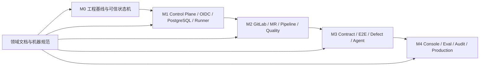

# M0–M4 交付任务书索引

## 1. 目标与非目标

本文定义从 v3 规范到代码、迁移、测试和运行 Evidence 的唯一交付路径。阶段任务书负责“何时、由谁、改什么子系统、交付什么”，领域文档负责“规则是什么”。阶段不形成第二份规则真源，也不以 Markdown 完成代替代码实现。

## 2. 参与者、角色、权限和信任边界

`product_owner` 验收产品需求；`technical_lead` 对实现与架构负责；`qa_owner` 对测试/Gate 负责；`security_owner` 对身份、隔离、Secret 负责；`operations_owner` 对部署/SLO/恢复负责。任务实施者不能单独批准自己的安全、质量或运维 Evidence；跨信任边界改动必须由对应 owner 评审。

## 3. 触发条件、输入和前置条件

每阶段在上一阶段 exit Gate 通过、所需 ADR/领域文档至少 `review`、机器规范可校验且追踪条目存在后启动。输入为 approved/review 需求、当前代码基线、风险清单、迁移数据与测试环境。依赖未满足时任务保持 `blocked`，不得通过隐式 stub 绕过。

并行执行与收敛模式：上一阶段进入 `verifying` 且本阶段机器规范与接口契约冻结后，本阶段任务可提前推进文档、设计与数据模型，并在预备分支实施代码；但代码合入验证顺序、Exit Gate 判定与状态翻转仍严格按 M0→M4 执行，预备分支产生的 Evidence 不计入上一阶段。执行编排查阅工作层管线文档 `plans/PIPELINE.md`（非权威真源，不受本索引权威性约束）。

## 4. 正常交互及时序图

## 5. 失败、取消、超时、重试、恢复和用户提示

阶段失败必须保留 Evidence、缺口、owner 和修复计划；不得修改阈值把失败改为通过。任务取消需说明已合入/未合入、数据兼容和清理步骤。CI 基础设施错误可在同 SHA/配置重试，产品失败必须修复后产生新 Evidence。恢复从最近 verified commit 继续。

## 6. 状态机、规则和不可变式

阶段文档状态独立维护 `spec_status/implementation_status/verification_status`；阶段完成仅允许 `approved + implemented + passed`。执行状态为 `planned → ready → in_progress → verifying → complete`，旁路为 `blocked/rolled_back`。安全降级只能减少能力；后阶段不得绕过前阶段不变量。

| 阶段 | 任务书 | 核心出口 |
| --- | --- | --- |
| M0 | [m0-foundation.md](m0-foundation.md) | 真实可运行、状态可信、验证 fail-closed |
| M1 | [m1-control-plane-runner.md](m1-control-plane-runner.md) | 统一身份/隔离、中央面与安全 Runner |
| M2 | [m2-gitlab-quality-loop.md](m2-gitlab-quality-loop.md) | exact-SHA GitLab 与权威质量闭环 |
| M3 | [m3-integration-defect-automation.md](m3-integration-defect-automation.md) | 跨仓问题到受控 Agent 修复闭环 |
| M4 | [m4-governance-console.md](m4-governance-console.md) | 治理、评测、审计、恢复与试点生产准入 |

## 7. 字段、配置和格式校验

阶段 Task ID 使用 `M{0..4}-{DOMAIN}-{NNN}`；需求/规则/Test ID 由领域文档定义。每个任务 MUST 填 owner、dependencies、authoritative docs/specs、code subsystem、outputs、migration、tests、Evidence、DoD。`last_verified_commit` 只能填实际通过全部关联 Gate 的完整 commit SHA。

## 8. 并发、幂等和一致性

可并行任务必须没有共享 schema/接口所有权冲突；机器规范、数据库迁移与公共状态机由单一 owner 串行合入。波次内冻结的接口、Schema 与事件目录的变更同样由单一集成入口串行处理，各并行流不得私自修改冻结契约。交付 Evidence 固定绑定 commit/config/policy/test profile；重跑不覆盖旧结果。文档、Schema、代码和测试在同一变更或可追踪变更链中保持一致。

## 9. 安全、Secret、隐私和审计

开发/测试环境也不得提交真实 Secret、关闭鉴权或放开任意命令。临时 bypass 必须不能进入默认构建，并有 owner/expiry/审计。安全任务要求 threat test 与 negative test Evidence；迁移与回滚不得恢复已移除的不安全接口。

## 10. 质量门禁、证据与 fail-closed 规则

统一 DoD：代码/迁移/配置/文档完成；机器规范与示例通过；单元/集成/安全/恢复测试按风险通过；可观察与审计点就绪；追踪矩阵完整；运行于目标环境；无 Required Gate 缺失。任何 `missing/skipped/error/stale/unverified` 均不算完成。

## 11. 指标、SLO、告警和运维动作

交付看板统计任务完成率、blocked age、变更 lead time、回滚率、缺陷逃逸、Gate 失败和追踪覆盖。阶段出口前需验证该阶段新增 SLI/告警/Runbook。连续两次回归或安全关键失败暂停后续阶段，执行根因复盘。

## 12. 验收测试和需求追踪

- `TC-DEL-001`：每个阶段任务均能追踪到领域 Requirement/Rule、代码、测试与 Evidence。
- `TC-DEL-002`：阶段状态不会在实现/验证未完成时显示 complete。
- `TC-DEL-003`：跨阶段 smoke 能证明前序能力未回归。

评审签署：PRD 为 product + technical；安全为 security + technical；Gate/测试为 QA + technical；运维为 operations + technical。

## 13. 数据迁移、兼容、发布与回滚

交付顺序固定 M0→M4；允许后阶段探索分支，但不得早于依赖上线；探索分支同时受第 3 章并行执行与收敛模式约束，其 Evidence 与状态翻转不早于依赖阶段 Exit Gate。所有数据变化采用 expand/migrate/contract，接口 breaking change 提供明确拒绝和迁移说明。每阶段必须定义 feature flag、回滚触发、最大回滚点和数据前向修复；回滚不能降低身份、Evidence 或审计不变量。
