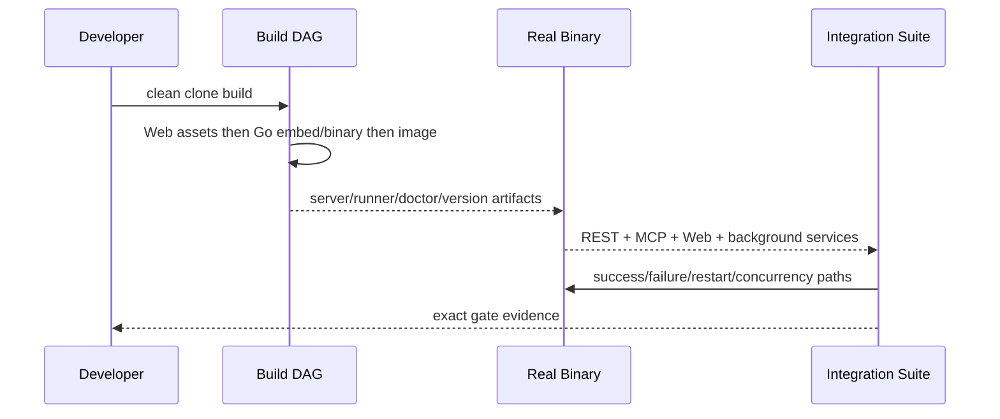

# M0：工程基线与可信状态机

## 1. 目标与非目标

M0 将现有原型收敛为可从干净 clone 构建和启动的真实系统，修复状态/事务/验证假通过，并关闭开发基线中的高风险入口。非目标：在 M0 引入完整 OIDC/PostgreSQL/GitLab 自动化；远程写默认关闭。

## 2. 参与者、角色、权限和信任边界

`technical_lead` 负责构建、装配和状态机；`qa_owner` 负责删除假测试并建立真实协议测试；`security_owner` 负责匿名、Origin 和命令边界；`product_owner` 验收可用流程。M0 仅允许健康端点匿名，任何代码执行只在本机明确开发配置与受控命令范围中。

## 3. 触发条件、输入和前置条件

输入为 v2.1 代码/审计基线、v3 review 领域文档和固定 Go/Node/Docker 工具链。开始前冻结旧文档、记录当前失败测试/入口/状态迁移/验证缺口，不得删除失败证据。每个任务建立代码 owner 和追踪行。

## 4. 正常交互及时序图

## 5. 失败、取消、超时、重试、恢复和用户提示

构建、启动、Git/worktree、验证或协议失败必须非零退出并给稳定错误。超时测试必须失败而非提前 return；取消测试清理子进程/worktree/Session。服务重启恢复只接受持久化合法状态，孤儿执行进入 recovery/failed。重试固定同 commit/config 并保留首次失败日志。

## 6. 状态机、规则和不可变式

| 任务 ID | 依赖 | 权威文档 | 代码子系统 | 必需输出 |
| --- | --- | --- | --- | --- |
| `M0-DOC-001` | 无 | [文档治理](../governance/documentation-policy.md)、[当前基线](../governance/current-state-baseline.md)、[追踪指南](../governance/traceability-guide.md) | `docs`, docs CI | v3 导航、状态、追踪、v2.1 冻结 |
| `M0-BLD-001` | DOC | [runtime-and-build](../technical/runtime-and-build.md) | CLI、build scripts、Web embed、container | 命令契约、固定工具链、可重复产物 |
| `M0-RUN-001` | BLD | [architecture](../technical/architecture.md)、[api-spec](../technical/api-spec.md) | composition root、HTTP/MCP/Web/background | 真正装配的服务与健康端点 |
| `M0-STATE-001` | RUN | [concurrency-model](../technical/concurrency-model.md) | application services、store、lease/worktree | 合法状态迁移、事务/CAS/恢复 |
| `M0-VAL-001` | STATE | [validation](../prd/validation.md)、[zero-trust](../technical/zero-trust-validation.md) | validation/evidence/policy | fail-closed 验证流水线 |
| `M0-SEC-001` | RUN, VAL | [runner-security](../security/runner-security.md) | middleware、command/path policy | 关闭匿名/Origin/任意命令风险 |
| `M0-TST-001` | BLD..SEC | [integration tests](../testing/integration-test-plan.md) | test harness、fixtures、CI | 真实 binary/协议/并发/恢复测试 |

状态和验证不变量分别以 `TASK-RULE-*`、`VAL-RULE-*` 为准，Delivery 不另定义状态语义。

### 当前执行状态

| 工作包 | 本地实现候选 | 仍未关闭 |
| --- | --- | --- |
| `M0-DOC-001` | v2.1 冻结、v3 导航/元数据/追踪、Markdown/Schema/API/Mermaid/链接 CI | 无：目标提交、Owner 审批和远程 CI Evidence 以本收口提交闭环（`last_verified_commit: HEAD` 自引用绑定；签署与 Evidence 链接见 [v0 复盘](../retrospective/v0-closure-retrospective.md)） |
| `M0-BLD-001` | 五个 CLI、Web→Go→Docker DAG、固定工具链、health/信号、distroless；干净源码快照构建、Docker/Compose smoke、SBOM、源码/镜像扫描本地通过 | 无：远程 CI 由 `m0-runtime` 工作流在目标提交产出 artifact（binary + SBOM）；签名/provenance 属发布环境（后续） |
| `M0-RUN-001` | 单一 composition root，真实 REST/MCP/Web/WS/background | v3 远程 MCP 身份上下文与 Tool 目录属于 M1 |
| `M0-STATE-001` | 集中状态 registry、逐资源 CAS/历史、Lease/epoch/队列版本/幂等、Heartbeat、原子恢复、安全 Worktree 重绑定与 GC、schema catalog/迁移锁 | PostgreSQL/Outbox/跨 Runner fencing 属 M1 |
| `M0-VAL-001` | Git/diff/boundary/test/coverage/policy/Profile/Evidence 全链 fail-closed；上下文缺失/无效会原子补偿；本地结果仅 diagnostic | GitLab CI `merge_gate` Evidence/Gate 聚合属 M2 |
| `M0-SEC-001` | 默认拒绝、远程写关闭、Origin、canonical path、版本化 Profile、输出/超时、公共错误/日志/代理头/排空边界 | rootless OCI、network/cgroup 强制和设备身份属 M1 |
| `M0-TST-001` | 真实 binary/MCP/Git/worktree/成功/失败/上下文补偿/并发/Heartbeat/schema 伪造/非空重启恢复；race/vet/lint/覆盖率与本地容器门禁通过 | 无：目标提交全量远程 CI 由三个工作流覆盖；角色签署以 PR 评审批准记录 |

上述"本地实现候选"不等于阶段完成；本文件只有在 `spec_status=approved`、`implementation_status=implemented`、`verification_status=passed` 且 `last_verified_commit` 绑定目标提交后才可标完成。`last_verified_commit: HEAD` 表示目标提交为携带本状态的自引用收口提交（`docs-check.rb` 强制该文档与 HEAD 一致）。

## 7. 字段、配置和格式校验

### 细分实施清单

- `M0-DOC-001`：归档旧真源；生成文档目录/模板/术语/追踪；启用 ID、链接、Schema、Mermaid 检查；禁止新文档反链 archive。
- `M0-BLD-001`：实现并测试 `server/runner/migrate/doctor/version` 参数、帮助、退出码；固定 Go/Node；建立 Web→Go→image DAG；配置优先级、signals、graceful shutdown、`livez/readyz`；输出版本/SBOM 元信息。
- `M0-RUN-001`：建立唯一 composition root；真实挂载 REST/MCP/静态 Web/WebSocket/worker；依赖注入失败即不 ready；删除返回假成功的 stub。
- `M0-STATE-001`：枚举 Task/Session/Worker/Workspace 合法迁移；事务只由 Application Service 持有；实现 lock order、CAS、Lease epoch、幂等键、孤儿恢复；事务内禁止回基础 DB 重新查询。
- `M0-VAL-001`：按顺序收集 baseline/boundary/diff/test/coverage/policy/SHA Evidence；解析/执行/缺失均 error/failed；Evidence 只追加；限制输出与超时。
- `M0-SEC-001`：移除任意 command string；引入 Command Profile 引用；canonicalize path；Origin 白名单；除 health 外要求认证；远程写 feature flag 默认 false。
- `M0-TST-001`：测试实际编译 binary；验证 MCP initialize/tools/list；真实 Git/worktree；成功/失败/取消/并发/重启；禁止宽松状态码、提前 return 和 REST 冒充 MCP。

所有输入、错误码、状态和 Schema 必须与领域/机器规范一致；无法确定时先更新真源并评审，不能在代码中发明旁路。

## 8. 并发、幂等和一致性

实施顺序为 DOC/BLD → RUN → STATE → VAL/SEC → TST；STATE 与 VAL 修改公共事务时串行评审。测试必须覆盖并发 claim、重复写、旧 Lease epoch、崩溃点。数据库/文件副作用与审计/Evidence 在可定义的事务边界内一致。

## 9. 安全、Secret、隐私和审计

开发配置不得包含真实 Secret；诊断输出脱敏。M0 安全负测试需覆盖 Origin、匿名非健康端点、路径遍历、符号链接、任意命令与输出资源限制。任何临时开发开关必须默认关闭、显著告警并不能进入 production profile。

## 10. 质量门禁、证据与 fail-closed 规则

### 每任务 DoD

每个任务必须同时满足：领域规则/机器规范一致；实现无 stub/fake pass；单元与真实集成测试；错误/取消/恢复路径；日志/metric/audit 点；迁移/兼容说明；追踪矩阵与 CI Evidence。`M0-VAL-001` 和核心状态机覆盖率至少 80%。

### M0 Exit Gate

- 干净 clone 一条受支持命令完成 Web、Go、Docker 构建并启动真实服务。
- MCP `initialize/tools/list`、REST health、Web 静态资源 smoke 通过。
- 成功提交、错误提交、Session 清理、并发与重启恢复自动测试通过。
- Git/worktree/diff/coverage/policy 任一异常都失败。
- 远程写默认关闭，非健康端点不得匿名。

## 11. 指标、SLO、告警和运维动作

构建记录耗时/缓存命中/产物 digest；运行记录启动/readiness/关闭耗时、后台队列与孤儿数；测试记录 flaky/超时/泄漏进程。ready 失败和孤儿恢复失败提供可操作日志。M0 无生产 SLO，但测试阈值与后续基线必须固定并保存。

## 12. 验收测试和需求追踪

Exit Evidence 至少关联 `TC-MCP-001/003/004`、`TC-TASK-002/003/004`、`TC-VAL-001..005`、`TC-CTX-002/003`、`TC-BLD-001`（M0 无独立 VM 部署工作包，`TC-DEP-001/002` 的干净部署/弱配置验证在 M0 由 `TC-BLD-001` 的 clean-source 构建、Compose smoke 与 fail-closed 配置测试承载，完整 VM 部署验证属 M1 `TC-DEP`）。上述 Test ID 均在追踪矩阵 M0 行关联。QA 逐项签署；technical/security 对各自负测试签署。任何未关联 Task/Requirement/Test/Evidence 的工作包不得关闭。

## 13. 数据迁移、兼容、发布与回滚

M0 仅迁移运行/状态语义，不执行 v3 PostgreSQL 切换。远程写能力只能通过已实现且默认关闭的 `remote_write` 开关灰度；其他能力在有对应配置 Schema、默认值和测试前不得声称可灰度。回滚触发：真实成功路径回归、状态破坏、验证 fail-open 或安全边界失效；回滚至最近可信构建并冻结写入，保留新 Evidence/审计/工作区快照供前向修复。不得回滚到公开任意命令或匿名写接口。
