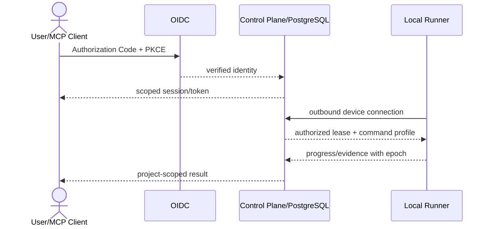

# M1：Control Plane、OIDC、PostgreSQL 与本地 Runner

## 1. 目标与非目标

M1 将可信单机基线拆分为中央 Control Plane 与成员侧安全 Runner，建立 OIDC Principal、project-scoped RBAC、PostgreSQL 真源和两种 MCP transport。非目标：接入完整 GitLab MR/Pipeline Gate 或允许 Control Plane 访问项目源码。

## 2. 参与者、角色、权限和信任边界

`technical_lead` 负责边界与数据；`security_owner` 负责 OIDC/RBAC/Runner 沙箱；`operations_owner` 负责 VM/PostgreSQL/TLS/备份；`qa_owner` 负责跨接口授权与逃逸测试。Control Plane、Browser/MCP、OIDC、PostgreSQL、Runner/host、项目代码分别隔离，Runner 只建立出站连接。

## 3. 触发条件、输入和前置条件

必须先通过 M0 Exit Gate。输入为批准的 ADR-001..004/008、OIDC/GitLab sandbox 配置、SQLite 数据样本、目标 VM 和 Runner 支持矩阵。OIDC claims、权限矩阵、数据迁移映射和 Runner threat cases 在编码前进入 review。

## 4. 正常交互及时序图

## 5. 失败、取消、超时、重试、恢复和用户提示

OIDC 或授权不可用时不得新授权；PostgreSQL 不可用时 not ready；Runner 断线按 suspect/offline/Lease 回收处理；设备撤销立即拒绝。登录、注册、迁移和 Lease 超时均返回稳定错误和 correlation ID。重试只针对幂等验证/连接，写操作先查询状态。SQLite 导入失败整体回滚并输出逐行报告。

## 6. 状态机、规则和不可变式

| 任务 ID | 依赖 | 权威文档 | 代码子系统 | 必需输出 |
| --- | --- | --- | --- | --- |
| `M1-ARCH-001` | M0 | [architecture](../technical/architecture.md) | control-plane/runner boundary、transport | 逻辑/部署/信任/故障域实现骨架 |
| `M1-AUTH-001` | ARCH | [identity-rbac](../security/identity-rbac.md)、[roles](../prd/roles-and-scenarios.md) | identity、session、authorization middleware | OIDC、Principal、统一 RBAC、审计 |
| `M1-DATA-001` | ARCH | [data-model](../technical/data-model.md) | PostgreSQL store、migrations、outbox/importer | project-scoped 模型与 SQLite 导入 |
| `M1-RUN-001` | AUTH, DATA | [multi-client](../prd/multi-client.md)、[runner-security](../security/runner-security.md) | runner daemon、device registry、lease、sandbox | 注册/批准/连接/沙箱/心跳/恢复 |
| `M1-MCP-001` | AUTH, RUN | [mcp-protocol](../prd/mcp-protocol.md)、[api-spec](../technical/api-spec.md) | MCP stdio/HTTP adapters | 稳定 transport、授权、取消/恢复 |
| `M1-DEP-001` | DATA, MCP | [deployment](../technical/deployment.md)、[PRD deployment](../prd/deployment.md) | Compose、proxy、secret、backup | VM 安装/升级/备份/readiness |

主体/项目/角色/Session 必须由服务端上下文导出；Central Plane 无项目代码；设备凭据与用户身份不可互换。

## 7. 字段、配置和格式校验

### 细分实施清单

- `M1-ARCH-001`：拆包与接口；实现 Control Plane 不接触源码的请求/代码/Evidence 流；定义 Runner outbound protocol、版本协商、故障域和 dependency health。
- `M1-AUTH-001`：Authorization Code + PKCE；校验 signature/iss/aud/exp/nbf/scope/state/nonce；Secure/HttpOnly/SameSite Cookie；15 分钟 access token；统一 `authorize(principal, action, resource)`；401/403/404；撤销与缓存失效；对齐 `../specs/openapi/runner.yaml` 的 Session/Worker 注册与恢复协议，建立会话-任务绑定并移除参数自报身份（M0.5 漂移修复，以既有机器规范为准，不新增接口形状）。
- `M1-DATA-001`：建 User/Team/Membership/Project/Runner/WorkItem/Lease/Execution/AuditEvent/Inbox/Outbox；所有资源外键含 project scope；迁移锁/版本；SQLite dry-run/import/report/reconcile。
- `M1-RUN-001`：一次性 10 分钟注册码、审批/撤销、Keychain 设备 key；generation/heartbeat/Lease epoch；rootless OCI、cap drop、no-new-privileges、无 host HOME/socket/device/SSH/cloud creds；Profile-only 命令；默认无网和资源硬限；Command Profile 实例配置化下发（M0.5 漂移修复）。
- `M1-MCP-001`：真实 stdio 与 Streamable HTTP；initialize/tools/resources/cancel；Origin/auth；schema；cursor 恢复；删除 `merge_task` 和自报 scope；领取接口补齐幂等键与队列版本并返回精确 worktree 路径，逐字段对齐 `../specs/mcp/tools.schema.json`（M0.5 漂移修复，先审计代码与规范的漂移清单再修复，禁止反向修改规范）。
- `M1-DEP-001`：Compose 服务/网络/volume；TLS/reverse proxy；Secret refs；config schema；migration/doctor/readiness；每日备份/WAL 基础、升级/回滚步骤。

实现字段/wire shape 以 OpenAPI/JSON Schema/RBAC YAML 为准，任何写接口必须有幂等键、expected version、授权和审计事件。

## 8. 并发、幂等和一致性

ARCH 先行；AUTH/DATA 可并行但共同模型由 ADR/RBAC 锁定；RUN 再集成；MCP/DEP 收口。事务与 Outbox 同提交；授权缓存撤销传播；Runner 新 generation fencing 旧连接；Lease CAS/epoch；导入按 source row identity 幂等。

## 9. 安全、Secret、隐私和审计

负测试覆盖 token signature/audience/time/scope、CSRF/Origin、伪造项目/角色/Session、资源枚举、Runner revocation、路径/环境/网络/进程/容器逃逸。Secret 只存句柄，设备 key 仅 Keychain。所有 deny、身份/成员/Runner/配置变化和 Lease 操作可审计。

## 10. 质量门禁、证据与 fail-closed 规则

### 每任务 DoD

完成实现、迁移、机器规范、负测试、指标/审计、操作说明；真实 REST/MCP/WebSocket/background 使用同一授权器；Runner 沙箱测试在支持平台通过；SQLite 导入有 dry-run、校验和回滚报告；Compose 能从干净 VM 重建。

### M1 Exit Gate

- 未认证 401、无权限 403、无项目可见性 404。
- 伪造 scope、错误 audience、被撤销 Runner、跨项目枚举全部拒绝并审计。
- REST/MCP Tool/Resource/WebSocket/background 授权决定一致。
- Runner 文件、环境、网络、进程和容器逃逸测试通过。
- Control Plane 无源码挂载；PostgreSQL 备份/readiness 与 SQLite 导入演练通过。

## 11. 指标、SLO、告警和运维动作

新增 OIDC 登录/授权 P95、deny、撤销延迟；DB pool/transaction/outbox lag；Runner online/heartbeat/Lease/recovery；MCP session/error；backup age/readiness。授权 P95 <50ms，撤销传播 P99 <60s；阈值触发 identity、runner-offline 或 database Runbook 草案。

## 12. 验收测试和需求追踪

至少关联 `TC-ROLE-001..004`、`TC-PROJ-001..004`、`TC-CLIENT-001..004`、`TC-MCP-001..005`、`TC-DEP-001..004`。Security 签署身份/Runner Evidence，Operations 签署部署/恢复，QA 签署跨 adapter 一致性。所有 M1 Task 行状态由实际 Evidence 更新。

## 13. 数据迁移、兼容、发布与回滚

发布按 PostgreSQL expand → SQLite dry-run/import → read-only compare → cutover；Runner/MCP 支持当前与前一小版本。feature flags 分离 remote MCP、Runner lease 和 PostgreSQL write。回滚触发：授权绕过、scope 污染、数据不一致、Runner 逃逸、无法恢复；立即关远程写/撤销 Lease，保留 PostgreSQL/审计，应用回滚仅在 schema compatible 时执行，禁止回 SQLite 双写。
