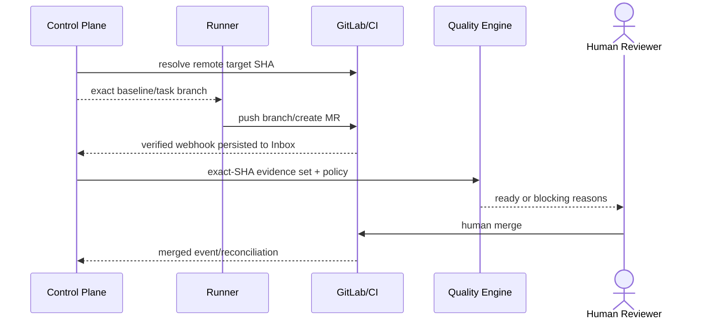

# M2：GitLab 基线、MR、Pipeline 与质量门禁

## 1. 目标与非目标

M2 交付自建 GitLab 的安全接入、远端 baseline、任务分支/MR/Pipeline 同步和 exact-SHA 权威质量闭环。非目标：平台自动合并、推送保护分支、用本地诊断授权合并，或在 GitLab 不可用时推断完成。

## 2. 参与者、角色、权限和信任边界

`platform_admin` 管 GitLab Instance；`project_admin` 管仓库绑定/强化策略；仅 Runner 宿主的 Git broker 使用成员 Keychain 凭据推送任务分支，中央 GitLab Bot 只创建/更新 MR并读取/同步状态；Webhook Receiver/Reconciler 负责收敛；`qa_owner`/`verifier` 管 Gate；人类 Reviewer 最终 merge。GitLab、Webhook、Artifact/CI producer 与 Control Plane 之间均需验证来源和最小权限。

## 3. 触发条件、输入和前置条件

必须通过 M1 Exit Gate。输入为批准的 GitLab host、sandbox 项目/保护分支/Bot、Webhook Secret、quality baseline、CI jobs/coverage/security fixtures。开始前完成 Token Scope/SSRF/Webhook threat cases 与 policy inheritance 示例。

## 4. 正常交互及时序图

## 5. 失败、取消、超时、重试、恢复和用户提示

无效 Webhook 无业务效果；合法事件处理失败进入 retry/DLQ；乱序/遗漏由对账修复。GitLab API 超时先查询对象再重试。Pipeline cancelled/skipped/error、Evidence 解析失败或 SHA 漂移都阻断。GitLab 不可用只显示缓存/last sync 并禁止新授权和 done。用户可查看事件、Pipeline/Job、Gate 原因和重放权限。

## 6. 状态机、规则和不可变式

| 任务 ID | 依赖 | 权威文档 | 代码子系统 | 必需输出 |
| --- | --- | --- | --- | --- |
| `M2-GL-001` | M1 | [GitLab PRD](../prd/gitlab-collaboration.md) | instance/repository connector | host/repository onboarding 与最小 Scope |
| `M2-WHK-001` | GL | [gitlab integration](../technical/gitlab-integration.md) | webhook receiver、Inbox、DLQ/replay | raw verify、持久化、去重、重放/对账 |
| `M2-GIT-001` | GL | [gitlab integration](../technical/gitlab-integration.md) | git baseline/branch adapter | 远端 SHA、命名分支、保护分支防护 |
| `M2-MR-001` | WHK, GIT | [gitlab integration](../technical/gitlab-integration.md) | MR/pipeline/job sync | MR/Pipeline 状态与 merged 真相 |
| `M2-QG-001` | MR | [quality policy](../quality/quality-policy.md)、[gates](../quality/gates-and-evidence.md) | policy/evidence/gate/waiver engine | 继承策略、Gate、Evidence、豁免 |
| `M2-SEC-001` | GL..QG | [supply chain security](../security/secrets-webhooks-supply-chain.md) | secret/token/artifact/provenance controls | Token/Secret/Webhook/供应链防护 |

baseline、Evidence、Gate、完成语义只引用 `GL-RULE-*`、`VAL-RULE-*` 与 quality 真源。

## 7. 字段、配置和格式校验

### 细分实施清单

- `M2-GL-001`：approved HTTPS host registry、证书/redirect 验证；numeric project binding；Bot Scope probe；连接 health/revoke；Secret refs/rotation。
- `M2-WHK-001`：对 raw bytes 验签；按 event UUID/payload digest 去重；事务写 raw metadata + Inbox 后 2xx；指数退避+jitter、DLQ、权限化人工 replay、周期 reconciliation。
- `M2-GIT-001`：从 remote target branch 解析 SHA；生成 `maestro/<project-key>/<task-id>`；只允许任务分支；push 前核验 protected/default branch；记录 ref update 与 SHA。
- `M2-MR-001`：MR upsert/task marker；Pipeline/Job/SHA 状态映射；乱序 comparator；merged/closed 对账；禁止 merge API；source/target 变化发布 stale 事件。
- `M2-QG-001`：company→project strengthen→task add 解析；Evidence immutable binding；Gate 七态；required 聚合；changed-lines 80%、total delta -0.5pp；SAST/dependency/image/license；flaky 一次；waiver 独立审批/≤7d/单 MR-SHA-check。
- `M2-SEC-001`：Token least privilege/rotation/revoke；SSRF/redirect；webhook replay/timing；artifact digest/provenance；Secret scan；SBOM、dependency/image/license enforcement。

机器字段由 AsyncAPI/Quality Policy Schema 定义；未知 GitLab event/check/policy 字段不得自动映射 passed。

## 8. 并发、幂等和一致性

GL 先接入，WHK/GIT 可并行，MR 汇合，QG 后置，SEC 全程评审。Inbox/Outbox at-least-once，以 event ID/digest 去重；MR/Pipeline upsert 用 external ID/version；Gate snapshot 原子且旧 Evidence stale；Replay 使用原 event identity，不能绕过验签结果或重复副作用。

## 9. 安全、Secret、隐私和审计

测试必须证明跨 host redirect/SSRF、无效/旧 Secret、重放、伪造 project/pipeline/job、恶意 artifact 和保护分支写入被拒。Token 原值不入 DB/log；Webhook replay 和 waiver 为高风险审计。Bot 权限 Evidence 必须显示无 source push/merge capability，Runner Git broker 必须拒绝未知 remote、自由 refspec 和非任务分支。

## 10. 质量门禁、证据与 fail-closed 规则

### 每任务 DoD

实现+机器事件/Schema+迁移+负测试+指标/审计+Runbook；GitLab sandbox 演练覆盖重复/乱序/遗漏/中断；Quality Engine golden cases 覆盖继承、stale、missing/error/skipped、waiver 到期/撤销；无直接 merge/protected push 代码路径。

### M2 Exit Gate

- 无效签名无业务效果；重复/乱序事件仅一次正确状态变化。
- SHA 漂移立即阻断 ready，旧 Evidence stale。
- 缺任一 Required Gate 不得 ready；不可豁免项无绕过。
- Maestro 无法推送/合并保护分支且未调用 merge API。
- GitLab 不可用只读缓存，不新授权、不标完成；恢复对账通过。

## 11. 指标、SLO、告警和运维动作

新增 Webhook persist P95 <2s、Inbox lag/DLQ/replay、reconciliation diff、GitLab API error/rate limit、MR/Pipeline sync、Evidence missing/stale、Gate/waiver 分布。DLQ 非零、对账差异或安全扫描 producer 异常触发 webhook-pipeline-failure/安全 Runbook。

## 12. 验收测试和需求追踪

至少关联 `TC-GL-001..005`、`TC-VAL-001..004`、`TC-TASK-004`、`TC-NFR-002/003`。QA 签署 Gate/证据，Security 签署 Webhook/Token/供应链，Technical 签署 protected branch/merge 不变量。Exit Evidence 固定 source/target SHA、policy 与 GitLab object IDs。

## 13. 数据迁移、兼容、发布与回滚

旧 URL/baseline/MR 数据迁移为 instance/project IDs、remote SHA 并标旧 Evidence stale。功能旗标依次开启 read connector → webhook shadow → task branch/MR → Gate enforce。回滚触发：Webhook 误接受、状态错序、protected branch 风险、Gate fail-open；立即关闭写/ready transition，保留 Inbox/Evidence/审计并以 GitLab 对账前向修复。不得恢复本地 HEAD 或自动 merge。
