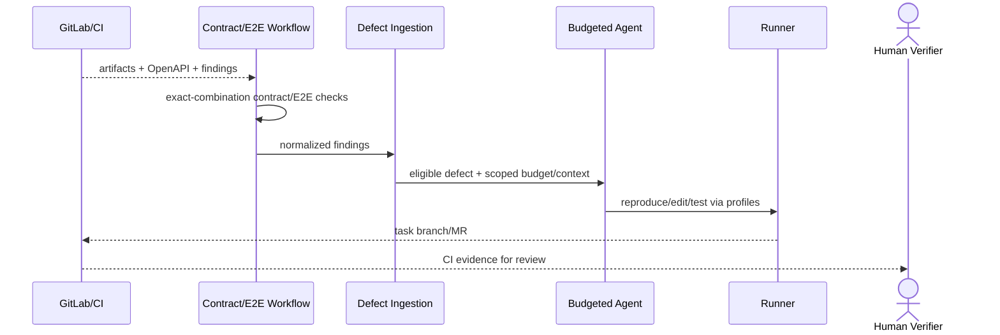

# M3：前后端联调、测试问题与 Agent 修复

## 1. 目标与非目标

M3 交付 OpenAPI 契约检查、跨仓 IntegrationRun、Finding/Defect 归一分派及受预算/工具/人工边界约束的 Agent 修复闭环。非目标：让模型控制确定性状态/权限/Gate、无证据自动关闭 Defect、自动批准/豁免/合并代码。

## 2. 参与者、角色、权限和信任边界

Contract/Workflow/Defect/Quality Engine 负责确定性规则；CI/QA/Scanner 生产 Finding；Coordinator triage/派发；delegated Agent 诊断修改；Runner 执行；Verifier/GitLab Reviewer 复验/合并。模型、Prompt、仓库、Issue、日志和外部契约均不可信。

## 3. 触发条件、输入和前置条件

必须通过 M2 Exit Gate。输入包括至少两个试点仓库、OpenAPI JSON/YAML 及兼容 golden cases、CI/JUnit/SAST/Secret/QA fixtures、E2E 环境 profile、Agent model/tool/budget 配置与红队集。先定义失败责任映射和 human handoff owner。

## 4. 正常交互及时序图

## 5. 失败、取消、超时、重试、恢复和用户提示

契约无效/缺失、环境失败、Finding quarantine、无法复现、预算耗尽和注入/越权分别分类。仅幂等基础设施步骤自动重试；Agent 默认最多 3 次/30 分钟。取消必须清环境/进程并保留 checkpoint/Evidence。恢复核验 SHA/artifact/worktree/Lease/budget ledger。用户看到责任方、真实消耗、停止/接管和证据。

## 6. 状态机、规则和不可变式

| 任务 ID | 依赖 | 权威文档 | 代码子系统 | 必需输出 |
| --- | --- | --- | --- | --- |
| `M3-CTR-001` | M2 | [context](../prd/context-filtering.md)、[contract engine](../technical/contract-engine.md) | contract parser/normalizer/diff | OpenAPI hash、compatible/breaking 判定 |
| `M3-INT-001` | CTR | [E2E workflows](../prd/end-to-end-workflows.md) | integration workflow/environment/artifact | exact-combination IntegrationRun/Evidence |
| `M3-DEF-001` | INT | [Defect PRD](../prd/defect-and-test-issues.md) | finding adapters/model | 六类 Finding 归一与生命周期 |
| `M3-DSP-001` | DEF | [defect ingestion](../technical/defect-ingestion.md) | fingerprint/dedup/triage/dispatch | 唯一 Defect、occurrence、责任任务 |
| `M3-AGT-001` | DSP | [Agent PRD](../prd/agent-remediation.md) | remediation orchestrator/agent/tools | 复现、候选修复、测试、MR、handoff |
| `M3-BUD-001` | AGT | [workflow engine](../technical/workflow-engine.md) | budget ledger/checkpoint/retry/stop | pre-call Gate、真记账、预算/停止边界 |

模型不能直接写 Workflow state；resolved/ready/done 仍由 Evidence 和外部事实决定。

## 7. 字段、配置和格式校验

### 细分实施清单

- `M3-CTR-001`：解析 OpenAPI 3 JSON/YAML；完整 request/response/security/schema validation；canonical normalize/hash；breaking/non-breaking diff rules/version；无契约/解析错误 fail-closed；owner mapping。
- `M3-INT-001`：manifest 固定前后端 SHA、artifact digest、contract/suite/fixture/profile versions；环境 Lease/TTL/teardown；waiting/running/pass/fail/cancel/expired；Evidence/责任输出。
- `M3-DEF-001`：Pipeline/JUnit/contract/SAST/Secret/manual QA adapters；保留 source/severity/environment/repro/evidence/Task-MR-Pipeline refs；状态转换与独立验证。
- `M3-DSP-001`：版本化 fingerprint（project/branch/test-or-rule/error signature）；事务 upsert occurrence；resolved recurrence reopen；severity SLA、owner routing、quarantine/replay。
- `M3-AGT-001`：eligibility；scoped ContextSet/Tool profiles；ground-truth loop；allowed path diff；本地诊断→task branch/MR→CI；计划/Tool/证据透明；停止/接管。
- `M3-BUD-001`：每次 LLM 调用前 reserve/check；记录 Provider real usage（并行/流式全计）；默认 3 attempts/30m；checkpoint；budget/context/repro/security stop；fallback 只产诊断，不宣称修复。

所有 Agent Tool 使用结构化 Schema，错误结构化返回；不得接受 shell、网络、Secret 或权限配置自由文本。

## 8. 并发、幂等和一致性

CTR→INT→DEF/DSP→AGT/BUD 按依赖推进；Defect adapters 可并行。IntegrationRun 用组合 hash；Finding 用 event ID/fingerprint；同 Defect/SHA 单 active remediation；模型调用预算先预留再真实结算；checkpoint 与 worktree digest/Lease epoch 一致。

## 9. 安全、Secret、隐私和审计

红队覆盖直接/间接注入、恶意 OpenAPI/仓库/日志、工具滥用、跨项目、Secret 外泄、命令/路径/网络逃逸、资源耗尽。Agent 无独立 identity/admin；Prompt/Tool 轨迹脱敏加密 30 天。每次模型/Tool/状态/预算/接管可审计。

## 10. 质量门禁、证据与 fail-closed 规则

### 每任务 DoD

实现、Schema/event、迁移、golden/negative/red-team、指标/审计、操作说明完整；确定性模块单元测试覆盖边界；E2E 从 Finding 到 MR/CI/Defect 状态；Agent 评测固定模型/config/trials；无法复现和预算耗尽 Evidence 被验证。

### M3 Exit Gate

- 跨仓 breaking change 阻断并生成明确责任任务。
- Pipeline 失败归一/去重为唯一 Defect。
- Agent 在预算内复现、修复、创建 MR；CI 复测后才可关闭 Defect。
- 注入/恶意文本不能扩大工具/数据权限。
- 无法复现时停止交人，不输出无证据“已修复”。

## 11. 指标、SLO、告警和运维动作

新增契约 parse/breaking、IntegrationRun 排队/环境/清理、Finding quarantine/dedup、Defect MTTA/MTTR/reopen、Agent reproduce/MR/CI/handoff、token/$/预算拒绝、Tool deny/注入。成本或安全异常自动关闭 Agent 自动触发并告警。

## 12. 验收测试和需求追踪

至少关联 `TC-E2E-001..004`、`TC-DEF-001..005`、`TC-AGT-001..005`、`TC-CTX-001..004`、`TC-NFR-002`。QA 签署契约/E2E/Defect，Security 签署红队，Product/Technical 审核 Agent 人机分工与成功定义。

## 13. 数据迁移、兼容、发布与回滚

旧契约/失败/Agent 记录无 SHA/digest/usage 者标 historical_unverified。发布依次为 contract shadow → E2E shadow → Finding shadow/人工 triage → 人工触发 Agent → 策略自动触发。回滚触发：错判 breaking、重复 Defect、预算失控、越权或虚假 resolved；关闭自动触发/写 Tool、撤销 Lease，保留分支/Defect/Evidence/账本，由人前向处理。
