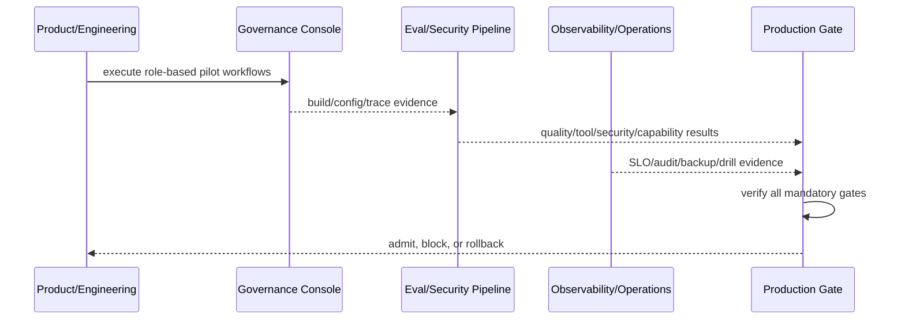

# M4：治理控制台、评测、审计与生产运营

## 1. 目标与非目标

M4 交付各角色可用的治理控制台、Agent 四层评测/红队、完整可导出审计、SLO/备份恢复/降级 Runbook 及 2–5 仓库试点准入。非目标：绕过 GitLab 人工合并、以试点通过承诺大规模 SaaS，或用单次 demo 取代重复评测与演练。

## 2. 参与者、角色、权限和信任边界

`product_owner` 负责试点验收；`technical_lead` 负责控制台/平台；`qa_owner` 负责功能与 Agent 评测；`security_owner` 负责红队/审计/应急；`operations_owner` 负责 SLO/恢复/Runbook；试点用户按实际角色参与。浏览器、Telemetry、Audit Store、Backup Store 与生产依赖隔离。

## 3. 触发条件、输入和前置条件

必须通过 M3 Exit Gate。输入包括角色任务清单、八个端到端场景、golden set/红队集、生产容量/SLI、备份目标、演练脚本和 Go/TypeScript 试点仓库。准入前确认 owner/on-call、数据保留、事件沟通和紧急停机权限。

## 4. 正常交互及时序图

八组详细业务时序的唯一真源为 [Web Dashboard §4](../prd/web-dashboard.md#4-正常交互及时序图)。

## 5. 失败、取消、超时、重试、恢复和用户提示

控制台覆盖 loading/empty/error/stale/offline/permission/conflict；评测失败保留 trial，不能挑结果；演练中止执行止损/清理；试点严重问题暂停扩面。只有同 build/config/profile 的基础设施错误可重试。用户与 on-call 看到影响、证据、owner、下一动作和恢复验证，不显示假绿。

## 6. 状态机、规则和不可变式

| 任务 ID | 依赖 | 权威文档 | 代码子系统 | 必需输出 |
| --- | --- | --- | --- | --- |
| `M4-UI-001` | M3 | [Web Dashboard](../prd/web-dashboard.md) | web app、event stream、operation API | 角色 IA、八场景、HITL/冲突/错误/a11y |
| `M4-EVAL-001` | UI/Agent | [agent eval](../testing/agent-evaluation-redteam.md) | eval harness/datasets/judges/report | 质量/轨迹/安全/能力四层评测 |
| `M4-OBS-001` | M1..M3 | [observability](../operations/observability-and-audit.md) | logs/metrics/traces/audit/export | 脱敏 telemetry 与只追加审计链 |
| `M4-REL-001` | OBS | [reliability](../operations/reliability-and-recovery.md) | SLO、backup/WAL、restore/degrade | 99.5%、RPO/RTO、恢复 Evidence |
| `M4-RBK-001` | OBS, REL | [Runner 离线](../operations/runbooks/runner-offline.md)、[Webhook/Pipeline](../operations/runbooks/webhook-pipeline-failure.md)、[数据库恢复](../operations/runbooks/database-backup-restore.md)、[紧急停止](../operations/runbooks/emergency-stop-credential-revoke.md) | runbook automation/on-call tooling | 四类 Runbook 与演练记录 |
| `M4-PILOT-001` | UI..RBK | [pilot acceptance](../testing/pilot-acceptance.md) | rollout flags/pilot telemetry | 影子、灰度、人工验收/准入报告 |

生产只能由全部 Mandatory Gate 聚合产生，单角色不能手工改绿。

## 7. 字段、配置和格式校验

### 细分实施清单

- `M4-UI-001`：角色首页/导航；项目/Runner/任务/缺陷/MR/Pipeline/Evidence/策略/审计/运维页；审批/重试/暂停/取消/撤销/豁免；影响+diff+可回滚；版本冲突/断线；Agent 计划/Tool/预算/停止/接管；WCAG AA。
- `M4-EVAL-001`：版本化 golden set；重复 trials 与 pass^k；输出质量、Tool trajectory、安全、能力；独立人评与校准 LLM judge；直接/间接注入、越权、外泄、逃逸、耗尽；固定 model/config/dataset/build。
- `M4-OBS-001`：结构化 log/metric/trace correlation；审计含 actor/role/team-project/action/resource/decision/reason/correlation/IP/device-token hash；覆盖登录/deny/角色/策略/Secret/Runner/Task/Gate/waiver/replay/MR-Pipeline；源码/Secret 禁日志；30d 轨迹、365d 安全审计、每日独立导出。
- `M4-REL-001`：availability/latency/webhook/queue/runner/DB SLI；月 99.5%、API P95<500ms、Webhook P95<2s；每日全备+WAL、RPO15m/RTO4h、季度恢复；只重试幂等操作+指数退避/jitter；依赖降级矩阵。
- `M4-RBK-001`：Runner offline、Webhook/Pipeline failure、DB backup/restore、emergency stop/revoke；每份含 trigger/impact/contain/diagnose/recover/validate/communicate/postmortem/drill frequency；指定 on-call/权限/证据。
- `M4-PILOT-001`：2–5 Go/TS 仓库分层选样；shadow→read-only→limited write→project opt-in；成功/失败/成本/人工负担基线；退出/回滚阈值；用户培训和签署。

评测分数、SLO、保留期和试点结论必须带版本/窗口/样本/单位，不接受自由文本“通过”。

## 8. 并发、幂等和一致性

UI/OBS 可先并行，EVAL 依赖稳定 Agent/轨迹，REL/RBK 依赖观测，PILOT 最后。操作 API 用幂等键/expected version；审计/telemetry 事件 ID 去重且审计只追加；评测 trial 不覆盖；备份/恢复/演练单实例加锁；试点 flags project-scoped。

## 9. 安全、Secret、隐私和审计

验证浏览器 Cookie/CSRF/CSP/Origin、敏感下载、审计访问、Telemetry 脱敏/保留/加密、Backup 访问/恢复、emergency credential revoke。Critical/High 为零；审计缺口或无法导出阻断生产。试点使用最小真实权限且禁止测试 Secret 进入模型。

## 10. 质量门禁、证据与 fail-closed 规则

### 每任务 DoD

实现/Schema/迁移/测试/指标/审计/Runbook/追踪完成；UI 各角色与状态通过自动+人工走查；Eval 可重复并保留原始 trial；Audit 完整性抽样/导出通过；恢复/安全演练在目标 VM；Pilot 有基线、反馈、issue 与签署。

### Production Admission Gate

- 功能、权限隔离、质量与 Agent 评测 Gate 全通过。
- Critical/High 安全问题为零。
- 备份恢复、Runner compromise、GitLab 中断、DLQ replay 演练通过。
- 审计链完整、只追加、可导出。
- 2–5 个 Go/TypeScript 仓库影子运行与人工验收通过。

## 11. 指标、SLO、告警和运维动作

控制台性能/错误/冲突/接管，Agent pass^k/轨迹/安全/成本，审计 completeness/export lag，availability/latency/error budget，backup age/restore，Runbook MTTA/MTTR，Pilot success/rollback/user burden。错误预算耗尽暂停扩张性发布；安全/审计/恢复硬门禁失败立即停止准入。

## 12. 验收测试和需求追踪

至少关联 `TC-UI-001..006`、`TC-AGT-001..005`、`TC-NFR-001..005` 及 testing/operations 文档新增测试 ID。五类 owner 分域签署，最终 product owner 只在技术 Gate 完整后做业务验收。Production report 必须列每个 Gate/Evidence/commit/expiry。

## 13. 数据迁移、兼容、发布与回滚

上线采用 shadow → internal → 2 projects → 2–5 projects；写能力按项目 flag，Agent 自动触发独立 kill switch。回滚触发：权限/审计缺口、Critical/High、SLO/error budget、数据错误、Agent 越权/预算失控、恢复失败；立即关自动化/远程写、撤销 Runner/凭据、保留审计/Evidence/MR，按 Runbook 恢复。回滚不能删除失败 trial、降低 Gate 或自动关闭 Defect。
