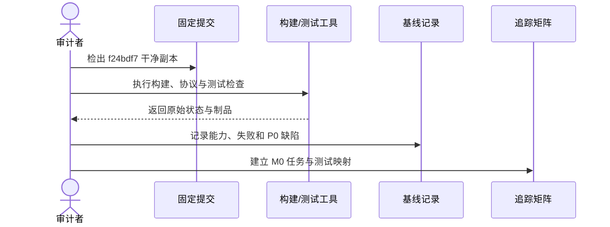

# 当前实现基线

## 1. 目标与非目标

基线提交为 `f24bdf7`。审计覆盖 Go 服务、SQLite Store、MCP 注册、REST、Web、Playwright、构建文件和 v2.1 文档。此基线用于 M0 排期，不代表生产验收。

本文目标是冻结已观察到的能力、失败证据和 P0 缺陷，防止后续计划把设计误报为实现。本文不定义 v3 目标行为，不替代领域设计，也不证明当前服务可运行、可部署或安全。

## 2. 参与者、角色、权限和信任边界

- `technical_lead` 维护审计结论，`qa_owner` 与 `security_owner` 分别复核测试和安全判断。
- 开发者可以提供补充证据，但不得直接把 `failed/unverified` 改为 `passed`；批准者必须核对可重复运行的制品。
- 被审计代码、旧文档、测试输出和本地生成文件均是不受信任输入，只能形成观察结论，不能扩大运行时权限。
- 此基线不授予远程写、匿名访问、任意命令、保护分支推送或合并权限。

## 3. 触发条件、输入和前置条件

M0 规划、P0 缺陷关闭、实现状态声明或基线复核时 MUST 查阅本文。输入包括固定提交 `f24bdf7`、干净 clone、锁定工具链、构建/测试命令和原始输出；缺少任一关键输入时验证结果保持 `unverified` 或 `failed`。

## 4. 正常交互及时序图

### 4.1 基线审计流程

### 4.2 能力状态

| 能力 | 设计 | 实现 | 验证 | 结论 |
| --- | --- | --- | --- | --- |
| Feature/Task/依赖 | 有 | 部分 | 组件测试 | 可复用概念 |
| 可执行服务入口 | 有描述 | 缺失 | 失败 | 阻断 |
| MCP Transport | 有注册 | 未装配 | 失败 | 阻断 |
| 干净构建 | 有描述 | 不完整 | 失败 | 阻断 |
| 项目隔离/RBAC | 文档声称 | 未实现 | 失败 | 阻断 |
| fail-closed 验证 | 文档声称 | 多处绕过 | 失败 | 阻断 |
| GitLab 集成 | 缺失 | 缺失 | 未验证 | 阻断 |
| 前后端联调 | 概念 | 简化解析 | 未验证 | 不满足 |
| Defect/TestIssue | 缺失 | 缺失 | 未验证 | 不满足 |
| 生产运维 | 草案 | 不可部署 | 失败 | 不满足 |

### 4.3 已执行证据

- 干净归档执行 `go test ./...`：因 `web/dist` 不存在而失败。
- `make build`：因 `cmd/maestro` 不存在而失败。
- 生成本地 `web/dist` 后，`go test`、`go vet`、`go build` 和内部 race 测试通过，但没有 main 包或服务产物。
- Go 总体覆盖率约 17.4%；Handler、MCP、WS 和 Web 为 0%。
- Playwright 可枚举普通套件 100 项、真实场景 71 项，实际运行因入口缺失失败。

## 5. 失败、取消、超时、重试、恢复和用户提示

### 5.1 P0 缺陷基线

1. 缺少生产依赖装配和 Transport。
2. SQLite 单连接事务内重复 DB 查询导致提交成功路径存在等待风险。
3. 默认 MCP Session 未创建即写外键。
4. Session 全局主键无法保证多项目隔离。
5. Git、worktree、coverage 和提交处理存在 fail-open。
6. 测试命令可以触发宿主进程执行，缺少沙箱和 Profile。
7. stale Session 清理可能把任务恢复为旧状态。
8. 本地 merge 绕过远端 SHA、Pipeline、审批和保护分支。
9. E2E 使用 REST equivalent 冒充 MCP，存在提前返回假通过。

构建、测试、协议握手或恢复检查失败时 MUST 保留原始错误并显示阻断项，不得提前返回成功。审计任务可以取消；取消、超时或工具不可用均不得改变既有失败结论。重试必须从固定提交的干净副本开始；若污染工作区或工具版本变化，应废弃该次结果并恢复环境后重跑。

## 6. 状态机、规则和不可变式

- 能力状态只允许根据可复现实测证据从“缺失/失败/未验证”更新；计划、文档描述和 mock 不构成实现证据。
- 本文件记录 `f24bdf7` 的历史事实，后续修复不得覆盖或重写这些事实。
- `failed` 不得自动降级为 `unverified` 或升级为 `passed`；只有在新提交执行指定测试后才能在阶段任务书和追踪矩阵记录新结论。
- REST equivalent 永远不能替代 MCP Transport 测试，本地 Evidence 永远不能替代 GitLab CI 合并 Evidence。

## 7. 字段、配置和格式校验

- 基线提交必须是 40 位 Git commit SHA，当前值为 `f24bdf7` 的短展示；可验证记录应解析到其完整 SHA。
- 每条能力记录必须给出设计、实现、验证和结论四列；缺失值使用“未验证”，不得留空或写“通过”。
- 测试命令、工具版本、退出码、日志摘要和制品 digest SHOULD 随验证记录保存。
- 状态字段必须使用文档治理允许的枚举；测试 ID 必须符合 `TC-<DOMAIN>-NNN`。

## 8. 并发、幂等和一致性

同一提交的并行审计可以独立执行，但汇总时 MUST 按提交、工具版本和环境指纹去重。重复运行不得覆盖原始失败制品；结果冲突时保持 fail-closed，并由独立审计者在干净环境复现。基线记录与追踪矩阵更新应在同一文档 MR 中完成，避免部分可见。

## 9. 安全、Secret、隐私和审计

审计输出 MUST 脱敏，不得记录 Token、Cookie、私钥、真实 Secret、完整环境变量或业务源码。执行测试不得开放宿主任意命令、Docker Socket、SSH/云凭据或真实 HOME。审计者、提交、命令、时间、退出码和结论必须可追溯；任何人工更改结论都需要批准记录。

## 10. 质量门禁、证据与 fail-closed 规则

`GATE-M0-001`：在所有阻断项关闭并由自动化证据验证前，不允许进入团队试点。

`GATE-M0-002`：M0 期间远程写能力必须默认关闭，非健康端点不得匿名访问。

缺失产物、命令未执行、解析错误、退出码异常、测试提前返回或证据不绑定目标提交时，结论 MUST 为失败或未验证。当前基线的 MCP、干净构建、权限隔离、fail-closed 验证、GitLab 和生产运维均未满足，不得豁免。

## 11. 指标、SLO、告警和运维动作

当前可量化基线为 Go 总体覆盖率约 17.4%，Handler、MCP、WS 和 Web 覆盖率为 0%；Playwright 可枚举 100 项普通套件和 71 项真实场景，但因入口缺失未形成通过证据。本文不声明生产 SLO。任一 P0 仍开放、覆盖率证据回退或 smoke test 失败时应在 M0 看板告警，并保持试点关闭。

## 12. 验收测试和需求追踪

- `TC-M0-CLEAN-001`：干净 clone 执行约定的一条命令完成 Web、Go、Docker 构建并启动服务。
- `TC-M0-MCP-001`：使用真实 binary 验证 MCP `initialize` 与 `tools/list`，不得用 REST 替代。
- `TC-M0-E2E-001`：成功、失败、Session 清理和重启恢复路径均产生可核验结果。
- P0 缺陷必须映射到 M0 Stage Task、Requirement/Rule、代码子系统、测试和 CI/Runtime Evidence；验证前 `Verified Commit` 保持空值。

## 13. 数据迁移、兼容、发布与回滚

每个 M0 缺陷关闭后更新追踪矩阵，不修改本文件中的历史证据；新的实测结果写入阶段任务书和 CI 产物。

从 SQLite 原型到 v3 PostgreSQL、从未装配 MCP 到稳定 Transport、从本地 merge 到 GitLab 人工合并均属于后续阶段迁移，不是当前能力。发布 M0 前 MUST 保留远程写默认关闭的回滚开关；发生回归时回滚实现和状态声明，但不得删除本基线或把 v2.1 恢复为权威规范。
