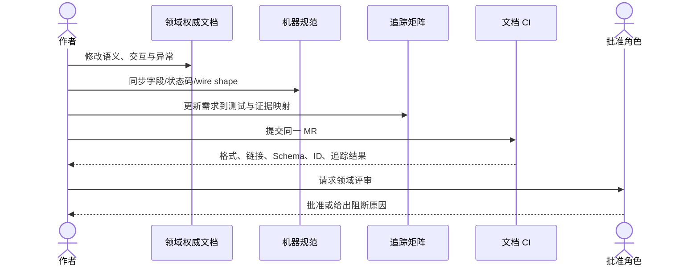

# 文档治理规则

## 1. 目标与非目标

`DOC-REQ-001`：v3.0 的每个阶段任务、需求、规则、设计、机器契约、迁移、权限、审计、测试和 Evidence MUST 通过唯一 ID 与追踪矩阵形成可验证链路。

本文定义文档生命周期、权威边界、需求编号、评审和 CI 门禁；不定义业务规则或具体接口字段。

## 2. 参与者、角色、权限和信任边界

| 文档 | Owner/必需批准角色 |
| --- | --- |
| PRD | product_owner、technical_lead |
| 安全/RBAC/Secret | security_owner、technical_lead |
| Gate/测试 | qa_owner、technical_lead |
| 运维/SLO | operations_owner、technical_lead |
| ADR/机器规范 | technical_lead、受影响领域 Owner |

申请人与批准人不得是同一主体。实际 GitLab CODEOWNERS 组在团队接入时绑定上述角色。作者只能修改其授权范围内的文档；批准角色负责领域语义，CI 负责格式和追踪的确定性判断。归档、外部链接、生成式输出和示例是不受信任输入，不得覆盖当前权威规则。

## 3. 触发条件、输入和前置条件

新建或修改需求、规则、状态机、权限、接口、Schema、Gate、测试、事件、迁移或阶段任务时 MUST 应用本文。变更前置输入至少包括唯一 `doc_id`、Stage Task ID、Requirement/Rule ID、受影响 ADR/规范、批准角色和计划验证 Test ID；缺失时文档保持 `draft` 或 `review`，不得进入批准。

## 4. 正常交互及时序图



### 4.1 权威边界

- PRD 只定义“做什么、谁能做、用户看到什么”。
- Security/Quality 定义不可被项目配置降低的约束。
- Technical 定义实现、事务、状态和恢复方法。
- `specs/` 定义精确字段、枚举、状态码和消息格式。
- Delivery 仅组织任务，不复制领域规则。
- 测试文档定义如何证明，不得放宽需求。

字段冲突时机器规范优先；语义冲突时对应领域权威文档优先；无法确定唯一权威时 MUST 阻断并由 `technical_lead` 协调解决。

## 5. 失败、取消、超时、重试、恢复和用户提示

- CI、链接、Schema 或评审失败时 MUST 显示文件、规则 ID 和可执行修复建议，不得生成“部分通过”结论。
- 评审取消或超时保持原状态；不得因无人响应自动批准。修复后可以对同一提交重试，内容或工具版本变化后必须重新运行全部受影响检查。
- 合并后发现断裂追踪、错误权限或安全降级时，应立即将相关验证置为 `failed/unverified`，阻断后续发布并通过修复 MR 恢复。
- 外部工具暂时不可用只允许重试；不得跳过本地元数据、ID、机器规范或归档引用检查。

## 6. 状态机、规则和不可变式

`spec_status`：`draft → review → approved → superseded`。

`implementation_status`：`not_started → partial → implemented`。

`verification_status`：`unverified → failed | passed`；任何代码或规范变化都会把相关文档重新置为 `unverified`。

完成条件必须同时满足：

1. 规范已批准。
2. 追踪矩阵存在完整映射。
3. 实现已合并。
4. 指定测试在当前提交通过。
5. `last_verified_commit` 指向包含该实现和测试的提交。

需求 ID 一旦发布不得复用或重编号；废弃项标记 `deprecated` 并保留追踪记录。无论环境是否降级，默认拒绝、身份范围不可由请求覆盖、无 Evidence 不通过、最终由人合并和所有状态变化可审计等全局不变量不得削弱。

## 7. 字段、配置和格式校验

每份 metadata-bearing 权威 Markdown MUST 包含以下字段，且不得用空白字段伪装完整：

```yaml
doc_id:
spec_version: 3.0
spec_status: draft | review | approved | superseded
implementation_status: not_started | partial | implemented
verification_status: unverified | failed | passed
owner_role:
approver_roles:
introduced_in: M0 | M1 | M2 | M3 | M4
authority_for:
related_adrs:
related_specs:
related_tests:
last_verified_commit:
```

### 7.1 需求与规则编号

| 类型 | 格式 | 示例 |
| --- | --- | --- |
| 需求 | `<DOMAIN>-REQ-NNN` | `AUTH-REQ-001` |
| 规则 | `<DOMAIN>-RULE-NNN` | `QG-RULE-004` |
| 阶段任务 | `M<0-4>-<DOMAIN>-NNN` | `M2-GL-001` |
| Gate | `GATE-M<0-4>-NNN` | `GATE-M2-004` |
| 测试 | `TC-<DOMAIN>-NNN` | `TC-RBAC-007` |
| 事件 | `EVT-<DOMAIN>-NNN` | `EVT-GL-003` |

### 7.2 固定章节

每份领域权威文档必须按顺序包含以下 13 章；无适用内容时写明“不适用及理由”，不得删除章节：

1. 目标与非目标。
2. 参与者、角色、权限和信任边界。
3. 触发条件、输入和前置条件。
4. 正常交互及时序图。
5. 失败、取消、超时、重试、恢复和用户提示。
6. 状态机、规则和不可变式。
7. 字段、配置和格式校验。
8. 并发、幂等和一致性。
9. 安全、Secret、隐私和审计。
10. 质量门禁、证据与 fail-closed 规则。
11. 指标、SLO、告警和运维动作。
12. 验收测试和需求追踪。
13. 数据迁移、兼容、发布与回滚。

## 8. 并发、幂等和一致性

- `doc_id`、Requirement ID、Rule/Gate ID、Test ID 和 Event ID 在 v3 命名空间内全局唯一；CI 必须确定性拒绝重复定义。
- 并发 MR 修改同一规则时，后合并者 MUST rebase 并重新执行评审与追踪检查；禁止 last-write-wins 静默覆盖。
- 同一提交重复执行文档 CI MUST 产生一致结论；工具、配置或外部依赖变化必须记录版本并重新验证。
- 权威文档、规范、迁移、追踪和测试变更应原子地在一个 MR 合并；无法原子合并时保持 fail-closed 状态。

## 9. 安全、Secret、隐私和审计

文档和示例 MUST 使用伪造/脱敏数据，禁止提交 Token、Cookie、私钥、Webhook Secret、云凭据、真实用户标识和不必要的源码。权限、安全、Gate、豁免和审计语义变化必须记录 actor、批准人、MR、提交和理由。仅 GitLab 受保护审计记录或批准的归档介质可作为治理审计证据。

## 10. 质量门禁、证据与 fail-closed 规则

### 10.1 CI 门禁

`DOC-RULE-001`：Markdown、链接、Mermaid、OpenAPI、AsyncAPI、JSON Schema 和 YAML 必须通过校验。

`DOC-RULE-002`：不得出现重复 ID、缺失元数据、断裂追踪或权威文档指向归档文档。

`DOC-RULE-003`：接口、状态机、权限、Gate 或事件变化而未更新追踪矩阵时必须阻断 MR。

`DOC-RULE-004`：归档文件不得被修改，除非修复归档索引或法律合规问题。

执行入口为 [Documentation workflow](../../.github/workflows/docs.yml)：`markdownlint-cli2` 使用 [Markdown 配置](../../.markdownlint-cli2.yaml)，Lychee 使用 [外链配置](../../.lychee.toml)，OpenAPI/AsyncAPI 使用 [Spectral ruleset](../../.spectral.yaml)，元数据/ID/追踪/本地链接由 [docs-check](../../scripts/docs-check.rb) 校验，JSON Schema/示例由 [schema-check](../../scripts/schema-check.rb) 调用 AJV，API/MCP/RBAC 不变量由 [spec-consistency-check](../../scripts/spec-consistency-check.rb) 校验，83 组 Mermaid 代码块由 [mermaid-check](../../scripts/mermaid-check.mjs) 解析，AsyncAPI 3.0 再由 [asyncapi-check](../../scripts/asyncapi-check.mjs) 解析。工具版本 MUST 在 workflow 中固定；升级工具必须重新验证全部文档。

匿名 `livez/readyz` 不伪造无语义的 4xx 响应；Redocly 的通用 4xx 规则可对这两个健康探针保留已知 warning，但任何 OpenAPI error 仍阻断。AsyncAPI 基线锁定 3.0.0，版本升级提示不是错误；升级到 3.1 必须新 ADR/兼容评审。

只有与目标提交绑定的 CI 结果可作为 `passed` Evidence；`missing/skipped/error/stale/unverified` 均阻断。文档 Gate 不允许通过手工文字、截图或旧提交结果绕过。

## 11. 指标、SLO、告警和运维动作

治理指标包括 front matter 完整率、固定章节完整率、重复 ID 数、断链数、追踪缺口数、过期 `last_verified_commit` 数、文档 CI 通过率和评审时长。合并目标为完整率 100%、缺陷数 0；任何硬门禁失败必须由 CI 告警并阻断。工具故障持续时由文档 Owner 和平台维护者处理，运行时 SLO 仍由运维权威文档定义。

## 12. 验收测试和需求追踪

- `TC-DOC-001`：所有权威 Markdown 均具有完整 front matter 和固定 13 章。
- `TC-DOC-002`：每个阶段任务至少映射一个需求/规则、设计、权限/审计、测试和证据。
- `TC-DOC-003`：归档链接检查通过且新文档无权威引用指向归档。

追踪矩阵 MUST 覆盖 Stage Task、Requirement、Rule/Gate、ADR、PRD、Technical、API/Schema/Event、Migration、Code、Permission、Audit、Test、Evidence 和状态；缺失必填映射时不得宣称实现或验证完成。

## 13. 数据迁移、兼容、发布与回滚

v2.1 保存在 `archive/v2.1/`。v3.0 采用破坏性规范升级，不维持可伪造身份的旧接口。若 v3 文档变更需要回滚，只能回滚至上一个已批准 v3 规范，不得重新启用 v2.1 为权威真源。

发布顺序 MUST 为规范与 ADR、机器规范、追踪矩阵、实现、测试证据和状态更新。破坏性变化必须给出迁移步骤、兼容窗口（若有）、回滚目标和数据校验；回滚后相关 `implementation_status` 与 `verification_status` 必须反映实际状态，不得保留虚假的通过标记。
