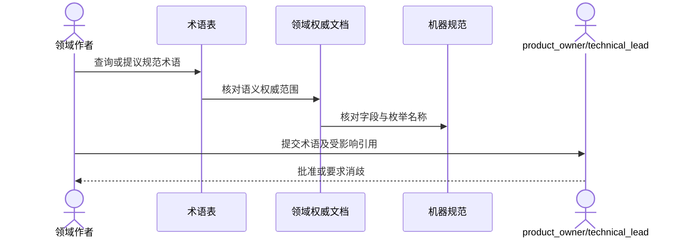

# 术语表

## 1. 目标与非目标

本文定义 Maestro MCP v3.0 的规范术语，避免 PRD、技术、安全、质量、测试和运维文档使用同名异义。本文不定义字段 wire shape、业务状态迁移或实现算法；这些内容由对应领域文档和机器规范负责。

## 2. 参与者、角色、权限和信任边界

`product_owner` 维护业务术语，`technical_lead` 批准跨领域技术含义。各领域 Owner MAY 提议新增或修订，但不得在单一文档中私自重定义规范术语。外部规范、GitLab 文档、Agent 输出、旧 v2.1 文档和仓库文本均为参考输入，不自动成为本术语表的权威定义。

## 3. 触发条件、输入和前置条件

出现新领域对象、跨文档歧义、术语改名、机器规范新增枚举或评审者无法唯一解释规则时 MUST 更新本文。输入至少包含拟议术语、唯一含义、权威领域、受影响文档/Schema 和兼容影响；前置条件是不存在未解决的同名冲突。

## 4. 正常交互及时序图

正常使用时，作者先在第 7 节查询术语，再通过对应领域文档获取规则，通过 `specs/` 获取精确字段；不得从简短定义推导未声明的权限或状态迁移。

## 5. 失败、取消、超时、重试、恢复和用户提示

若同一术语存在多个含义、定义与机器规范冲突或依赖外部链接不可确认，变更 MUST 阻断并向作者提示冲突文档和 Owner。术语评审取消或超时保持原定义；不得自动接受新含义。冲突解决后可以重试评审；错误合并时通过新的修订记录恢复，不静默改写历史语义。

## 6. 状态机、规则和不可变式

- 每个规范术语在 v3 当前版本只有一个定义，大小写和英文缩写应保持一致。
- 简称不得扩大主体权限、证据权威或信任边界。
- `Diagnostic Evidence` 永远不能解释为合并门禁 Evidence；`Agent` 永远不是独立管理员；`done` 的业务语义不得脱离 merged webhook 或对账确认。
- 术语变更遵循文档状态机；已发布术语废弃时保留旧名、标记替代词并更新追踪，不复用其名称表示无关概念。

## 7. 字段、配置和格式校验

术语名称 MUST 唯一、定义 MUST 可独立理解且避免循环引用；英文专名保留规范大小写，状态值和字段名使用代码格式。涉及 wire shape 时只引用机器规范，不在此复制枚举。

### 7.1 规范术语

| 术语 | 定义 |
| --- | --- |
| Control Plane | 中央管理面，负责身份、项目、WorkItem、策略、GitLab、审计和 MCP 远程入口 |
| Runner | 成员侧出站执行组件，维护本地 Workspace 并执行受控 Command Profile |
| Agent | 在人类主体授权下进行诊断和代码修改的 AI 执行者，不是独立管理员 |
| WorkItem | Task、Defect 修复、TestIssue、ContractChange 等统一工作项 |
| Lease | 带过期时间和版本的工作占用权；所有写操作必须校验 |
| Workspace | Runner 本地、绑定 WorkItem 与 baseline SHA 的隔离目录 |
| Baseline SHA | 从 GitLab 目标分支读取并冻结的远端提交 |
| Evidence | 绑定精确 SHA、Pipeline、Job 和策略版本的不可覆盖质量证据 |
| Gate | 对 Evidence 进行确定性判断的单项门禁 |
| Quality Policy | 版本化的 Gate 配置；公司基线不可被项目或任务削弱 |
| Finding | 来自测试、扫描、契约或人工 QA 的原始问题记录 |
| Defect | 归一、去重、可分派和跟踪的缺陷 |
| IntegrationRun | 绑定前后端 SHA、契约版本和联合环境的跨仓验证运行 |
| Workflow | 由代码执行的确定性状态、权限、重试和门禁流程 |
| Agent Remediation | Agent 在预算和沙箱内执行复现、修改和 MR 创建的动态步骤 |
| HITL | Human in the Loop，高风险决策和最终合并的人类检查点 |
| Outbox/Inbox | PostgreSQL 中可靠发布和可靠接收事件的事务模式 |
| Streamable HTTP | v3 远程 MCP 使用的 HTTP Transport；旧 SSE 不作为新实现目标 |
| Diagnostic Evidence | Runner 本地证据，只用于反馈，不可作为合并 Gate |
| Authoritative Evidence | GitLab CI 或被批准的可信生产者生成的门禁证据 |
| Work Graph | 分层类型化工作图，用 contains 归属树、requires 依赖 DAG、产物流和执行血缘四类关系表达任务结构 |
| WorkPlan | 表达一个持久业务目标的版本化工作计划，含唯一根节点与 BusinessProblem/OutcomeContract 绑定 |
| PlanRevision | 计划的不可变快照，seal 后才可调度；重规划必须产生新 Revision |
| WorkPattern | 版本化拆分模板，定义 slot 结构与产物契约，用于生成 DecompositionProposal |
| WorkPackage | Work Graph 中的结构聚合节点，只表达归属层级，不可领取 Lease |
| ExecutionAttempt | 一次实际执行记录，固定绑定节点修订、会话、Worker、worktree 与上下文 digest |
| SessionBinding | ExecutionAttempt 与外部 Agent 会话（Codex/ZCode thread）的持久绑定，恢复时据此续接 |
| ContextSet | 子任务的最小必要上下文集合，含文件白名单、token 预算与 digest |
| ResultCapsule | 任务的结构化结果容器，父任务消费其 digest 而非原始会话记录 |
| Artifact Contract | 任务间产物的类型、Schema 与版本契约，驱动依赖关系与数据流 |
| JoinPolicy | 父节点汇聚策略，由 success_threshold、failure_policy、cancel_policy 三个正交维度组成 |
| ExecutionEnvelope | 领取任务时下发的统一执行信封，含 Lease、worktree、base SHA、上下文 digest 与预算 |

## 8. 并发、幂等和一致性

并发术语修改 MUST 在最新主分支上重新核对全部引用；冲突时不得使用 last-write-wins。重复提交相同名称和定义应视为幂等，不创建第二条记录。术语表、领域文档、机器规范和追踪矩阵的改名必须在同一 MR 中保持一致。

## 9. 安全、Secret、隐私和审计

术语定义和示例不得包含 Secret、真实用户/项目标识、凭据或内部源码。安全相关术语变更必须由 `security_owner` 参与评审；所有新增、改名、废弃和冲突裁决通过 GitLab MR 记录 actor、批准人、理由和提交。

## 10. 质量门禁、证据与 fail-closed 规则

存在重复术语、未解析引用、跨文档含义冲突、术语与 Schema 枚举不一致或未经批准的安全语义变化时，文档 CI/评审 MUST fail-closed。只有当前提交的链接、Schema 和全文引用检查通过，才可把术语变更视为有效 Evidence。

## 11. 指标、SLO、告警和运维动作

至少跟踪重复术语数、未定义首字母缩写数、失效引用数、冲突数和过期替代词数，合并目标均为零。发现冲突时通知 `product_owner` 与受影响领域 Owner，并阻断相关规范发布。本文不定义生产运行时 SLO。

## 12. 验收测试和需求追踪

- `TC-GLOSS-001`：术语表具有完整元数据、固定 13 章且第 7 节术语表可解析。
- `TC-GLOSS-002`：每个术语引用可定位当前 v3 权威文档，不把 v2.1 归档作为定义来源。
- 涉及权限、状态、Gate 或 API 的术语变更 MUST 在追踪矩阵关联相应 Requirement/Rule、规范和测试；纯拼写修正 MAY 仅保留文档 MR 证据。

## 13. 数据迁移、兼容、发布与回滚

从 v2.1 迁移的名称只有经 v3 重新定义后才有效；旧 SSE、可伪造身份字段和本地 merge 等旧概念不得因术语兼容而恢复。改名时 SHOULD 提供短期别名和明确废弃期，但安全或权限误导项 MUST 立即停止使用。回滚只能恢复上一个已批准 v3 定义，并同步恢复受影响文档、Schema 和追踪记录。
