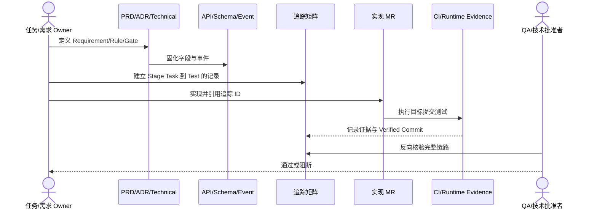

# 需求追踪指南

## 1. 目标与非目标

本文定义 v3.0 从阶段任务到运行证据的追踪方法，保证实现、权限、审计、测试和发布结论可以反向核验。本文不定义具体业务需求、代码实现或 Gate 阈值，也不以填写矩阵替代实际测试。

每个阶段工作包必须形成完整链路：

`Stage Task → Requirement/Rule/Gate → ADR/PRD → Technical → API/Schema/Event → Migration → Code → Permission/Audit → Test → Evidence`。

任何一段为空时，任务不得进入 `verified`。

## 2. 参与者、角色、权限和信任边界

- `qa_owner` 维护追踪规则，`technical_lead` 批准跨层映射和完成结论。
- 需求 Owner 负责 Requirement/Rule，技术 Owner 负责设计与代码子系统，安全/权限 Owner 负责 Permission/Audit，测试 Owner 负责 Test/Evidence。
- 作者可以填写和修正记录，但不得自证其实现或人工构造通过证据；批准人必须与申请人分离。
- MR 描述、Agent 输出、外部 Issue 和 v2.1 归档是不受信任输入，只有当前 v3 权威文档、机器规范、合并代码和绑定提交的测试制品可形成权威链路。

## 3. 触发条件、输入和前置条件

创建阶段任务、需求或规则，修改接口/状态/权限/Gate/事件，提交实现 MR，执行数据迁移，生成验证证据或宣告阶段完成时 MUST 新建或更新追踪记录。输入至少包含唯一 Stage Task ID、Requirement/Rule/Gate ID、权威文档、代码子系统、Permission、Audit Event、Test ID 和目标提交；未知项必须明确标为待定，不能用“同上”或推测值填充。

## 4. 正常交互及时序图

### 4.1 实现 MR 模板要求

每个 MR 描述必须包含：

1. Stage Task ID。
2. Requirement/Rule/Gate ID。
3. API、事件或 Schema 变更。
4. 权限和审计影响。
5. 数据迁移和回滚。
6. Test ID 与证据链接。
7. 文档状态更新。

## 5. 失败、取消、超时、重试、恢复和用户提示

缺失映射、ID 冲突、证据不可访问、测试超时、工具解析错误或 Verified Commit 不匹配时 MUST 阻断，并在 MR 中显示缺失列、记录标识和修复要求。追踪评审取消保持原状态；重试必须使用同一或更新后的目标提交重新验证。证据存储恢复后需校验 digest 和提交绑定，不能只恢复链接文字。

## 6. 状态机、规则和不可变式

- 追踪记录随阶段任务经历 `planned → documented → implemented → verified`；只有完整权威链和当前提交证据才允许进入 `verified`。
- 需求范围变化时新增或废弃记录，不覆盖历史结论；已使用 ID 不得复用。
- `Implementation Status` 与 `Verification Status` 独立，代码合并不自动表示验证通过。
- 身份隔离、SHA 一致性、策略完整性、Webhook 真实性和最终人工合并等不可变规则必须能够从 Gate 追踪到测试与证据。

## 7. 字段、配置和格式校验

`traceability-matrix.csv` 固定列为：Stage Task ID、Requirement ID、Rule/Gate ID、ADR、PRD、Technical Design、API/Schema/Event、Data Migration、Code Subsystem、Permission、Audit Event、Test ID、CI/Runtime Evidence、Implementation Status、Verification Status、Verified Commit。

### 7.1 填写规则

- 多个值使用分号分隔，不使用含义不明的“同上”。
- `Code Subsystem` 写包或组件，不写尚未确定的行号。
- `CI/Runtime Evidence` 写稳定的 Job、报告或制品名称。
- `Verified Commit` 只在测试已通过后填写。
- 需求范围变化时新增或废弃记录，不覆盖历史结论。

ID、状态和提交格式 MUST 通过自动校验；路径必须指向当前 v3 权威文件。未实现记录的 Evidence 与 Verified Commit 应为空，不能以 `N/A` 隐藏本应存在的测试或权限映射。

## 8. 并发、幂等和一致性

- 同一 Stage Task/Requirement/Rule 组合只能有一个当前记录；重复导入应按稳定键幂等更新，不生成冲突结论。
- 并发 MR 修改同一记录时，后合并者 MUST 基于最新矩阵重新核对；CSV 冲突不得用 last-write-wins 解决。
- 权威文档、规范、迁移、实现和矩阵状态必须在同一提交或可验证的提交链中一致；部分合并保持未验证。
- CI 重跑不得覆盖先前失败证据；应保留 attempt 与制品 digest，并只把符合规则的最终结论绑定到目标提交。

## 9. 安全、Secret、隐私和审计

矩阵只保存标识、路径、稳定 Job/制品名称和 digest，不得存储 Token、Cookie、Secret、私钥、完整 Prompt、源码或含敏感查询参数的链接。权限决策、审计事件和豁免必须逐项追踪；对记录的新增、修改、验证和废弃通过 GitLab MR 保留 actor、批准人、理由和提交。

## 10. 质量门禁、证据与 fail-closed 规则

`GATE-DOC-TRACE`：缺失 Requirement、Technical Design、Test ID 或 Evidence 的实现 MR 必须阻断。

权限、审计、API/Schema/Event 或迁移适用却缺失时同样 MUST 阻断。`missing/skipped/error/stale/unverified` 证据均不得使记录进入 verified；截图、手工说明、REST equivalent MCP 或不绑定目标提交的结果不构成 Evidence。

## 11. 指标、SLO、告警和运维动作

至少跟踪阶段任务覆盖率、Requirement 到 Test 覆盖率、Permission/Audit 覆盖率、孤儿 ID 数、断链数、过期 Verified Commit 数和证据可访问率。阶段准入目标为必填追踪覆盖率 100%、孤儿和断链为 0；异常由文档 CI 告警并分派给对应 Owner。本文不定义生产 API SLO。

## 12. 验收测试和需求追踪

- `TC-TRACE-001`：每个 M0–M4 阶段任务至少具有 Requirement/Rule、权威设计、权限/审计、Test ID 和证据槽位。
- `TC-TRACE-002`：本指南与其引用文档具有完整元数据和固定章节。
- 自定义 docs-check MUST 检测重复 ID、必填空列、非法状态、过期提交、归档误引用和实现/验证状态矛盾。
- 追踪测试自身通过后，仅证明矩阵结构完整，不证明被追踪的运行时 Requirement 已实现。

## 13. 数据迁移、兼容、发布与回滚

v2.1 记录只作为历史输入；迁移到 v3 时必须分配 v3 ID 并指向当前权威文件，不得把归档路径作为实现依赖。CSV 列变更属于破坏性治理变更，必须提供转换脚本/步骤、备份、行数与 digest 校验及回滚方案。发布或回滚代码时同步更新 Implementation/Verification Status 和 Verified Commit，历史 Evidence 不删除，仅标记失效或 superseded。
