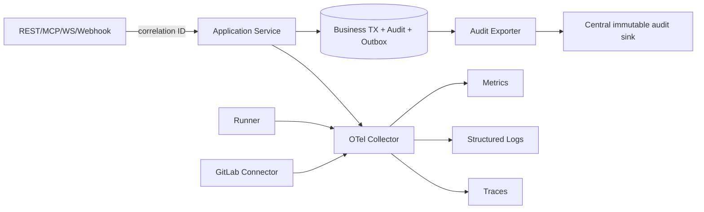

# 可观测性、审计与告警

> 本文定义 v3 目标遥测与审计要求。当前本地日志和可修改 SQLite audit 表不满足集中、完整和防篡改要求。

## 1. 目标与非目标

`OBS-REQ-001`：任何用户请求、Agent/Runner 执行、GitLab 事件、Gate 决策和恢复动作可通过 correlation/causation 链还原。`AUDIT-REQ-001`：安全和业务审计必须完整、只追加、独立保留且可检索。仅脱敏并加密后的 Prompt、输出和 Tool 轨迹可进入专用轨迹库；可观测性不记录 Secret、完整源码、原始未脱敏内容或模型私有思维链，也不以高基数原始标签替代结构化调查。

## 2. 参与者、角色、权限和信任边界

Control Plane、Runner、GitLab Connector、Inbox/Outbox Worker、Quality Engine 和 Web/MCP Edge 产生 Telemetry；OpenTelemetry Collector 传输；Metrics/Logs/Traces/Audit Sink 分别存储。Operations Owner 查看运行数据，Security Owner 查看安全审计，Project Admin 仅查看本项目脱敏数据。遥测后端和 Collector 是独立高信任边界，不能共享业务写凭据。

## 3. 触发条件、输入和前置条件

每个入站请求、登录与拒绝、角色/策略/Secret/Runner 变更、任务状态、Gate/豁免、Webhook 重放、MR/Pipeline 同步、外部调用、队列消息、Lease、Evidence 和 Runbook 操作都触发 AuditEvent 或 span。启动前校验 OTLP Endpoint、采样、脱敏、保留期、时钟同步和 Audit Sink；审计 Schema 不可用时写服务不得 ready。

## 4. 正常交互及时序图

业务状态、AuditEvent 与 Outbox 在同一事务提交；外部 Audit Sink 不可用时由 durable Outbox 缓冲，禁止丢弃。

## 5. 失败、取消、超时、重试、恢复和用户提示

Metrics/trace 后端故障不阻断安全业务，但本地采用有界缓冲并告警；AuditEvent 无法写入业务事务时相关写操作失败。Audit Export 指数退避并进 DLQ，积压期间限制高风险管理动作。日志磁盘临界时优先保留审计/错误并停止接收新工作，禁止静默删除。用户错误返回 correlation ID，不暴露内部堆栈或敏感标签。

## 6. 状态机、规则和不可变式

Audit：`created → transactionally_committed → exported → acknowledged/failed_dlq`；Incident：`detected → acknowledged → mitigated → recovered → reviewed`。

- `OBS-RULE-001`：入口生成或验证 correlation ID，内部 span/message 传播，跨事件使用 causation ID。
- `OBS-RULE-002`：AuditEvent 只追加；更正以新事件引用原事件，禁止 UPDATE/DELETE。
- `OBS-RULE-003`：日志、指标、trace 和审计共享 project/work_item/execution/GitLab object 的稳定 ID，但不得把 Token/完整 URL 放入标签。
- `OBS-RULE-004`：健康状态必须区分 liveness、readiness 和 dependency/degraded，不允许固定 200 伪装健康。
- `OBS-RULE-005`：告警必须关联 Owner、严重度、Runbook 和抑制/去重键。

## 7. 字段、配置和格式校验

AuditEvent 必填 `event_id/schema_version/occurred_at/recorded_at/actor_principal_id/actor_role/team_id/project_id/action/resource_type/resource_id/decision/reason/policy_version/correlation_id/causation_id/request_id/source_ip/user_agent_hash/runner_id_hash/token_id_hash/outcome`；不适用字段显式为 `null`，不得省略主体和 scope。GitLab 事件增加 instance/project/MR/pipeline/job/SHA，Runner 事件增加 lease/epoch。`source_ip` 按数据分级加密/掩码展示，Runner/Token 标识只存 hash。结构化日志使用 UTC RFC3339Nano、level、service/version/environment；未知审计 Schema 阻断处理。

## 8. 并发、幂等和一致性

Audit `event_id` 全局唯一，Exporter 至少一次投递，Sink 以 event ID 去重。时间排序以 recorded_at 和 per-aggregate sequence 为准，不单信客户端时间。采样不得影响审计、错误、拒绝和高风险 span；普通 trace 可 head/tail sampling，但关联 ID 必须始终写日志。

## 9. 安全、Secret、隐私和审计

默认禁止在普通日志/Metric/Trace 中记录 Authorization/Cookie、Secret、环境变量、源码 diff、完整 Prompt/Tool result、Webhook 原文和 Artifact 内容。使用字段 allowlist、正则/熵/canary 三层脱敏；脱敏失败丢弃敏感字段而非原样输出。脱敏加密后的 Prompt、输出和 Tool 轨迹在按 Project 授权的专用轨迹库保存 30 天；安全 Audit 默认保存 365 天并每日导出到权限独立、只追加的备份，法律/事件 hold 优先。审计查询、导出、保留策略和删除到期批次本身也产生审计。

## 10. 质量门禁、证据与 fail-closed 规则

发布必须通过 telemetry schema、correlation completeness、canary Secret、Audit transaction/duplicate/export/DLQ 和 alert-to-Runbook 测试。关键路径审计覆盖率必须 100%；未知字段不应引发高基数爆炸。高风险操作无法生成审计、生产配置启用敏感 body capture 或告警无 Runbook 时阻断。

## 11. 指标、SLO、告警和运维动作

最小指标：HTTP/MCP latency/error、authorization denied、Runner online/lease expiry、GitLab API/rate limit、Webhook verify/inbox lag/DLQ、Outbox lag、Gate stale/error、DB pool/replication/backup、audit export lag。普通 API P95 <500ms；Webhook 持久化 P95 <2s；事件 60s 内收敛。Audit export lag >5m、Inbox/Outbox P95 >30s、DLQ>0、跨项目拒绝突增和 Secret canary 命中立即告警。

## 12. 验收测试和需求追踪

- `TC-OBS-001`：从 MCP/REST 请求追踪到 Runner、GitLab、Gate、审计和最终状态。
- `TC-OBS-002`：审计事务失败阻断写，Exporter 重投无重复并可从 DLQ 恢复。
- `TC-OBS-003`：canary Secret 不出现在所有遥测与 Artifact。
- `TC-OBS-004`：每个 P0/P1 告警准确触发对应 Runbook，并验证恢复信号。
- `TC-OBS-005`：RBAC 限制跨项目日志/审计查询且查询被审计。

## 13. 数据迁移、兼容、发布与回滚

旧 activity/audit 记录导入时标记 `legacy/incomplete`，缺少 Principal 或 correlation 不得补造。新事件 Schema 支持当前和前一版本，生产者先双写/验证再切换；Exporter 回滚不得丢水位。迁移后旧表只读保留至法定期限，禁止因回滚恢复可修改审计或关闭脱敏。
