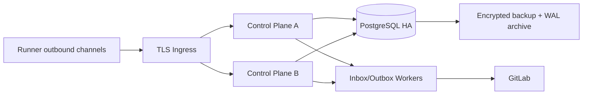

# 可靠性、部署与恢复

> 本文定义 v3 生产目标。当前单机 SQLite、草案 Docker Compose、固定 200 健康检查和缺失启动入口不满足生产部署要求。

## 1. 目标与非目标

`REL-REQ-001`：Control Plane 在依赖中断、进程重启、Runner 离线和 GitLab 事件遗漏后安全恢复，不丢事务事实、不重复副作用、不放宽安全门禁。`REL-REQ-002`：达到月度 99.5% 可用性、RPO≤15 分钟、RTO≤4 小时。v3 初期不承诺跨地域 active-active，也不在控制面不可用时允许 Runner 自主领取新任务。

## 2. 参与者、角色、权限和信任边界

Operations Owner 管部署、容量、备份和事故；DBA 管 PostgreSQL；Security Owner 批准生产 Secret/网络；Technical Lead 管迁移与回滚；Runner/GitLab 是外部依赖。生产组件为无状态 Control Plane 副本、PostgreSQL HA、durable Inbox/Outbox、Artifact Store、Secret Store、OTel 和反向代理；生产不使用 SQLite 作为共享事实源。

## 3. 触发条件、输入和前置条件

部署、扩缩容、数据库迁移、证书/Secret 轮换、故障告警、备份或季度演练触发。前置条件：镜像 digest/签名/SBOM 已验证，配置 Schema 通过，数据库备份新鲜且恢复已验证，容量余量≥30%，Runbook/值班人就绪，部署窗口和回滚版本明确。

## 4. 正常交互及时序图

部署采用滚动或蓝绿；Schema 遵循 `expand → backfill → dual-read-compare → cutover → contract`。readiness 检查 DB、迁移版本、策略/Secret 基本可用和队列写入；liveness 只检查进程是否可恢复，不能因外部 GitLab 短暂故障重启风暴。

## 5. 失败、取消、超时、重试、恢复和用户提示

DB 不可用时 readiness 失败并拒绝写；GitLab 不可用时带 last_sync 只读降级，不创建新远端副作用或标 done；队列/Worker 故障由 Outbox 重放；Runner 离线待 Lease 到期后重派。所有外部调用使用有限 timeout、指数退避+jitter、熔断和幂等 identity。用户看到 degraded dependency、最后同步和人工动作，不推断成功。

## 6. 状态机、规则和不可变式

Deployment：`planned → prechecked → deploying → verifying → healthy/rollback/failed`；Backup：`scheduled → running → verified/failed → expired`；Incident：`detected → contained → recovering → reconciled → closed`。

- `REL-RULE-001`：业务状态、Audit 与 Outbox 同事务；恢复以数据库事实和 GitLab 对账为准。
- `REL-RULE-002`：所有消费者幂等；进程重启不得重复状态转换或外部写。
- `REL-RULE-003`：恢复后必须重新验证授权、Lease epoch、source/target SHA、策略和 GitLab 状态。
- `REL-RULE-004`：备份成功仅在异机 restore、校验和业务 smoke 通过后成立。
- `REL-RULE-005`：回滚不执行破坏性 schema downgrade，不删除新数据或审计。

## 7. 字段、配置和格式校验

所有配置符合 `config.schema.json`，Secret 只为 reference。镜像用 digest，环境有唯一 ID，数据库 migration/version、队列 watermarks 和备份 manifest 必须记录。Timeout、pool、rate、retention 和 resource limit 有上下界；未知或缺失生产配置阻断启动。备份 manifest 含 cluster/source、LSN/time range、encryption key version、checksum、size、created/verified/expiry。

## 8. 并发、幂等和一致性

多副本通过数据库锁/唯一约束/Lease 选主，不依赖进程内锁。Job claim 使用 `SKIP LOCKED` 或等价 CAS；Inbox/Outbox event ID 去重；部署期间兼容读写当前/前一 schema。GitLab side effect 使用远端 identity 查询恢复；恢复对账先观察后修复，修复动作单独审计。

## 9. 安全、Secret、隐私和审计

备份、快照、日志和 dump 加密并使用独立账号；恢复环境默认隔离网络和关闭外发。部署/迁移/备份/恢复/扩缩容/功能开关/手工 SQL/对账修复全部审计。生产数据库禁止共享管理员账号；break-glass 凭据短期、双人批准、使用后立即轮换。

## 10. 质量门禁、证据与 fail-closed 规则

发布前必须有 clean image smoke、迁移 rehearsal、兼容测试、负载/故障测试、备份新鲜度、restore drill 和安全 Gate Evidence。readiness、迁移、审计或 Secret 验证失败阻断流量；GitLab/Runner 故障不得关闭 Gate。部署后验证授权、创建/取消 WorkItem、Inbox/Outbox、只读 GitLab 对账和审计链，再扩大流量。

## 11. 指标、SLO、告警和运维动作

月度可用性 SLO 99.5%；普通 API P95<500ms；Webhook durable ingest P95<2s；正常事件 60s 内收敛；Runner offline 90s 内识别；RPO≤15m、RTO≤4h。监控 error/latency/saturation、DB replication/connection/disk/WAL、Inbox/Outbox lag、DLQ、backup age/restore verification、GitLab rate limit 和 Runner capacity。P0 5 分钟响应、P1 15 分钟响应。

## 12. 验收测试和需求追踪

- `TC-REL-001`：任一 Control Plane/Worker 重启无重复副作用。
- `TC-REL-002`：DB/GitLab/队列/Runner 故障按 fail-closed 语义恢复并对账。
- `TC-DR-001`：从加密备份/WAL 在隔离环境恢复，满足 RPO/RTO 和业务校验。
- `TC-REL-003`：滚动/蓝绿部署期间当前与前一 minor 客户端/Runner 兼容。
- `TC-REL-004`：容量、资源限制、熔断和降级在负载测试中有效。

## 13. 数据迁移、兼容、发布与回滚

从 SQLite 到 PostgreSQL 使用只读导入、ID 映射、校验和和 shadow compare，禁止双主写。每次发布先 canary 5%，观察一完整关键流程后 25%/100%；安全或数据不变量异常立即停止。应用回滚到前一兼容镜像，Schema 维持 expanded 形态；迁移 contract 仅在回滚窗口结束且备份验证后执行。
