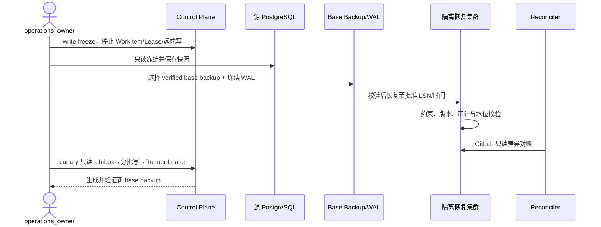

# Runbook：PostgreSQL 备份、恢复与切换

> 本 Runbook 是 v3 目标流程。当前 SQLite 数据库与部署草案不具备这里描述的 PostgreSQL HA、WAL 归档和恢复自动化。

## 1. 目标与非目标

用于计划恢复演练、误操作、数据库损坏、集群丢失或 PostgreSQL 时间点恢复。目标是达到 RPO 不超过 15 分钟、RTO 不超过 4 小时，并保持业务状态、审计、Inbox/Outbox 与 GitLab 对账一致。本文不允许原地覆盖唯一源集群、跳过 checksum、关闭审计约束、双主写或把生产备份恢复到可外发的非生产网络。

## 2. 参与者、角色、权限和信任边界

- `operations_owner` 指挥事件，DBA 执行数据库操作，`technical_lead` 与 `qa_owner` 验证应用，`security_owner` 管理加密密钥、取证和安全事件。
- 生产切换需要 Operations + Technical 双人批准；安全事件还需 Security 批准。DBA 不能单独批准其执行结果。
- 源集群、恢复集群、备份账号/故障域、Secret Store、Control Plane、GitLab 与独立审计备份是不同信任域；恢复集群验证期间禁止 Runner/GitLab 出站。

## 3. 触发条件、输入和前置条件

例行演练是计划变更；主库不可用但可 failover 为 P1；数据损坏、误删、安全入侵或 failover 后不一致为 P0。疑似篡改时先由 `security_owner` 保全证据，再选择恢复点。

输入 MUST 包含 incident ID、检测时间、最后确认正常时间、源 cluster ID、目标 Schema/migration version、可用 base backup manifests、连续 WAL 范围、目标时间/LSN、加密 key reference/version、潜在丢失事务和当前 GitLab/Inbox/Outbox 水位。前置条件是已验证的备份、独立恢复容量、兼容应用镜像和双人审批；缺一则不得切换生产。

## 4. 正常交互及时序图

### 4.1 立即止损和恢复步骤

1. 关闭新 WorkItem、Lease 与远端写，仅允许授权只读；保存数据库、WAL、指标、审计和配置快照，旧集群尽量转只读而非删除。
2. 选择恢复点之前最新且状态为 `verified` 的 base backup 和连续 WAL；校验 manifest、checksum、签名/权限与 key version。
3. 恢复到新的隔离集群，回放 WAL 到批准时间/LSN，记录实际恢复点；检查 extension 与 migration version，使用兼容应用镜像以只读模式启动，自动 migration 必须显式批准。
4. 校验行数、外键/唯一约束、aggregate version、Audit sequence、Inbox/Outbox event ID 与水位、Lease epoch、策略/Evidence/Gate digest 和 Secret reference。
5. 通过批准的 GitLab API 只读 Reconcile；恢复点后的差异进入人工清单，不自动覆盖。验证后先只读 canary，再恢复 Audit Export/Inbox，最后分批恢复写与 Runner Lease。

## 5. 失败、取消、超时、重试、恢复和用户提示

- 新集群出现完整性、安全或授权错误时立即重新冻结写，不双写；选择修复或从另一已验证恢复点重做，禁止切回已确认损坏的旧集群。
- 恢复可在切换前取消，取消后保持源集群只读和 Evidence；切换后回退必须评估新事务，不能静默丢弃。备份/密钥泄漏时先吊销轮换并重新加密可用副本。
- 自动重试仅限 checksum、只读校验和幂等下载；WAL 回放、migration、服务发现切换和恢复写必须人工确认。超过 RTO 仍未通过 Gate 立即升级灾难恢复指挥。
- P0 每 30 分钟、P1 每 60 分钟提示影响窗口、写冻结、目标/实际 RPO/RTO、当前验证阶段和下一检查点；不得披露备份位置、Key、DSN 或内部拓扑。

## 6. 状态机、规则和不可变式

恢复流程为 `detected/planned → write_frozen → restore_point_approved → restoring → data_validating → app_validating → reconciling → staged_cutover → monitoring → closed`；任一验证失败进入 `rollback_frozen`，再返回 `restore_point_approved` 或终止。

- 未通过 checksum/签名/连续 WAL/Schema 兼容校验的备份不可使用。
- 源集群与恢复集群不得同时接受写；所有旧 Lease 在恢复边界后失效。
- 审计、Inbox/Outbox 和业务 aggregate 必须在同一恢复点一致；GitLab 远端事实不由数据库快照覆盖。
- 旧集群切换后至少隔离只读 7 天或按法律保全要求保存，禁止立即销毁。

## 7. 字段、配置和格式校验

Backup manifest MUST 包含 `cluster_id`、base backup ID、开始/结束时间、起止 LSN、WAL segment 范围、checksum、签名、加密 key reference/version、Schema/migration version、大小、创建/验证/到期时间和状态。恢复记录包含目标/实际时间与 LSN、应用镜像 digest、批准人、RPO/RTO、验证 query/report digest、GitLab 差异和切换时间线。时间使用 UTC，凭据只保存 Secret reference。

## 8. 并发、幂等和一致性

- write freeze 以 incident/scope 幂等并使用单调版本；冻结前排队的 Outbox/Worker 写也必须停止。
- 同一 cluster 只允许一个 active restore/cutover；锁顺序为 incident → cluster → restore target → application deployment。
- 重复恢复步骤必须校验 manifest/LSN/attempt，不能覆盖旧 Evidence；服务发现切换使用 CAS 与 deployment generation。
- Inbox/Outbox 重放、Lease 恢复和 GitLab Reconcile 各自使用原幂等键；不使用 last-write-wins 解决恢复点后的差异。

## 9. 安全、Secret、隐私和审计

备份持续加密，复制到独立账号/故障域并设不可变保留；Key 只由 Secret Store 引用，恢复人员按最小权限临时授权。非生产恢复环境必须网络隔离并禁止数据外发。审计 MUST 覆盖审批、备份选择、checksum/签名、Key version、恢复命令、查询摘要、切换与回退；日志和沟通不得包含数据内容、DSN 或 Secret。

## 10. 质量门禁、证据与 fail-closed 规则

退出须满足：实际 RPO≤15 分钟、RTO≤4 小时；readiness 正常；核心 E2E、授权和审计测试通过；Inbox/Outbox 无不可解释积压；GitLab 对账完成；无重复副作用或旧 Lease 推进；新 base backup 已生成并验证。`qa_owner`、`technical_lead`、`operations_owner` 共同签署后才能解除事件。

Evidence 保存全部批准、manifest/checksum、目标/实际 LSN、命令审计、验证摘要、GitLab 差异、RPO/RTO、切换时间线与新备份结果；missing/error/stale 均阻断生产写恢复。

## 11. 指标、SLO、告警和运维动作

生产持续 WAL 归档并每日创建加密 base backup；监控最后成功备份/WAL 时间、归档中断、验证失败、备份容量/到期、估算 RPO、恢复耗时与对账差异。每天自动验证备份可读性，至少每周自动异机 restore smoke。P0/P1 在两个工作日内复盘，修复覆盖、自动化、容量、监控和演练用例。

## 12. 验收测试和需求追踪

- `TC-DB-BACKUP-001`：每日 base backup、连续 WAL、checksum/签名与不可变副本可验证。
- `TC-DB-RESTORE-001`：隔离环境完成 point-in-time restore，实测 RPO/RTO 并通过数据/业务/GitLab 对账。
- `TC-DB-CUTOVER-001`：分阶段切换无双写、旧 Lease 推进或重复 Outbox 副作用。
- 每季度执行全量 base backup + WAL 恢复；每年至少覆盖区域/宿主完全丢失，Evidence 关联 `M4-REL-001`、`M4-RBK-001` 与生产准入 Gate。

## 13. 数据迁移、兼容、发布与回滚

恢复脚本、PostgreSQL/extension、Schema migration、备份格式或加密 Key 流程变化必须先在隔离环境恢复演练，再按 expand/migrate/contract 发布。旧备份仅在读取器与 Schema 兼容且完整验证时可使用。回滚不得覆盖源集群、恢复双主写或沿用失败恢复点；必须重新冻结、选择另一 verified 恢复点并生成新 attempt/Evidence。
