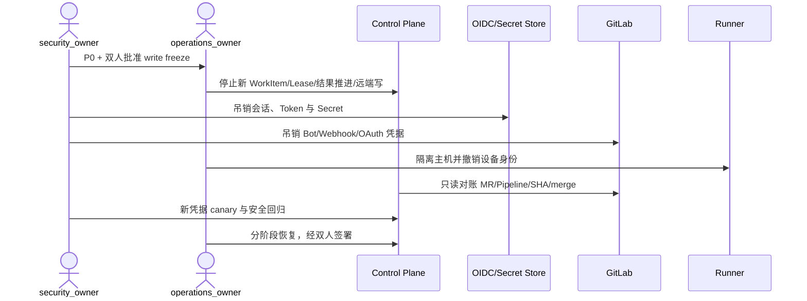

# Runbook：紧急停止、凭据吊销与安全恢复

> 本 Runbook 定义 v3 必须具备的应急能力，不表示当前代码已有全局写冻结、细粒度吊销或 Secret Store 集成。

## 1. 目标与非目标

用于 Token、Secret、设备密钥泄漏，未授权跨项目访问，保护分支异常写入，被攻陷的 Runner/Agent/Control Plane，伪造 Webhook 已产生副作用或供应链签名失信。首要目标是阻止进一步损害，即使需要短时停止写服务。本文不以可用性为由延迟吊销、不允许使用疑似泄漏会话处置事件，也不授权恢复已吊销凭据。

## 2. 参与者、角色、权限和信任边界

- `security_owner` 是 P0 事件指挥；`operations_owner` 执行平台冻结和恢复；`technical_lead` 确认系统影响面；项目 Owner、企业安全与法务按数据级别加入。
- 全局 emergency stop、break-glass、生产凭据换发和恢复写至少双人批准；审批人必须使用独立、已验证且未受影响的身份。
- Project Admin 只能参与本项目恢复，不能解除公司级冻结；Agent、Runner 和 GitLab Bot 无应急审批权。
- OIDC Provider、Secret Store、GitLab、Runner 主机、Control Plane 与审计备份是独立信任域；任一域疑似失陷时不得用其自证安全。

## 3. 触发条件、输入和前置条件

下列任一项直接触发 P0：有效凭据进入日志/制品；越权读写其他项目；Bot/Runner 可写保护分支；未知主体获得管理权限；失效签名制品进入生产；伪造事件改变 Gate/任务状态。疑似但未确认时也 MUST 先遏制，不等待完整取证。

输入至少包含首次可能失陷时间、主体/Token/Runner ID hash、受影响 Team/Project/GitLab scope、异常动作、source/target SHA、配置/策略/镜像版本和可用审计源。前置条件是建立独立 incident/correlation ID、安全沟通渠道和未受影响的双人管理身份；若无法满足，只允许基础设施级网络隔离与全局写冻结。

## 4. 正常交互及时序图

### 4.1 立即止损（0–15 分钟）

1. 启用全局或受影响 Project write freeze：停止新 WorkItem、Lease、Runner 结果推进、GitLab 分支/MR/status 写及高风险管理操作；仅保留 health、授权只读与审计导出。
2. 隔离可疑 Runner/服务实例和网络路径；冻结 Workspace、日志、镜像与配置作为证据，禁止清日志或删除对象。
3. 保存 Token ID hash、审计、GitLab event、source/target SHA 与策略/配置版本。
4. 按风险面吊销：用户 OIDC session/refresh token → Maestro service account → GitLab token/OAuth grant → Webhook Secret → Runner device key/enrollment code → 数据库/Secret Store/Artifact/签名 key；确认泄漏时先 revoke 再换发，不保留重叠窗口。

### 4.2 调查、修复与恢复

从首次可能失陷时间起查询认证/授权、Secret 读取、Runner Lease/Tool、GitLab API/Webhook、分支/MR/status、Gate/Waiver、审计查询和制品 promotion；枚举共享 scope、派生 Token、缓存和副本，无法解释的差异全部视为受影响。

修复泄漏源、权限策略、镜像/依赖或主机后，从干净终端和 Secret Store 生成最小 scope 新凭据。所有 active Lease 失效，旧结果只存 late evidence；受影响 SHA、Evidence、Gate 和 Waiver 标记 `stale`。恢复顺序固定为身份/JWKS与授权 → 审计/Secret Store → 只读 API/MCP → Webhook Inbox/Reconcile → 单个干净 Runner smoke → 单项目低风险写 → 全量；每阶段至少观察 15 分钟并双签。

## 5. 失败、取消、超时、重试、恢复和用户提示

- 恢复阶段再现异常立即回到 write freeze；不得关闭认证、减少审计或扩大 Token scope 来“临时恢复”。取消恢复只保留更严格的冻结状态。
- 吊销、冻结和标记 stale 是幂等操作，可对同一 incident 重试；凭据换发、远端修复和数据恢复必须人工确认，不能自动循环重试。
- GitLab/IdP/Secret Store 不可用时保持冻结并提示“身份或远端事实不可验证”；超时不得沿用缓存授权或旧凭据。
- 每 30 分钟更新影响、遏制范围、吊销覆盖、恢复阶段和下一检查点；外部通知由安全/法务批准，禁止披露 Secret、可利用细节和个人敏感数据。

## 6. 状态机、规则和不可变式

事件状态为 `detected → contained → credentials_revoked → scope_assessed → remediated → validating → staged_recovery → closed`，任一验证失败返回 `contained`。`closed` 必须由 Security、Operations 和 Technical 共同签署。

- 安全降级只能减少能力，不能降低鉴权、Gate 或审计。
- 已吊销主体/设备/凭据不可原地恢复，必须生成新标识或版本并重新授权。
- 受影响 Evidence 必须 `stale`，所有 active Lease 必须失效；旧结果不能推进 WorkItem。
- 未经授权的远端变更由项目 Owner 与 Security 决定 revert/close，Maestro 不自动改写，不推送或合并保护分支。

## 7. 字段、配置和格式校验

事件记录 MUST 包含 `incident_id`、`correlation_id`、`severity`、`detected_at`、`possible_compromise_from`、`affected_scope`、`principal_or_credential_hash`、`credential_type/version`、`freeze_scope`、`revoked_at`、双人批准、`source_sha`、`target_sha`、镜像/策略/配置 digest、恢复阶段和 Evidence 引用。不得记录明文 Token/Secret。新的凭据必须具备最小 scope、明确 owner/expiry/version，并通过 Secret Store reference 校验。

## 8. 并发、幂等和一致性

- emergency stop 以全局/Team/Project scope 和 incident ID 幂等；更窄范围不得覆盖更宽冻结，后写入只能保持或加强限制。
- 吊销与换发使用 credential version/CAS；并发请求不能让旧版本重新 active。Runner connection generation、Lease epoch、Session version 同步失效。
- 数据库、GitLab 和审计通过只读 Reconcile 生成差异清单，不采用 last-write-wins；数据库疑似篡改时转数据库恢复 Runbook。
- Outbox/后台任务必须读取当前冻结版本，冻结前排队的写操作也不得在之后执行。

## 9. 安全、Secret、隐私和审计

Secret 只能在批准的 Secret Store 生成、保存和引用；禁止个人 PAT、明文环境变量、重用旧值或经聊天/工单传播。重新注册 Runner 需 `project_admin + security_owner` 批准并生成新设备密钥；新 Webhook Secret 必须以合法测试事件验证 HMAC 与 timestamp。审计以只追加方式保存冻结、吊销、查询、换发、差异、批准和恢复，并独立导出；证据访问按最小权限和法律保全要求控制。

## 10. 质量门禁、证据与 fail-closed 规则

退出必须同时满足：旧凭据全部证明失效；无未解释访问或远端变更；受影响主机/镜像已重建；跨项目、Token passthrough、保护分支、Webhook 和 Secret 外泄回归通过；Gate 重新获得 exact-SHA 权威 Evidence；审计连续完整。

Evidence 包括时间线、触发信号、批准、冻结范围、Token/设备 ID hash、吊销证明、Secret version、审计查询、GitLab/数据库差异、镜像 digest、修复提交和恢复测试。任一 Critical/High 未关闭或 Evidence 缺失时保持 P0 和 write freeze。

## 11. 指标、SLO、告警和运维动作

监控从检测到冻结/吊销时间、吊销覆盖率、异常访问数、受影响 Project/Runner/Token 数、未解释差异、恢复阶段失败和审计导出完整率。目标是 P0 触发后 15 分钟内完成初始遏制。24 小时内提交初报，5 个工作日内完成无责复盘；根因必须转为威胁模型、回归/红队、监控与轮换任务，验证前不关闭。

## 12. 验收测试和需求追踪

- `TC-SEC-STOP-001`：全局/项目写冻结能阻断排队与新增写，但保留 health、只读和审计导出。
- `TC-SEC-REVOKE-001`：OIDC、Runner、GitLab Bot、Webhook 与服务凭据吊销后均不可复用。
- `TC-SEC-RECOVER-001`：受影响 SHA/Gate/Lease stale 后，仅新凭据和新 Evidence 能分阶段恢复。
- 每季度执行双人控制桌面演练，每半年在隔离环境实做吊销、换发和分阶段恢复，Evidence 关联 `M4-RBK-001` 与生产准入 Gate。

## 13. 数据迁移、兼容、发布与回滚

Secret 类型、签发链、应急 API、冻结 scope 或审计 Schema 变化必须同步威胁模型、配置/事件 Schema、迁移和回归 Evidence 后发布。旧凭据只迁移为 revoked tombstone，不能兼容性保留 active。回滚只能维持或扩大冻结范围，绝不能重新启用已吊销凭据、减少审计、放宽 Token scope 或恢复受影响 Evidence；必要时使用前向修复和新 credential version。
