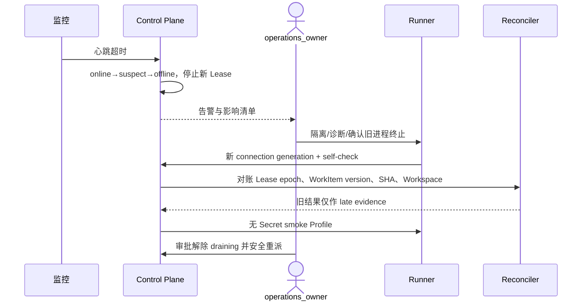

# Runbook：Runner 离线与 Lease 恢复

> 本 Runbook 定义目标操作流程；所述控制面动作在实现前不得被理解为当前已有按钮或 API。

## 1. 目标与非目标

用于 Runner 心跳超时、连接循环、设备撤销、宿主故障或无可用执行容量。目标是在不接受旧 Lease 结果、不重复执行和不破坏 Workspace 证据的前提下恢复容量。本文不授权删除 Worktree、重置数据库状态、延长旧 Lease、关闭设备认证或接入未批准设备。

## 2. 参与者、角色、权限和信任边界

- `operations_owner` 负责事件指挥、全池容量和恢复节奏；`project_admin` 只能处理本项目 Runner；`security_owner` 负责失陷判定、吊销和重新注册批准。
- Runner 是出站连接的设备主体，只能操作服务器分配的 Project/Lease/Workspace；Control Plane 不信任离线期间产生的状态推进。
- Runner Owner 可提供设备诊断信息，但不能批准自己的吊销恢复；重新注册和从 `revoked` 恢复必须重新走注册审批，不能原地复活。
- 所有操作 MUST 使用 incident ID 与 correlation ID，并通过统一授权和审计入口执行。

## 3. 触发条件、输入和前置条件

- 心跳 45 秒未到进入 `suspect`，90 秒未到进入 `offline`；单 Runner 且无 active Lease 为 P3，有 active Lease 或同池超过 20% 离线为 P2，关键项目/全池无容量为 P1。
- 凭据泄漏、跨项目访问或宿主入侵迹象立即升级 P0，并转入 `emergency-stop-credential-revoke.md`。
- 输入 MUST 包含告警时间、Runner/Project ID、connection generation、last heartbeat、active Lease/epoch、Runner 版本与 capability、当前 WorkItem/Workspace 状态。
- 操作前 MUST 确认审计可写、Control Plane 可查询；若设备身份或审计不可用，只允许隔离、吊销和 fail-closed 暂停。

## 4. 正常交互及时序图

### 4.1 立即止损与诊断

1. 将受影响 Runner 置为 `draining`，停止签发新 Lease；怀疑失陷时直接 `revoked` 并使 epoch 失效。
2. 检查 Control Plane、Ingress、TLS、DNS 是否为多 Runner 共因，再核验设备电源、网络、磁盘、时钟、Keychain、OCI runtime、版本、策略变更和资源耗尽。
3. 多机故障查中央依赖；单机故障保留 Workspace 等待 Lease 过期；资源满时隔离未清理 Workspace；密钥失效不得绕过验证；版本不兼容必须升级；入侵迹象转安全事件。

### 4.2 安全恢复

1. 确认旧执行进程树终止；无法确认时等待 Lease 到期，并保持 Workspace `quarantined`。
2. Runner 用有效设备身份建立新的 connection generation，完成 capability、版本、时钟和沙箱 self-check。
3. Reconciler 比较 Lease epoch、WorkItem version、任务分支 SHA 与 Workspace 状态；旧 generation/epoch 结果只存 late evidence。
4. 先运行无 Secret 的 smoke Command Profile，连续健康后解除 `draining`；对过期 Lease 生成新 epoch，重派前从 GitLab 重新确认 source/target SHA。

## 5. 失败、取消、超时、重试、恢复和用户提示

- 恢复后 15 分钟内再次离线必须重新 `draining`，停止循环重派并至少升级 P2；容量不足时暂停低优先级 WorkItem，不降低沙箱门禁。
- 取消重派时保持原 Lease `expired/cancelled` 与 Workspace 隔离记录；不得把执行中断映射为 `done`。设备诊断超时后仍按 Lease TTL 回收，不人工延长 epoch。
- 只允许以新 epoch 重试幂等工作；包含不可重复外部副作用的任务转 `needs_human`。任何数据或凭据异常立即升级 `security_owner`。
- UI/告警 MUST 显示 `execution_interrupted/runner_offline`、影响范围、安全重派状态和下一更新时间；P1 每 30 分钟、P2 每 60 分钟更新。不得显示设备密钥、内部 IP、完整路径或任务源码。

## 6. 状态机、规则和不可变式

Runner 仅允许 `pending_approval → approved → online → suspect/offline/draining → online`，以及任意高风险状态到 `revoked`；`revoked` 不可原地恢复。Lease 仅允许 `offered/accepted/active/completed/failed/cancelled/expired` 的合法迁移。

- `offline` Runner MUST NOT 获得新 Lease；旧 connection generation 或 Lease epoch MUST NOT 推进 WorkItem。
- active Lease 在确认终止或 TTL 到期前不得并发重派；重新分配必须产生新 epoch。
- 离线结果只能作为不可覆盖的诊断 Evidence，不得成为 Gate 或完成依据。
- `done` 只能由 GitLab merged webhook 或对账确认，Runner 恢复不得直接写入。

## 7. 字段、配置和格式校验

事件记录 MUST 包含 `incident_id`、`correlation_id`、`project_id`、`runner_id`、`connection_generation`、`last_heartbeat_at`、`lease_id`、`lease_epoch`、`work_item_version`、`branch_sha`、`workspace_state`、`runner_version`、`capabilities` 和动作批准人。ID/epoch/version 必须为服务器签发值；时间统一 UTC。心跳阈值、Lease TTL 和支持版本来自版本化配置，不得在请求参数中覆盖。

## 8. 并发、幂等和一致性

- Runner 状态更新使用乐观版本；事件去重键为 `runner_id + connection_generation + event_type + sequence`。
- Reconciler 在 Project/Runner 锁顺序下比较 generation、epoch 和 WorkItem version；任一不匹配即拒绝状态副作用。
- drain、revoke、重派与 Workspace 隔离操作必须幂等；重复调用返回同一业务结果和原审计关联，不创建第二 Lease。
- 恢复前后必须与 GitLab 远端 SHA 对账；缓存、Runner 本地状态或本地 `HEAD` 不能覆盖远端事实。

## 9. 安全、Secret、隐私和审计

禁止临时关闭设备认证、把设备密钥从 Keychain 导出、向容器注入宿主凭据或接受未批准版本。宿主疑似入侵时先隔离网络、吊销设备身份并保全证据。审计 MUST 覆盖离线判定、drain/revoke、重连、self-check、对账、旧结果拒绝、重派和解除观察；日志脱敏，Workspace 仅记录 digest 与受控引用。

## 10. 质量门禁、证据与 fail-closed 规则

退出事件必须同时满足：Runner 连续 5 分钟心跳正常；smoke 沙箱通过；无旧 epoch/generation 推进状态；active/quarantined Workspace 均有归属；队列下降且无重复/跨项目执行；远端 SHA 对账一致；审计链完整。任一 Evidence 缺失、解析错误或 stale 时保持 `draining/offline`，不得恢复调度。

证据至少保存告警、心跳、generation、Lease/epoch、版本/capability、资源指标、self-check、SHA、对账差异、审计 event ID 和时间线。

## 11. 指标、SLO、告警和运维动作

跟踪心跳延迟、online/suspect/offline 数、active Lease 中断率、重派率、旧 epoch 拒绝数、Workspace quarantine age、队列深度和恢复时长。P1/P2 在 2 个工作日内复盘并更新容量、版本强制、证书临期、离线检测和混沌测试；预防行动必须有 owner、期限和回归 Evidence。

## 12. 验收测试和需求追踪

- `TC-RBKRUN-001`：45/90 秒状态迁移与停止新 Lease。
- `TC-RBKRUN-002`：网络分区后旧 generation/epoch 回传被拒绝，新 epoch 仅执行一次。
- `TC-RBKRUN-003`：失陷 Runner 吊销、跨项目与凭据逃逸负向测试。
- 每月桌面演练单 Runner/全池离线；每季度在隔离环境注入网络分区、旧 epoch 回传和重连，并将 Evidence 关联 `M1-RUN-001` 与 `M4-RBK-001`。

## 13. 数据迁移、兼容、发布与回滚

Runbook、心跳阈值或 Runner 协议变化须经 Operations、Technical、Security 评审，并与支持版本矩阵、配置 Schema 和迁移说明一起发布。回滚只能恢复上一已评审且协议兼容的流程；不得恢复入站连接、延长旧 Lease、接受旧 generation 或把 `revoked` 设备重新激活。状态迁移失败时保持 fail-closed，并以前向修复方式完成对账。
