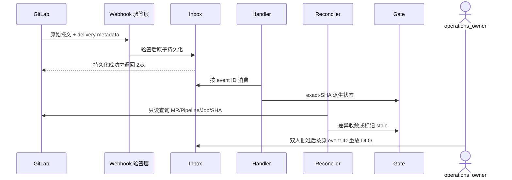

# Runbook：GitLab Webhook、Pipeline 与 Gate 不一致

> 本 Runbook 定义 v3 目标操作流程，不表示当前仓库已实现 Inbox、DLQ、Reconciler 或 GitLab 状态发布。

## 1. 目标与非目标

用于 Webhook 验证失败/自动禁用、Inbox/DLQ 积压、事件遗漏或乱序、Pipeline/Job 状态不同步、Artifact 缺失，以及 Gate 与 GitLab 事实不一致。目标是让 Gate 始终 fail-closed，并以 GitLab 当前事实安全收敛。本文不允许手工伪造 Pipeline 成功、把 Gate 改为 `passed`、复制旧 SHA Evidence、关闭保护分支或重放未验证报文。

## 2. 参与者、角色、权限和信任边界

- `operations_owner` 指挥事件和恢复；`qa_owner` 确认 Gate 分类；`security_owner` 处置签名、Token 和伪造事件；`project_admin` 只能批准本项目范围的受控操作。
- GitLab 是 MR、Pipeline、Job、protected branch 和 merge 的远端事实源；Webhook 报文、Artifact、日志与人工输入均为不可信输入。
- 仅 Webhook 验签层可把原始报文写入 Inbox；仅 Reconciler 可基于只读 GitLab API 修正派生状态；任何主体不得绕过统一授权、双人重放审批和审计。

## 3. 触发条件、输入和前置条件

- 单项目同步延迟超过 60 秒或出现一条 DLQ 为 P2；多项目/全部 Webhook 失败、错误 ready/status 或超过 15 分钟不能收敛为 P1；伪造事件产生副作用、保护分支风险或 Secret 泄漏为 P0。
- 输入 MUST 包含 GitLab instance/project numeric ID、MR IID、source/target SHA、pipeline/job ID、Webhook delivery/event ID、payload digest、签名结论、correlation ID、Inbox/DLQ 水位与当前 Gate snapshot。
- 前置条件是审计可写且可通过批准的 GitLab API 读取远端事实；API 不可用时只允许缓存只读、标记 stale 和停止写，不得新授权或宣称完成。

## 4. 正常交互及时序图

### 4.1 立即止损与诊断

1. 将受影响 Project/MR Gate 标记 `stale`，附 `dependency_unavailable` 原因；暂停 Maestro 新远端写/status 发布，保留只读查询。
2. 直接从批准的 GitLab API 读取当前 MR、Pipeline、Job 与 SHA，区分 GitLab 事实失败和 Maestro 同步失败。
3. 检查 delivery、签名/时间戳、Inbox lag、handler retry、DLQ、Reconcile 差异、rate limit、证书/Secret 轮换、GitLab 升级和 Hook auto-disabled。

### 4.2 诊断分支与恢复

| 事实 | 处理 |
| --- | --- |
| GitLab Pipeline 失败 | 保持 Gate `failed`，交由代码 Owner 修复，不自动重跑 |
| Runner/基础设施错误 | `qa_owner` 分类后最多按策略重跑一次，保留原失败 |
| Webhook 未投递/被禁用 | 修复 HTTPS/证书/响应后启用 Hook，立即全量 Reconcile |
| 签名/时间戳错误 | 核验时钟与 Secret version，不放宽 freshness |
| 已持久化但 handler 失败 | 修复后从 Inbox/DLQ 按原 event ID 授权重放 |
| 状态绑定旧 SHA | 标记 `stale`，从当前 SHA 重新收集 Evidence |
| Artifact 缺失/篡改 | Gate `error/failed`，以新 Job/Artifact 重建，不手工补结论 |

恢复时先用合法测试事件验证验签、原子持久化与 2xx，再对影响窗口全量只读 Reconcile；仅从已验证 Inbox 重放，重新摄取并校验 SHA/digest 后重算 Gate。连续两个 Reconcile 周期无差异才恢复状态发布。

## 5. 失败、取消、超时、重试、恢复和用户提示

- 恢复发布后再次出现差异，立即退回只读 Reconcile 并保持 Gate `stale`；确认伪造或 Token 泄漏时升级 P0 并执行应急凭据 Runbook。
- Handler 仅对幂等消费指数退避重试；超过预算进入 DLQ，不删除 Inbox、不生成新 event ID。人工取消重放不改变原记录和 Gate 阻断状态。
- GitLab 长期不可用时提示“远端事实不可确认”，停止依赖 Maestro ready 状态；不得人工把缺失/错误 Gate 视为通过。
- 用户提示 MUST 包含受影响 MR/Pipeline、阻断原因、GitLab 原始状态、允许/禁止动作、correlation ID 和下一更新时间；不得包含 Secret、签名值或完整原始 payload。

## 6. 状态机、规则和不可变式

Webhook 记录按 `received → verified → persisted → processing → processed` 迁移，失败进入 `retrying → dlq`，授权重放返回 `processing`；未通过 `verified/persisted` 不得产生业务副作用。Gate 只使用 `pending/running/passed/failed/error/stale/waived`。

- 未验签报文 MUST NOT 写入业务 Inbox 或改变状态；返回 2xx 的前提是原始报文已持久化。
- 重复/乱序事件对同一业务对象最多产生一次状态变化；事件顺序不能覆盖更新的 GitLab SHA/版本。
- source 或 target SHA 变化立即使旧 Evidence `stale`；`missing/skipped/error/stale` 全部阻断。
- GitLab 不可用时只能降级到更少能力，不能新授权、标记完成或降低 Gate。

## 7. 字段、配置和格式校验

事件至少包含 `event_id`、`delivery_id`、`type`、`version`、`gitlab_instance_id`、`project_id`、`object_kind`、`occurred_at`、`received_at`、`correlation_id`、`payload_digest`、`signature_result`、`source_sha`、`target_sha`、`pipeline_id`、`job_id` 和敏感级别。GitLab Host 必须来自管理员配置、使用 HTTPS 并验证证书；禁止跨 Host 重定向。时间戳、新旧 Secret 窗口和 payload 大小必须按版本化配置校验。

## 8. 并发、幂等和一致性

- 幂等键优先使用 GitLab event/delivery ID，无可靠 ID 时使用 canonical payload hash；Inbox 上设置唯一约束。
- Handler 以对象版本/source SHA/target SHA 做乐观并发，旧事件不得覆盖新状态；Outbox 与业务状态同事务写入。
- DLQ 重放使用原 event ID、重放 attempt 和审批记录，不生成第二业务事件；并行 Reconcile 按 instance/project/object 锁顺序串行收敛。
- Webhook 与周期 Reconcile 最终一致，但任何不一致期间 Gate 保持 `stale/error`，不得使用 last-write-wins 选择有利结论。

## 9. 安全、Secret、隐私和审计

对原始请求验签并实施时间窗口、大小和内容类型限制；Webhook Secret/Token 存 Secret Store，支持版本化轮换且不得进入日志。签名失败报文仅保留最小安全元数据和 digest。审计 MUST 覆盖签名拒绝、Inbox 持久化、重试/DLQ、双人重放批准、Reconcile 差异、Gate 重算、写暂停与恢复。

## 10. 质量门禁、证据与 fail-closed 规则

退出事件须满足：合法测试投递成功；Inbox lag 小于 30 秒且 DLQ 为 0；所有受影响 MR 的 SHA/Pipeline/Job/Gate 与 GitLab 一致；不存在旧 SHA ready；重复事件没有第二副作用；审计完整；连续观察至少 15 分钟。

证据保存 delivery ID/时间/状态、payload digest、验证结果、Inbox/DLQ 记录、GitLab API snapshot、source/target SHA、Pipeline/Job/Artifact digest、Gate 前后 snapshot、重放批准和时间线。任一证据缺失或 stale 时不得解除阻断。

## 11. 指标、SLO、告警和运维动作

Webhook 持久化 P95 目标小于 2 秒；监控签名失败率、2xx/非 2xx、Inbox age/lag、retry、DLQ、Reconcile drift、GitLab API 错误/rate limit、stale Gate 数和恢复时长。签名失败突增即使无业务影响也告警 `security_owner`。事件后更新 drift/auto-disabled、时钟、证书/Token 临期、容量和 Reconcile 覆盖监控。

## 12. 验收测试和需求追踪

- `TC-WHK-001`：无效签名不产生 Inbox 业务效果，合法报文持久化后才 2xx。
- `TC-WHK-002`：重复、乱序、handler 重试与 DLQ 重放只产生一次状态变化。
- `TC-GL-REC-001`：Webhook 遗漏后全量 Reconcile 以远端 SHA/Pipeline 事实收敛。
- 每月在 GitLab Sandbox 注入签名失败、事件遗漏与 Artifact 异常；每季度完成一次受权 DLQ 重放和全量 Reconcile，关联 `M2-WHK-001`、`M2-MR-001` 与 `M4-RBK-001`。

## 13. 数据迁移、兼容、发布与回滚

Runbook 必须随 Webhook/事件 Schema、GitLab 版本、Secret 轮换或 Gate 规则一起评审发布；事件版本升级必须保留可重放的原始报文与向前兼容读取器。回滚只能回到上一兼容处理器和已确认水位，并 MUST 保留 Inbox/DLQ、payload digest 与审计；不得恢复未验签处理、手工 Gate pass 或旧 SHA Evidence。版本行为以 GitLab 官方 [Webhook](https://docs.gitlab.com/user/project/integrations/webhooks/) 与 [Pipeline API](https://docs.gitlab.com/api/pipelines/) 为校验基线。
