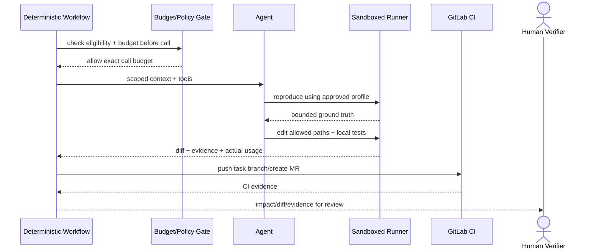
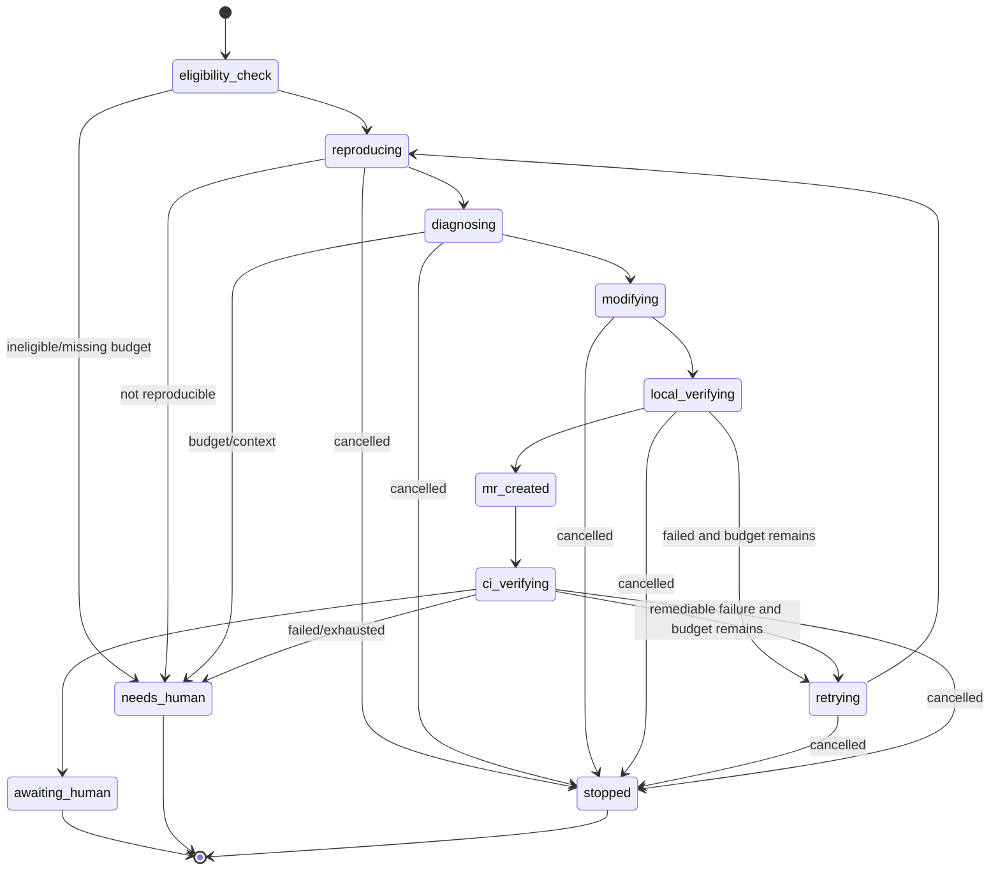

# Agent 自动复现与修复

## 1. 目标与非目标

`AGT-REQ-001` 在确定性 Workflow 管理授权、状态、预算、门禁和重试的前提下，让 Agent 处理需要灵活判断的诊断与代码修改。`AGT-REQ-002` 成功仅表示创建候选分支/MR，最终合并必须由人完成。非目标：用 Agent 替代规则引擎、CI、审批者，或在无复现/证据时猜测“已修复”。

## 2. 参与者、角色、权限和信任边界

Coordinator/QA 启动或批准自动修复；Workflow Engine 负责硬约束；delegated Agent 继承用户、项目、Runner 的权限交集；Runner 运行批准 Tool/Profile；GitLab CI 复验；Verifier/Reviewer 人工监督。Prompt、仓库、Issue、日志和模型输出均不可信，不能改变系统策略、Tool 参数边界、网络和 Secret。

## 3. 触发条件、输入和前置条件

只有 Defect 为 `auto_remediable=true`、存在可执行复现步骤、具备 exact SHA、不是不可豁免安全问题、存在 `budget_tokens` 且 Runner 合规时才可自动启动。输入包含 Defect、acceptance、允许路径、Command Profiles、最多尝试、时间/token 预算、委托主体和停止条件。

## 4. 正常交互及时序图

## 5. 失败、取消、超时、重试、恢复和用户提示

默认最多 3 次尝试、30 分钟；每次模型调用前检查剩余预算。预算耗尽、无法复现、上下文不足、工具/解析失败、连续失败或安全信号时转 `needs_human`。取消立即阻止新 Tool，当前进程按 Runner 策略终止并保留 checkpoint。崩溃恢复从已验证 checkpoint 继续，不回放有副作用调用。UI 显示计划、当前步骤、Tool 摘要、真实 token、证据、停止/接管按钮。

## 6. 状态机、规则和不可变式

RemediationRun enum 固定为 `eligibility_check/reproducing/diagnosing/modifying/local_verifying/retrying/mr_created/ci_verifying/awaiting_human/needs_human/stopped`；`resolved` 是 Defect 生命周期状态，不是 Agent 执行状态。`AGT-RULE-001` 每次模型调用前预算 Gate；`AGT-RULE-002` 按 Provider `usage` 真记账，包含并行/流式调用；`AGT-RULE-003` Agent 不能定义命令、网络、Secret、豁免或合并；`AGT-RULE-004` 无 ground truth 不得声明修复；`AGT-RULE-005` Workflow 状态不能由模型自由文本驱动。

## 7. 字段、配置和格式校验

RemediationRun 必含 `defect_id/delegator/project/runner/source_sha/budget_tokens/spent_tokens/max_attempts/deadline/allowed_paths/profile_versions`。预算为正整数，默认 max attempts 3、deadline 30 分钟；每次 usage 记录 input/output/cache/total 与 provider request ID。Tool 输入按 Schema 校验并拒绝任意 shell 字符串。

## 8. 并发、幂等和一致性

同一 Defect/SHA 同时只允许一个 active RemediationRun；启动、模型调用、Tool 调用和 MR 创建均有独立幂等键。预算预留与调用记录事务化，调用结束用真实 usage 结算；并发调用总预留不能超过剩余预算。Checkpoint 绑定 worktree digest 和 Lease epoch。

## 9. 安全、Secret、隐私和审计

Agent 使用 rootless 隔离、网络默认关闭、最小文件范围；所有 Tool 调用显式可见和可审计。间接注入视为数据，不得修改高优先级策略。脱敏加密后的 Prompt/输出/Tool 轨迹保留 30 天；Secret、Cookie、私钥和完整源码禁止进入中央日志。

## 10. 质量门禁、证据与 fail-closed 规则

启动 Gate：eligibility、scope、budget、runner、reproduction profile；MR Gate：可复现 fail Evidence、候选 diff、本地 pass 诊断、branch/SHA；解决 Gate：权威 CI 复测通过与独立人审。Fallback 只能提供诊断摘要/人工清单，MUST NOT 产出“修复成功”。

## 11. 指标、SLO、告警和运维动作

监控 eligibility、复现率、MR 产出率、CI 首次通过率、人工接管率、尝试次数、token/$ 成本、回滚/reopen、注入/越权拒绝。异常成本或安全事件立即暂停自动修复；预算耗尽应可预测展示，不造成空白或崩溃。

## 12. 验收测试和需求追踪

- `TC-AGT-001`：可修复 Defect 在预算内复现、修改、测试、创建 MR。
- `TC-AGT-002`：每次调用前预算检查，并以真实 usage（含并行/流式）对账。
- `TC-AGT-003`：Prompt injection、恶意日志/仓库无法扩大 Tool、网络、Secret 权限。
- `TC-AGT-004`：无法复现/预算耗尽/连续失败转人工且不声称已修复。
- `TC-AGT-005`：Agent 不能自审、自豁免或 merge。

## 13. 数据迁移、兼容、发布与回滚

旧 Agent 运行记录无 usage/委托/SHA 者标 `historical_unverified`。上线顺序为 replay-only → shadow recommendation → 人工触发 → 策略允许自动触发；每级均需评测 Gate。紧急回滚关闭自动触发并撤销 active Lease，保留分支、运行轨迹和预算账本供人工处理。
