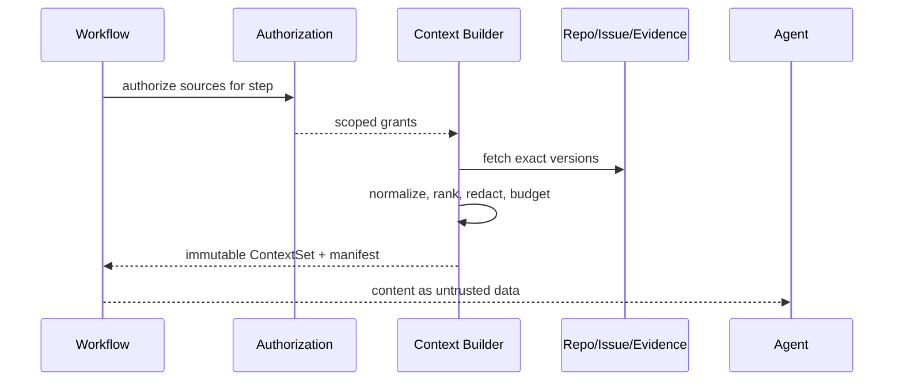

# 上下文筛选与边界

> 当前实现说明：M0 已实现 Task、依赖项与 API contract 的最小上下文切片。必需来源缺失、无效或构建失败均 fail-closed；若失败发生在领取之后，Task/Session/Worker/Lease 会在同一补偿事务中恢复一致状态，新建 Worktree 标记清理，既有已修改 Worktree 则隔离且不得自动重派。带不可变 manifest、完整 token/byte/file 预算和多来源排序的 ContextSet 仍属 M3，因此本规范保持 `partial/unverified`。

## 1. 目标与非目标

`CTX-REQ-001` 为每个执行步骤构建“足够且仅足够”的 project-scoped ContextSet。`CTX-REQ-002` 上下文 MUST 有来源、版本、预算、敏感级别和可复现筛选结果。本文不授予读取权限，不把检索结果当作可信指令，也不保存无限期记忆。

## 2. 参与者、角色、权限和信任边界

调用主体提出任务意图；Context Builder 依据服务端授权检索；Runner 只读取 Lease 允许的工作区；Agent 消费过滤后的不可信内容；Verifier 可查看来源清单而非越权原文。仓库、Issue、MR、测试日志和 Prompt 均为潜在注入边界。

## 3. 触发条件、输入和前置条件

任务规划、复现、修改、验证前分别构建 ContextSet。输入为 task ID、step kind、exact SHA、允许路径/数据源、token/byte/file budget；前置条件为有效 delegated context、项目可见性、可解析 include/exclude 规则及不存在符号链接逃逸。

## 4. 正常交互及时序图

## 5. 失败、取消、超时、重试、恢复和用户提示

必要来源缺失、SHA 不匹配、无法解码、超预算无法压缩、敏感内容脱敏失败时 MUST 中止该步骤。可选来源失败应记录 omission，不得静默补造。取消停止检索并删除临时明文；重试固定相同版本。用户提示列出缺失来源、限制和缩小范围建议，但不泄漏被拒资源。

## 6. 状态机、规则和不可变式

ContextSet 状态：`requested → collecting → filtered → sealed → consumed/expired`，失败为 `rejected`。`CTX-RULE-001` sealed 后不可修改；`CTX-RULE-002` 内容不能覆盖系统/工具策略；`CTX-RULE-003` 来源权限在每次构建时重验；`CTX-RULE-004` 必需来源 omission 时 fail-closed。

## 7. 字段、配置和格式校验

Manifest 至少含 `context_id/project_id/task_id/step/source_uri/source_version/digest/classification/selected_bytes/token_estimate/redactions/created_at/expires_at`。路径必须 canonicalize，拒绝绝对路径、`..`、NUL、符号链接越界。文件类型、单文件/总字节、文件数和 token 上限必须有硬限制。

## 8. 并发、幂等和一致性

构建键为 `task_id + step + source_versions + filter_version + budget`；同键返回同 digest。构建期间源版本变化则废弃并重建，不混合版本。manifest 与引用 Evidence 原子保存，缓存按 project/context 隔离且按过期时间清除。

## 9. 安全、Secret、隐私和审计

先授权、再获取、再脱敏；Secret pattern 命中默认移除并记录类型，不记录原值。Central Plane 不持久化完整源码；脱敏加密 Agent 轨迹最多 30 天。审计记录请求者、数据源类别、数量、digest、拒绝原因和策略版本。

## 10. 质量门禁、证据与 fail-closed 规则

Agent 输出若声称基于仓库/测试事实，MUST 引用 manifest source ID；空泛或不存在引用不得通过验证。注入扫描、scope 校验、SHA freshness 和 redaction 是 Required Gate，不可由 Agent 豁免。

## 11. 指标、SLO、告警和运维动作

监控构建 P95、token/byte 利用率、omission、redaction、cache hit、stale rebuild 和越界拒绝。上下文构建 P95 目标 < 2s（不含外部大对象下载）；Secret 命中或跨项目请求立即安全告警。

## 12. 验收测试和需求追踪

- `TC-CTX-001`：同输入产生相同 manifest digest，版本变化触发重建。
- `TC-CTX-002`：绝对路径、遍历、符号链接逃逸和跨项目来源被拒绝。
- `TC-CTX-003`：Prompt injection 不改变 Tool/网络/Secret 权限。
- `TC-CTX-004`：超预算采用可验证压缩；必需信息无法保留则停止并转人工。

## 13. 数据迁移、兼容、发布与回滚

旧 include/exclude 规则迁移到版本化 Filter Policy；不明确的 wildcard 默认收紧并产生人工清单。旧缓存不得复用到 v3。新筛选器先 shadow 比较 omission/size，再 enforce；回滚只能回到同等或更严格边界。
