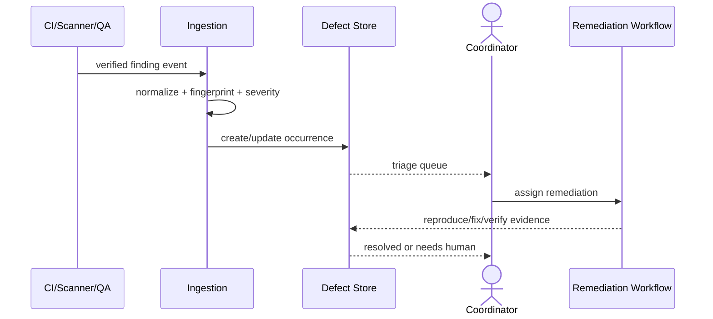
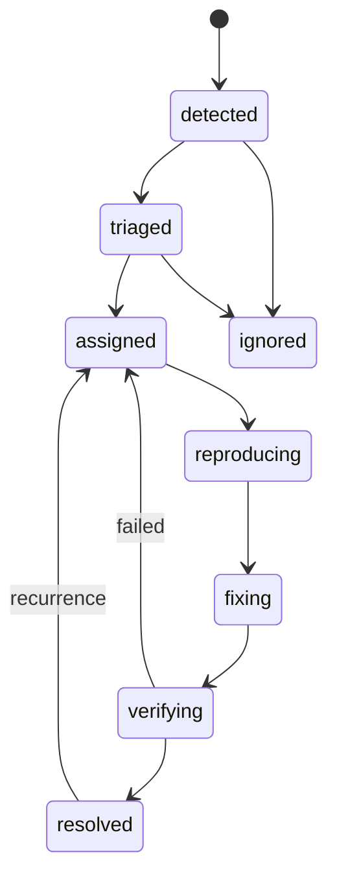

# Finding、Defect 与测试问题

## 1. 目标与非目标

`DEF-REQ-001` 将 Pipeline、JUnit、契约、安全扫描与人工 QA 结果归一为可去重、分派、修复、复验的 Finding/Defect。`DEF-REQ-002` 重复发生 MUST 累加 occurrence，已解决问题再现 MUST reopen。本文不让 Agent 决定安全严重度或自动忽略问题。

## 2. 参与者、角色、权限和信任边界

CI/Scanner/QA 是 Finding 生产者；Ingestion Service 归一；Coordinator/QA triage；Developer/Agent 修复；Verifier 复验；Project admin 审批 ignore（若策略允许）。外部报告和日志均不可信，安全 Finding 受更严格可见性控制。

## 3. 触发条件、输入和前置条件

Pipeline/Job 完成、JUnit 上传、契约 diff、SAST/Secret 命中或 QA 提交触发。输入需包含 project、source、rule/test identity、branch/SHA、发生时间、标准化前错误、环境与证据引用。生产者身份和 payload 必须验证；未知 project/SHA 拒绝进入业务表。

## 4. 正常交互及时序图

## 5. 失败、取消、超时、重试、恢复和用户提示

解析失败进入 quarantine，不得丢弃或创建模糊 Defect；生产者重试通过 event ID 去重。Triage 超时按 severity 升级；修复取消不关闭 Defect。外部证据暂不可用时显示 `evidence_unavailable` 并阻断 resolved。用户看到严重度依据、首/末发生、次数、复现与责任队列。

## 6. 状态机、规则和不可变式

Defect enum 固定为 `detected/triaged/assigned/reproducing/fixing/verifying/resolved/ignored`。`DEF-RULE-001` fingerprint 相同只增加 occurrence；`DEF-RULE-002` resolved 必须有 exact-SHA 复验证据；`DEF-RULE-003` Critical/High 安全问题不可自动 ignore；`DEF-RULE-004` 无法复现时 Defect 保持 `assigned/reproducing` 并把关联 WorkItem/RemediationRun 转 `needs_human`，不得给 Defect 发明同名状态或误标 resolved。

## 7. 字段、配置和格式校验

Finding 必含 `source/type/project/repository/branch/source_sha/rule_or_test/error_signature/environment/evidence_ref`。指纹为项目、分支、测试/规则和标准化错误签名的版本化 hash。Severity 为 `critical/high/medium/low/info`；复现步骤最多 20 项并禁止 Secret。Occurrence 保留 producer event ID。

## 8. 并发、幂等和一致性

事件 ID 去重；fingerprint 以唯一约束和事务 upsert 防并发重复。Occurrence 只追加；Defect 状态用 optimistic version。迟到事件发生时间早于 resolved 可记历史 occurrence；发生时间晚于 resolved 则原子 reopen 并发出事件。

## 9. 安全、Secret、隐私和审计

Secret Finding 的匹配原文必须遮蔽，只保留类型、位置和不可逆指纹。Issue 文本不得作为系统指令。审计 severity/owner/status/ignore 变化、自动化触发、证据访问和 reopen；ignore 必须有理由、期限和独立审批（若 required）。

## 10. 质量门禁、证据与 fail-closed 规则

Critical/High 未解决安全 Defect 阻断生产；与 MR exact SHA 相关的 required test/contract Defect 阻断 ready。resolved 需复现从 fail 变 pass 的 Evidence；仅修改状态或关闭 GitLab Issue 不构成证据。

## 11. 指标、SLO、告警和运维动作

监控 Finding ingest/parse、去重率、MTTA/MTTR、reopen、无法复现、quarantine 和按严重度 backlog。Critical 立即通知，High 15 分钟内进入 triage；quarantine 持续增长触发 producer/parser 运维动作。

## 12. 验收测试和需求追踪

- `TC-DEF-001`：六类来源归一为完整 Finding/Defect。
- `TC-DEF-002`：并发重复事件仅一个 Defect、多个 occurrence。
- `TC-DEF-003`：resolved 后新发生会 reopen。
- `TC-DEF-004`：无证据/无法复现/安全高危不能虚假 resolved 或 ignore。
- `TC-DEF-005`：敏感证据按角色隔离且日志无 Secret。

## 13. 数据迁移、兼容、发布与回滚

旧 test failure 按 fingerprint v1 回填，无法确定 SHA 的记录标 `historical_unverified`。上线先 shadow 归一并与人工分类比较，再启用自动建单；指纹版本升级保留 alias。回滚保留 occurrence，不合并或删除既有 Defect。
