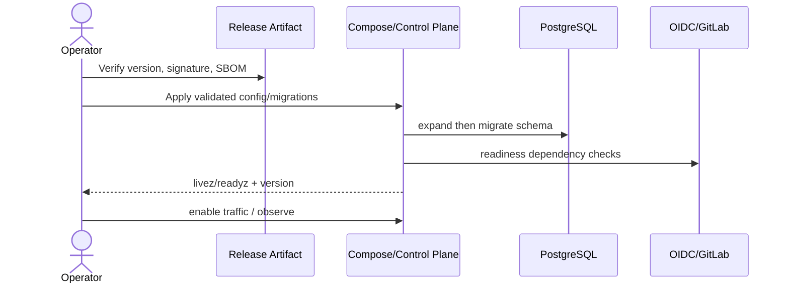

# 部署与环境产品需求

## 1. 目标与非目标

`DEP-REQ-001` v3 MUST 支持公司 VM + Docker Compose 部署中央 Control Plane/PostgreSQL/反向代理，并支持成员机器本地 Runner。`DEP-REQ-002` 安装、升级、备份、恢复、健康检查和回滚 MUST 可操作、可审计。非目标：M4 前提供多区域/多集群 SaaS、让中央服务挂载源码、或将 Docker Socket 暴露给业务容器。

## 2. 参与者、角色、权限和信任边界

`operations_owner` 管 VM、TLS、备份和发布；`platform_admin` 管应用配置；`security_owner` 管 Secret/应急；`project_admin` 只管项目连接；Runner 设备所有者只管已批准的本机。Public ingress、Control Plane network、database network、backup store、GitLab/OIDC、Runner outbound 各自隔离。

## 3. 触发条件、输入和前置条件

新安装、配置变更、版本升级、证书/Secret 轮换、备份恢复触发。前置条件：受支持 Linux/容器运行时、固定 Go/Node 构建版本产物、DNS/TLS、PostgreSQL、Secret Store、OIDC/GitLab 出站连通、容量与恢复目标确认。生产配置必须通过 Schema 和 doctor。

## 4. 正常交互及时序图

## 5. 失败、取消、超时、重试、恢复和用户提示

Migration 或 readiness 失败时不得接流量；发布取消需完成当前原子步骤。只重试幂等 pull/check/backup 操作。升级后异常按 Runbook 回滚应用并验证数据库兼容；PostgreSQL 恢复执行数据校验和外部对账。运维输出必须给出 component、phase、error code、correlation ID 与安全修复建议。

## 6. 状态机、规则和不可变式

环境状态：`unconfigured → installing → migrating → ready → degraded/maintenance → decommissioned`。`DEP-RULE-001` `livez` 只表示进程存活，`readyz` 必须验证接流量条件；`DEP-RULE-002` 中央服务无源码卷；`DEP-RULE-003` migration 前备份且向后兼容；`DEP-RULE-004` 安全配置缺失时不启动或只健康端点。

## 7. 字段、配置和格式校验

配置优先级为 CLI flag > environment > config file > safe default，最终有效配置可脱敏打印。生产必须显式设置 public URL、OIDC issuer/audience、DB、TLS/Proxy trust、Secret refs、retention 和 feature flags。未知/弱安全值拒绝；CPU/memory/disk/connection pool/timeout 有上下限。

## 8. 并发、幂等和一致性

Migration 使用全局 advisory lock；同版本重复执行无副作用。滚动/重启期间写入通过数据库事务与 Outbox 保证，多个实例不重复消费。配置变更带 revision；只在所有实例报告相同 revision 后完成发布。

## 9. 安全、Secret、隐私和审计

容器非 root、只读文件系统（必要目录例外）、最小网络/能力，不挂载 Docker Socket。Secret 通过外部文件/句柄注入并支持轮换，不进入 image/env dump。发布、配置、迁移、备份、恢复、证书/Secret 轮换和紧急停机均审计。

## 10. 质量门禁、证据与 fail-closed 规则

发布 Gate：干净 clone 构建、签名/SBOM、镜像扫描、配置 Schema、migration dry-run、真实 smoke、备份可用和回滚演练。任一 Required Gate 缺失不得标 ready；依赖失效时降级只读或 not ready，不能放宽授权/质量。

## 11. 指标、SLO、告警和运维动作

目标月可用性 99.5%、API P95 < 500ms、RPO 15 分钟、RTO 4 小时。监控 CPU/memory/disk、DB pool/lag、ready、发布错误、证书到期、备份年龄与 Runner/GitLab/OIDC 可用性。证书 30/14/7 天告警，备份超 RPO 立即告警。

## 12. 验收测试和需求追踪

- `TC-DEP-001`：干净 VM 一条受支持流程安装并通过 livez/readyz/smoke。
- `TC-DEP-002`：无 Secret、弱配置、失败 migration 不接流量。
- `TC-DEP-003`：升级/应用回滚/数据库恢复后状态和审计一致。
- `TC-DEP-004`：中央容器无源码、Docker Socket、宿主设备/凭据挂载。

## 13. 数据迁移、兼容、发布与回滚

SQLite 仅提供一次性、可重放且有报告的导入；生产真源切 PostgreSQL 后禁止双写 SQLite。数据库遵循 expand/migrate/contract，contract 至少延后一稳定版本。回滚前检查 schema compatibility；恢复后重放 Outbox/对账 GitLab，绝不覆盖审计。
