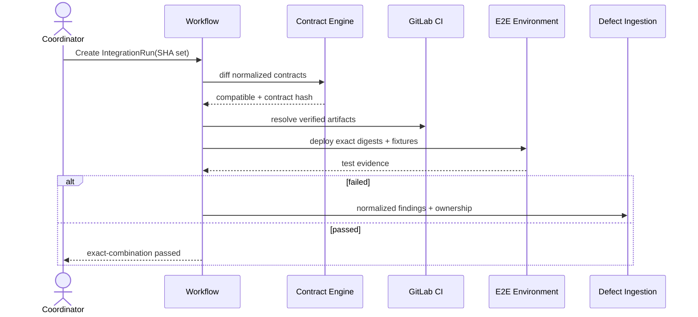

# 跨仓联调与端到端 Workflow

## 1. 目标与非目标

`E2E-REQ-001` 将前端 SHA、后端 SHA、契约版本、环境与测试 Evidence 固定为可重放的 IntegrationRun。`E2E-REQ-002` breaking change 或组合测试失败 MUST 阻断相关任务并生成明确责任 Defect。本文不构建通用 CI 平台，也不允许以“各仓单测通过”替代联合 E2E。

## 2. 参与者、角色、权限和信任边界

Coordinator 选择组合；Contract Engine 解析/比较契约；Workflow Engine 编排；GitLab CI 构建制品；Environment Controller 创建隔离环境；QA/Verifier 复核；Agent 只能处理已分派 Defect。不同仓库、CI Artifact、测试环境和第三方依赖均为独立边界。

## 3. 触发条件、输入和前置条件

MR 更新、契约变化、手动联调、Nightly 或 Defect 复验触发。输入必须固定参与仓库/role、commit SHA、artifact digest、OpenAPI version/hash、test suite version、environment profile、数据 fixture 和策略。所有 SHA 可从远端解析且 Artifact 可验证后才开始。

## 4. 正常交互及时序图

## 5. 失败、取消、超时、重试、恢复和用户提示

契约缺失/无效、Artifact 不可验证、环境准备失败、测试超时和 teardown 失败分别分类。取消停止新 Job 并始终执行清理；环境类临时故障 MAY 以同一组合重试，业务失败不得自动反复运行。恢复只复用 digest 匹配的制品。UI 显示组合矩阵、阶段、环境 TTL、日志/Evidence 和责任仓库。

## 6. 状态机、规则和不可变式

IntegrationRun 的 wire 状态固定为 `waiting → running → passed/failed/cancelled/expired`；`contract_check/provisioning/executing/cleanup` 是 `phase`，不得扩展为第二套状态。breaking contract、环境阻断或清理失败均以 `state=failed` 加稳定 `reason_code` 表达，清理另写 `cleanup_status` 并隔离环境。`E2E-RULE-001` 组合中任一 SHA/digest 变化创建新 Run；`E2E-RULE-002` breaking contract 阻断 provisioning；`E2E-RULE-003` passed 只对精确组合有效；`E2E-RULE-004` teardown 是必须执行的终结步骤。

## 7. 字段、配置和格式校验

Run manifest 必含 `run_id/project_group/repositories[{role,project_id,sha,artifact_digest}]/contract_hash/suite_version/environment_profile/fixture_version/ttl/policy_version`。角色唯一；SHA/digest 合法；TTL 在 15 分钟–24 小时范围；OpenAPI 只接受支持版本的 JSON/YAML 且完整校验 request/response schema。

## 8. 并发、幂等和一致性

同一规范化组合和 suite/policy 使用内容 hash 去重；active Run 可复用观察者但不共享可变环境。环境分配用 Lease 和 fencing token；事件按 run/version 去重。跨仓状态最终一致，Gate snapshot 仅在全部 producer 到达后原子发布。

## 9. 安全、Secret、隐私和审计

环境使用短期凭据、隔离网络和合成/脱敏数据；禁止生产 Secret 与真实个人数据。Artifact 校验来源和 digest。审计 Run 创建/取消/重试、组合、环境、契约决定、Finding 与清理结果；测试日志脱敏并限时保存。

## 10. 质量门禁、证据与 fail-closed 规则

Required Gate：contract parse/integrity/compatibility、artifact provenance、environment readiness、integration suite、cleanup。缺少适用的 contract/E2E Evidence 或 Evidence 与组合不符均阻断相关 MR；breaking change 必须有关联责任任务或批准的迁移计划。

## 11. 指标、SLO、告警和运维动作

监控排队/准备/执行/清理时长、环境成功率、组合重用、flaky、breaking change、责任分派和资源泄漏。环境到 TTL 必须自动销毁；`cleanup_status=failed` 立即告警并隔离。P95 准备时长由 profile 设基线并逐项目跟踪。

## 12. 验收测试和需求追踪

- `TC-E2E-001`：前后端精确 SHA/契约/制品组合通过联合 E2E。
- `TC-E2E-002`：breaking change 在部署前阻断并生成明确责任任务。
- `TC-E2E-003`：测试失败归一、去重为唯一 Defect 并关联 Run。
- `TC-E2E-004`：取消/超时/崩溃恢复均清理环境且不复用错误制品。

## 13. 数据迁移、兼容、发布与回滚

旧联调记录缺少组合 digest 者标历史参考，不参与 Gate。先选 2 个仓库 shadow 生成 IntegrationRun，与现有 CI 对比后 enforce。契约算法升级保留 parser/diff version；回滚不把新算法判定的 breaking 自动改为 compatible。
