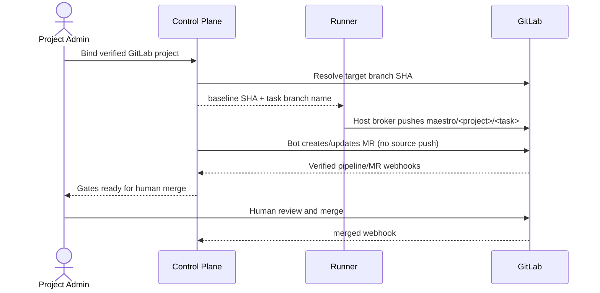

# GitLab 协作、MR 与 Pipeline

## 1. 目标与非目标

`GL-REQ-001` 以自建 GitLab 的远端分支、MR、Pipeline、Job 和 merged 事件作为代码协作事实。`GL-REQ-002` Maestro MUST 只允许成员侧 Runner 的宿主 Git broker 写任务分支并由人最终合并；中央 Control Plane/GitLab Bot 不推送源码分支。所有 Maestro 组件都不得推送保护分支、调用 merge API、用本地 `HEAD` 作为 baseline 或替代 GitLab 审批规则。

事件接入以 [GitLab Webhooks](https://docs.gitlab.com/user/project/integrations/webhooks/) 为协议依据；MR 查询与创建以 [Merge Requests API](https://docs.gitlab.com/api/merge_requests/) 为依据，但 Maestro 的 Token 与代码路径 MUST 不具备 merge 能力。

## 2. 参与者、角色、权限和信任边界

Platform admin 配置批准的 GitLab Instance；Project admin 绑定仓库；Bot 使用最小 API Scope 查询状态并创建/更新 MR；Runner 宿主 Git broker 使用 OS Keychain 中成员凭据推送任务分支；人类 Reviewer 在 GitLab 审查合并；Webhook Receiver 与 Reconciler 同步事实。GitLab Host、Webhook 入口、宿主 credential broker 和 Artifact 是外部信任边界。

## 3. 触发条件、输入和前置条件

仓库接入、任务执行、MR/Pipeline 事件与周期对账触发流程。前置条件：HTTPS host、证书验证、禁止跨 host 重定向、仓库 ID/默认分支验证、Bot 最小 Scope、Webhook Secret 配置、远端 target SHA 解析成功。

## 4. 正常交互及时序图

## 5. 失败、取消、超时、重试、恢复和用户提示

GitLab 不可用时仅允许读取带同步时间的缓存，不得新授权、推断合并或标记完成。Webhook 无效签名直接拒绝且无业务效果；合法事件持久化后异步处理，失败进入重试/DLQ。推送或 MR 创建超时先按分支/MR identity 查询再重试。提示包含 GitLab object link、last sync、错误类别和人工对账入口。

## 6. 状态机、规则和不可变式

RepositoryConnection：`pending → verified → degraded/revoked`；MR Sync：`unknown → opened → pipeline_running → gate_blocked/ready → merged/closed`。`GL-RULE-001` baseline 来自远端 target SHA；`GL-RULE-002` 分支为 `maestro/<project-key>/<task-id>`；`GL-RULE-003` source/target SHA 变化使 Evidence stale；`GL-RULE-004` done 仅 merged 事件或对账确认。

## 7. 字段、配置和格式校验

Instance 只接受 platform admin 配置的 HTTPS base URL；repository 使用 immutable numeric project ID。MR 必须含 task ID marker、source/target branch、source/target SHA；Webhook 对原始 bytes 验签并验证 event type/project ID。外部 URL 禁止用户直接传入请求代理。

## 8. 并发、幂等和一致性

Webhook 以 GitLab event UUID，缺失时以 payload digest 去重；原始事件与 Inbox 同事务持久化后才返回 2xx。MR upsert 使用 `(gitlab_project_id, source_branch, target_branch)`；乱序事件按 object `updated_at`、pipeline ID 与 SHA 判定，周期对账修复遗漏。

## 9. 安全、Secret、隐私和审计

中央 Bot Token/Secret 只保存句柄并定期轮换；成员 GitLab credential 只存在 Runner OS Keychain，由宿主 broker 使用且不进入控制面或沙箱。验证 TLS 和固定 host，拒绝跨 host redirect/SSRF。审计 Instance/仓库配置、Token 轮换、broker 分支操作、Webhook verify/replay、MR/Pipeline 同步和 merged 判定；payload 按敏感级别与保留策略存储。

## 10. 质量门禁、证据与 fail-closed 规则

进入 ready 需要 exact source/target SHA 的权威 CI Evidence 与全部 Required Gate。GitLab 状态缺失、out-of-date、pipeline skipped/cancelled 或 source/target 漂移均阻断。Webhook 真实性与 SHA 一致性不可豁免。

## 11. 指标、SLO、告警和运维动作

监控 Webhook verify/ingest P95、Inbox lag、DLQ、对账差异、API 限流、MR sync lag、pipeline duration。持久化 P95 < 2s；正常事件 60s 内反映。DLQ 非零或对账差异连续出现触发 webhook-pipeline-failure Runbook。

## 12. 验收测试和需求追踪

- `TC-GL-001`：远端 baseline、任务分支、MR、Pipeline、人工 merge 全链路。
- `TC-GL-002`：无效签名、重复和乱序事件不产生重复/错误状态。
- `TC-GL-003`：SHA 漂移立即 stale 并阻断 ready。
- `TC-GL-004`：Bot 无源码 push/merge capability；Git broker 拒绝非任务分支，且 GitLab 保护分支拒绝纵深绕过。
- `TC-GL-005`：GitLab 中断只读降级并可对账恢复。

## 13. 数据迁移、兼容、发布与回滚

旧仓库 URL 迁移为 approved instance ID + numeric project ID 并重新验证；旧本地 baseline 作废。Webhook v3 并行接收并 shadow 对账后切换。回滚保留 Inbox/事件水位和 stale 标记，不恢复直接合并或本地 HEAD。
