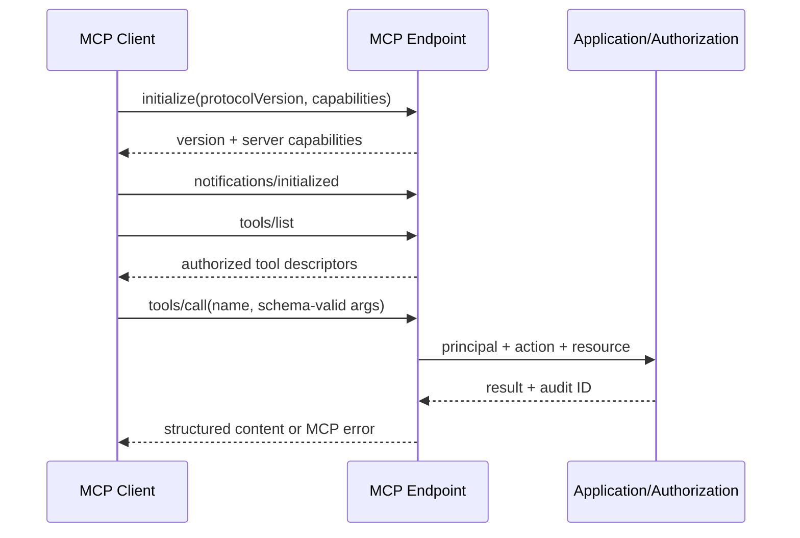

# MCP 协议与 Tool/Resource 契约

## 1. 目标与非目标

`MCP-REQ-001` 提供真实 MCP `initialize`、`tools/list`、`tools/call`、Resource 与取消能力，支持本地 stdio 和中央 Streamable HTTP。`MCP-REQ-002` MCP 与 REST 使用相同业务授权和状态机。不得以 REST equivalent 测试冒充 MCP；公开 Tool MUST NOT 包含 `merge_task`、任意命令或 Secret 读取。

远程实现 MUST 遵循稳定版 [MCP Transport](https://modelcontextprotocol.io/specification/2025-11-25/basic/transports) 与 [MCP Authorization](https://modelcontextprotocol.io/specification/2025-11-25/basic/authorization)；若依赖版本与规范冲突，以锁定的兼容矩阵和 ADR-004 的显式决策为准，不能静默降级协议或授权。

## 2. 参与者、角色、权限和信任边界

MCP Client 是不可信调用方；stdio Server 继承本地受控启动上下文；远程 MCP 通过 OIDC/OAuth 授权；Control Plane 解析协议并调用 Application Service；Runner 不直接信任 Client 参数。Client capability 不代表业务权限。

## 3. 触发条件、输入和前置条件

连接先完成 `initialize`/`initialized`，协商支持的 protocol version、capabilities 与服务版本。远程请求需有效 Bearer token 和允许 Origin；stdio 需受控配置。Tool 输入必须匹配 JSON Schema，资源 URI 必须可见且为 project-scoped。

## 4. 正常交互及时序图

## 5. 失败、取消、超时、重试、恢复和用户提示

协议错误、无效参数、未认证、无权限、冲突、限流、依赖不可用和内部错误须返回稳定 code 与 correlation ID，不泄漏栈/资源存在性。Client 发取消通知后服务停止未提交步骤；已提交事务不回滚而返回当前资源。远程断线不自动重放写 Tool，Client 必须用原幂等键查询/重试。

## 6. 状态机、规则和不可变式

连接：`new → initialized → active → draining → closed`；远程 Session：`issued → active → expired/revoked`。`MCP-RULE-001` initialize 前的业务请求拒绝；`MCP-RULE-002` tool list 可按权限收窄但调用仍服务端鉴权；`MCP-RULE-003` 未知能力不启用；`MCP-RULE-004` transport 差异不得改变业务语义。

## 7. 字段、配置和格式校验

Tool descriptor 和参数以 `tools.schema.json` 为准。写 Tool 必含 `idempotency_key` 与 `expected_version`；不能接受 `role` 或授权用 `session_id`。Resource URI 使用 `maestro://projects/{project_id}/...`，ID、分页 cursor、限制和文本长度严格校验；未知字段按 Schema 规则拒绝。

## 8. 并发、幂等和一致性

JSON-RPC request ID 只关联传输，不充当业务幂等键。相同写请求通过业务幂等键去重；并发更新用 expected version，冲突返回当前版本。通知至少一次，客户端按 event ID 去重；断线恢复先重新 initialize，再按 cursor 拉取状态。

## 9. 安全、Secret、隐私和审计

HTTP MUST 验证 `Origin`，仅允许配置白名单；拒绝 token 出现在 query；日志脱敏 Authorization/Cookie/Tool 敏感参数。Tool 每次调用记录 principal、tool、project、decision、duration、result class 与 correlation ID。错误鉴权不得退回匿名。

## 10. 质量门禁、证据与 fail-closed 规则

MCP 契约 Gate 要求 initialize/tools/list/tools/call/cancel 在真实 binary 上测试；Tool Schema、权限映射和错误码必须通过契约测试。未实现的 Tool 不得列出，后端依赖错误不能返回成功内容。

## 11. 指标、SLO、告警和运维动作

监控 active session、初始化失败、Tool P50/P95、错误率、取消延迟、schema reject、Origin/auth deny 和断连。普通只读 Tool P95 目标 < 500ms（不含长任务）；错误率或拒绝异常升高触发协议/安全告警。

## 12. 验收测试和需求追踪

- `TC-MCP-001`：真实 stdio 完成 initialize、tools/list、tools/call。
- `TC-MCP-002`：真实 Streamable HTTP 完成授权、恢复与取消。
- `TC-MCP-003`：未初始化、非法 Schema、伪造 scope、错误 Origin 和过期 token 被拒绝。
- `TC-MCP-004`：`merge_task` 与任意命令 Tool 不存在。
- `TC-MCP-005`：MCP/REST 对同主体同动作的授权和错误语义一致。

## 13. 数据迁移、兼容、发布与回滚

v2 自报身份字段和 `merge_task` 为 breaking removal；服务端通过 protocol/server version 明确拒绝不兼容 Client，不做静默转换。新 Tool 先 feature flag、schema 测试再公开；回滚时保留幂等记录与 Session 撤销，不重新暴露已移除能力。
