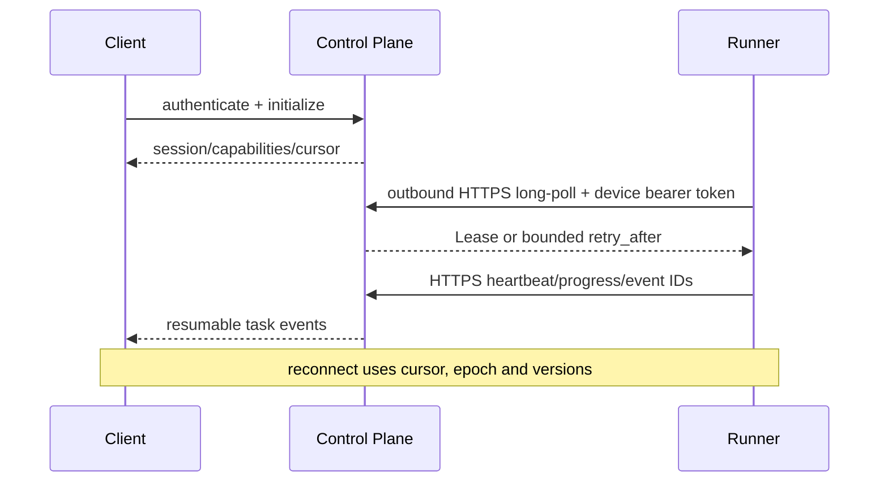

# 多客户端、Runner 连接与会话恢复

## 1. 目标与非目标

`CLIENT-REQ-001` 支持本地 stdio MCP、中央 Streamable HTTP MCP、Web Console 与 Runner 出站 HTTPS Lease API，并保持一致授权和任务语义。`CLIENT-REQ-002` 网络中断后 MUST 可安全恢复而不重复副作用。产品不支持 Control Plane 主动连接成员机器、自定义 WebSocket/mTLS Runner 协议，也不保证客户端本地 UI 状态为事实真源。

stdio 与 Streamable HTTP 的 framing、Session 和恢复边界 MUST 与 [MCP Transport](https://modelcontextprotocol.io/specification/2025-11-25/basic/transports) 保持一致；远程授权遵循 [MCP Authorization](https://modelcontextprotocol.io/specification/2025-11-25/basic/authorization)。

## 2. 参与者、角色、权限和信任边界

Desktop/CLI MCP Client、Browser、Control Plane、Runner 与 GitLab 是独立进程及信任域。一个人可有多个 Client Session，但每个请求的 principal/project/action 必须独立验证。Runner device identity 与用户 Session 分离，Runner 只接受 Control Plane 签发的 scoped Lease。

## 3. 触发条件、输入和前置条件

客户端初始化、登录、订阅事件、Runner 注册/心跳、断线重连触发本流程。远程 MCP 需 OIDC token；Web 需安全 Cookie；Runner 首次需一次性注册码，批准后使用 Keychain 中设备密钥。所有端需声明版本和 capabilities。

## 4. 正常交互及时序图

## 5. 失败、取消、超时、重试、恢复和用户提示

断线时 Client 显示最后同步时间和 offline，不推测成功；Runner 未心跳进入 `suspect` 后 `offline`，Lease 等待超时再回收。重连使用 cursor 拉取缺失事件，`410 CURSOR_EXPIRED` 时获取完整 snapshot。取消请求关联 operation ID；网络超时后查询状态，不盲目新建写操作。

## 6. 状态机、规则和不可变式

Client Session：`connecting → active → reconnecting → expired/closed`；Runner 使用规范状态 `pending_approval/approved/online/suspect/offline/draining/revoked`。`CLIENT-RULE-001` Runner 仅通过出站 HTTPS long-poll、heartbeat 与 result API 通信；`CLIENT-RULE-002` revoked 不能恢复；`CLIENT-RULE-003` 客户端 capability 只能减少功能；`CLIENT-RULE-004` 旧 Lease epoch 的进度/结果被拒绝。

## 7. 字段、配置和格式校验

握手包含 client/server/protocol version、capability enum、device/session ID、event cursor 和时间；禁止自由格式 capability。心跳间隔默认 15 秒、suspect 45 秒、offline 90 秒，允许在安全范围配置。注册 code 单次使用、10 分钟过期；device key 必须为支持的算法/长度。

## 8. 并发、幂等和一致性

同用户多 Session 可并行读；写仍按业务幂等键和版本串行化。一个 Runner 仅有一个 active connection generation，新设备 token/进程 generation 使旧 generation 失效。long-poll 超时返回显式 `retry_after`，客户端使用 jitter 重试；事件 cursor 单调递增，客户端按 event ID 去重；snapshot 带版本水位线避免事件流/快照缝隙。

## 9. 安全、Secret、隐私和审计

设备私钥仅存 OS Keychain；注册 code、token 不写日志。TLS 必须验证主机与证书；Runner 不接受任意重定向。审计注册、批准、连接、Lease、撤销、Session 创建/取消及异常版本；IP 与设备/token 只保存哈希标识。

## 10. 质量门禁、证据与 fail-closed 规则

连接 Gate 包含版本兼容、设备有效、project 绑定、Runner 沙箱能力和时钟偏差。任一验证失败不得发 Lease。离线恢复测试必须证明不重复执行、旧 epoch 不提交、事件无缺失或有明确全量恢复。

## 11. 指标、SLO、告警和运维动作

监控连接数、重连率、cursor gap、心跳延迟、offline 时长、Lease reassign 和版本分布。心跳判定延迟按上述阈值；大量 Runner 同时离线触发网络/证书检查，小范围离线执行 runner-offline Runbook。

## 12. 验收测试和需求追踪

- `TC-CLIENT-001`：stdio、HTTP、Web 对同资源状态一致。
- `TC-CLIENT-002`：中断前后写请求仅产生一次副作用。
- `TC-CLIENT-003`：Runner 断线、旧连接回归、撤销均正确处理 Lease。
- `TC-CLIENT-004`：不兼容版本明确失败且不降级安全能力。

## 13. 数据迁移、兼容、发布与回滚

旧匿名/共享客户端迁移为 Principal Session；旧 Runner 需重新注册并生成设备身份。兼容矩阵至少覆盖当前与前一小版本，安全 breaking change 可强制升级。回滚前确认 Runner 双向兼容；不得恢复长效注册 code 或入站连接。
