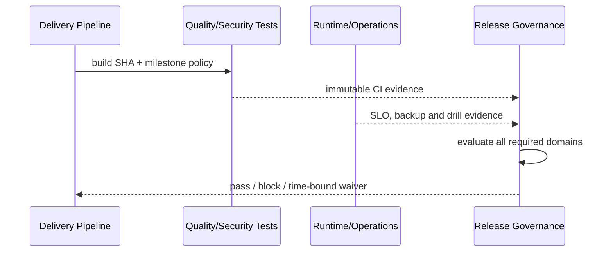

# 非功能需求与阶段目标

## 1. 目标与非目标

`NFR-REQ-001` 为 M0–M4 定义可测的安全、可靠性、性能、质量、可运维性和可访问性门槛。`NFR-REQ-002` 所有门槛 MUST 由 CI/运行证据验证，不能以文档状态替代实现状态。本文不承诺未试点规模或 99.5% 以上多区域 SLA。

## 2. 参与者、角色、权限和信任边界

`technical_lead` 对架构/性能负责，`security_owner` 对隔离/高危漏洞负责，`qa_owner` 对测试/Gate 负责，`operations_owner` 对 SLO/恢复负责，`product_owner` 对验收负责。执行者不能单独批准自己的 NFR 例外；生产准入需各责任域 Evidence。

## 3. 触发条件、输入和前置条件

每次 PR、阶段出口、候选发布、生产事故和季度演练触发评估。输入包括构建 SHA、环境/负载 profile、策略版本、测试/扫描/演练产物、时间窗口和 owner。无可比基线或采样不足时结果为 `unverified` 而非 passed。

## 4. 正常交互及时序图

## 5. 失败、取消、超时、重试、恢复和用户提示

NFR 测试失败需标明产品缺陷或测试基础设施错误；后者也阻断直至有效重跑。超时、样本不足、指标缺失均为 error/unverified。性能重试需使用相同 profile 并保留所有结果。控制台显示阈值、实际值、趋势、证据时间、owner 和修复/豁免入口。

## 6. 状态机、规则和不可变式

阶段评估：`draft → evidence_collecting → review → passed/failed/unverified → superseded`。`NFR-RULE-001` 只有 approved + implemented + passed 才可标阶段完成；`NFR-RULE-002` Critical/High 安全问题为零才能生产；`NFR-RULE-003` 安全/隔离/SHA/Webhook 真相不可豁免；`NFR-RULE-004` Evidence 过期必须重验。

| 阶段 | 新增强制目标 |
| --- | --- |
| M0 | 干净构建/真实协议 smoke；状态机与验证覆盖率 ≥80%；fail-closed |
| M1 | 统一 RBAC；Runner 逃逸测试；PostgreSQL/备份/readiness |
| M2 | exact-SHA CI Evidence；changed-lines coverage ≥80%；total coverage 下降 ≤0.5pp；Critical/High 扫描阻断 |
| M3 | 契约/E2E/Defect 闭环；Agent 预算真记账、注入红队、人工接管 |
| M4 | 99.5% 月可用性；API P95 <500ms；RPO 15m/RTO 4h；试点与演练通过 |

## 7. 字段、配置和格式校验

NFR Evidence 必含 metric/check ID、value/unit、threshold/comparator、sample/window、environment profile、producer/version、build SHA、timestamp、digest。百分比、时长和容量单位统一；禁止无单位数值。测试 profile 与例外均版本化且有 owner/expiry。

## 8. 并发、幂等和一致性

同 `check + SHA + profile + policy` 的评估幂等；多生产者 Evidence 只追加，聚合快照带版本。并行测试资源必须隔离以免互相污染；迟到 Evidence 若不匹配当前 SHA 标 stale，不覆盖新结论。

## 9. 安全、Secret、隐私和审计

压测/评测使用合成或脱敏数据，禁止生产 Secret。安全报告按最小可见性保存。所有 NFR 结论、阈值变化、例外、Evidence 替换/过期与生产准入决策审计；例外申请人与审批人分离。

## 10. 质量门禁、证据与 fail-closed 规则

生产同时满足功能、权限隔离、质量、Agent 评测、安全、恢复演练、审计导出与试点 Gate。Required check 的 `missing/skipped/error/stale` 均阻断。豁免最多 7 天、绑定一个 SHA/check；Critical/High 安全和不可豁免规则无豁免路径。

## 11. 指标、SLO、告警和运维动作

核心 SLI：availability、API latency/error、Webhook persist/lag、Runner online/lease、Gate evaluation、Agent cost/success/handoff、backup age/restore、audit completeness。月 99.5% 错误预算分档触发变更冻结/复盘；Webhook P95 <2s。每日全备+WAL，季度恢复演练。

## 12. 验收测试和需求追踪

- `TC-NFR-001`：每阶段全部 Mandatory NFR 有可验证 Evidence 和 owner。
- `TC-NFR-002`：指标缺失、样本不足、producer 失败和 stale 均不通过。
- `TC-NFR-003`：性能、隔离、备份恢复、Runner compromise、GitLab 中断和 DLQ 演练通过。
- `TC-NFR-004`：2–5 个 Go/TypeScript 仓库影子运行和人工验收通过。
- `TC-NFR-005`：Critical/High 安全问题为零且审计链可导出。

## 13. 数据迁移、兼容、发布与回滚

历史 NFR 结论无统一字段者只作参考并标 unverified。阈值从 observe → warn → enforce 分阶段启用，但安全硬门禁可直接 enforce。阈值升级保留历史 policy/Evidence；回滚不能删除失败记录或降低已生效安全边界。
