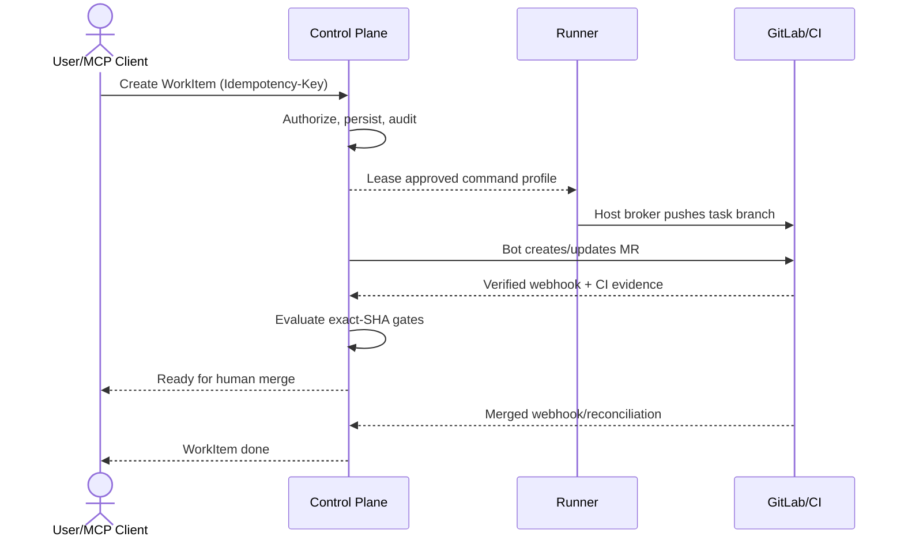

# Maestro MCP v3.0 产品总览

## 1. 目标与非目标

`OV-REQ-001` Maestro MCP MUST 将任务编排、代码执行、GitLab 协作和质量证据连接成可审计闭环，并在项目、身份、Runner 与 SHA 四个维度隔离。`OV-REQ-002` 产品 MUST 支持公司 VM 上的中央 Control Plane、成员侧本地 Runner、Go/TypeScript 试点仓库及 stdio/Streamable HTTP MCP 客户端。

非目标：平台不替代 GitLab 的代码托管、CI 和人工合并；不提供任意宿主命令执行；不让 Agent 自主修改权限、质量基线、Secret 或执行最终合并；M0–M4 是交付阶段而非产品模块。

## 2. 参与者、角色、权限和信任边界

人类角色为 `platform_admin/project_admin/coordinator/developer/verifier/viewer`；非人主体为 delegated Agent、Runner device、GitLab Bot 与 background service。权限以[角色与场景](roles-and-scenarios.md)为准，所有访问 MUST 取“主体授权 ∩ 项目范围 ∩ Runner 能力 ∩ 当前状态”的交集。Control Plane、Runner、GitLab、OIDC Provider、浏览器/MCP Client 分属独立信任域；Control Plane MUST NOT 挂载项目源码。

## 3. 触发条件、输入和前置条件

闭环由用户创建 WorkItem、GitLab 事件或被允许的自动修复策略触发。前置条件 MUST 包含：有效身份、可见项目、批准且在线的 Runner、远端 baseline SHA、版本化策略与 Command Profile；缺任一项时 MUST 保持只读或进入阻塞态。主要输入仅接受机器规范定义的 ID、期望版本和幂等键，角色、项目范围与 Session 身份 MUST 从服务端上下文导出。

## 4. 正常交互及时序图

## 5. 失败、取消、超时、重试、恢复和用户提示

外部依赖失败 MUST 映射为稳定错误码并保留最近可信状态；不得将超时视为成功。用户取消 MUST 停止新步骤、撤销 Lease 并保留已产生证据。只有具备幂等语义的网络/后台操作 MAY 指数退避重试；恢复后先对账再继续。界面 MUST 显示失败阶段、影响、可重试性、关联 ID 和人工处理入口。

## 6. 状态机、规则和不可变式

WorkItem 主路径为 `draft → queued → leased → executing → validating → ready_for_human_merge → done`，旁路为 `blocked/cancelling/cancelled/failed/needs_human`；完整合法边以[任务管理](task-management.md)为准。`OV-RULE-001` 无有效 Evidence 不得通过；`OV-RULE-002` `done` 只能由 merged webhook 或周期对账确认；`OV-RULE-003` 安全降级只能减少能力；`OV-RULE-004` 最终合并只能由人在 GitLab 完成。

## 7. 字段、配置和格式校验

所有资源 ID MUST 为服务端生成的不可猜测 ID；时间使用 UTC RFC 3339；SHA 为 40 位小写十六进制；版本采用不可变 SemVer；用户文本按字段长度限制并作为不可信数据处理。配置 MUST 先通过 `config.schema.json`，未知安全相关字段 MUST 拒绝，不能静默忽略。

## 8. 并发、幂等和一致性

所有写 API MUST 接受 `Idempotency-Key` 和期望资源版本；同一主体、路由、规范化请求在 24 小时内复用键返回原结果，不同载荷复用键返回 `409 IDEMPOTENCY_CONFLICT`。状态变更、审计和 Outbox MUST 同事务提交；异步消费者至少一次投递并按 event ID 去重。

## 9. 安全、Secret、隐私和审计

默认拒绝；鉴权失败不得降级为匿名。Secret 只允许引用 Secret Store 中的句柄，MUST NOT 出现在 Prompt、日志、事件或源码挂载中。每次授权决定、状态变化、Gate、豁免与外部同步均记录 actor、scope、decision、reason、correlation ID；源码内容不进入中央审计。

## 10. 质量门禁、证据与 fail-closed 规则

Evidence MUST 绑定精确 `source_sha + target_sha + policy_version`；CI Evidence 才可用于合并 Gate。本地结果仅供诊断。Required Gate 缺失、跳过、错误或过期均阻断。身份隔离、SHA 一致性、策略完整性和 Webhook 真实性不可豁免。

## 11. 指标、SLO、告警和运维动作

产品月可用性目标 99.5%；普通 API P95 < 500ms；Webhook 持久化 P95 < 2s。必须观测闭环成功率、任务 lead time、Gate 阻断率、Runner 在线率、Webhook backlog、Agent 人工接管率和预算消耗。错误预算耗尽时 MUST 暂停扩张性变更并执行相应 Runbook。

## 12. 验收测试和需求追踪

- `TC-OV-001`：从创建任务到人工合并与 `done` 对账完成，全部关联 ID 可追踪。
- `TC-OV-002`：伪造项目/角色、缺 Evidence、SHA 漂移和未验签 Webhook 均 fail-closed。
- `TC-OV-003`：GitLab 或 Runner 故障只降低能力，不产生虚假完成。

需求与阶段任务 MUST 写入 `governance/traceability-matrix.csv`，至少关联 `OV-REQ-001/002`、`OV-RULE-001..004` 与以上测试。

## 13. 数据迁移、兼容、发布与回滚

v3 对调用方自报身份范围、任意命令和 `merge_task` 做破坏性移除。发布采用数据库 expand/migrate/contract、Runner 兼容窗口和功能开关；旧客户端只能进入明确的只读兼容模式。回滚 MUST 保留新数据与审计，禁止回到会放宽授权或质量门禁的版本。
