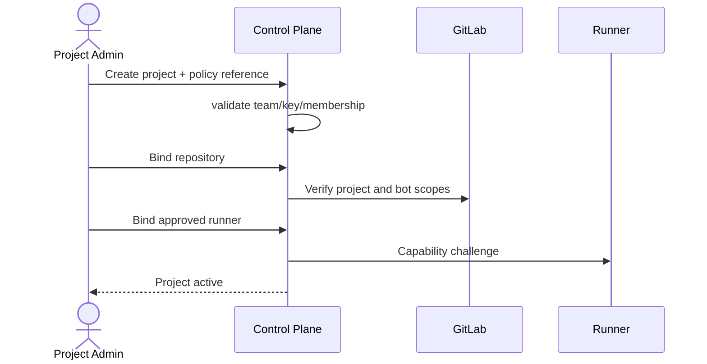

# 项目管理

## 1. 目标与非目标

`PROJ-REQ-001` 提供 team-scoped 项目创建、成员管理、仓库/Runner 绑定、策略继承与安全停用。`PROJ-REQ-002` 所有项目资源 MUST 隔离且可追踪。项目不拥有 GitLab 仓库内容，也不允许 Maestro 代替 GitLab 修改保护分支设置。

## 2. 参与者、角色、权限和信任边界

`platform_admin` 管实例级接入但无隐式源码权；`project_admin` 管本项目；`coordinator/developer/verifier/viewer` 按动作受限。GitLab repository 与 Runner 都是外部边界，绑定只建立引用和最小权限，不转移其凭据所有权。

## 3. 触发条件、输入和前置条件

创建项目需 active team、唯一 `project_key`、默认质量策略和至少一名 project admin。绑定仓库需验证 GitLab host、namespace/project ID、默认目标分支和 Bot 权限；绑定 Runner 需设备已批准且声明兼容能力。停用前 MUST 展示进行中任务、Lease、MR 和保留影响。

## 4. 正常交互及时序图

## 5. 失败、取消、超时、重试、恢复和用户提示

GitLab/Runner 验证超时保持 `configuring`，不创建半有效绑定；可安全重试验证。删除改为两阶段停用与保留期，进行中任务存在时默认拒绝并列出阻塞项。恢复必须重新验证凭据、策略和默认分支 SHA。错误提示不得暴露无权项目或仓库。

## 6. 状态机、规则和不可变式

项目状态：`draft → configuring → active → suspended → archived`；仓库绑定：`pending → verified → degraded → revoked`。`PROJ-RULE-001` project key 在 team 内不可复用；`PROJ-RULE-002` 每个资源外键携带 project scope；`PROJ-RULE-003` 下级策略只能加强；`PROJ-RULE-004` suspended 项目禁止新写操作和 Lease。

## 7. 字段、配置和格式校验

`project_key` 匹配 `^[a-z][a-z0-9-]{2,31}$`；显示名 1–80 字符；描述最多 2,000 字符；GitLab project 使用数值 ID 加批准的 host ID，不接受任意 URL；默认分支必须从 GitLab API 解析。标签键值、保留期和策略引用均按 Schema 校验。

## 8. 并发、幂等和一致性

项目与绑定写入使用资源版本和幂等键；同一仓库在同一 team 默认只能绑定一个 active 项目。项目、初始 admin、策略引用与审计同事务；外部验证通过 Inbox/Outbox 最终一致，UI 显示同步时间和 degraded 状态。

## 9. 安全、Secret、隐私和审计

仓库 Token 仅保存 Secret 句柄；连接验证输出脱敏。成员、策略、仓库、Runner、状态及保留期变化必须审计前后值、actor 与理由。Project admin 无权查看平台级 Secret 原值。

## 10. 质量门禁、证据与 fail-closed 规则

激活 Gate 要求有效 admin、已验证仓库、批准 Runner、可解析公司/项目策略和成功权限隔离测试。任一依赖 degraded 时禁止新增自动执行；缓存只读 MAY 保留。

## 11. 指标、SLO、告警和运维动作

监控项目激活耗时、绑定验证失败率、degraded 时长、孤儿资源和跨项目拒绝。外部连接状态最迟 5 分钟对账；连续三次失败告警 project admin，24 小时未恢复升级至平台运维。

## 12. 验收测试和需求追踪

- `TC-PROJ-001`：创建、绑定、激活、停用、恢复全链路及审计通过。
- `TC-PROJ-002`：重复 key、无权仓库、弱化策略和跨项目绑定被拒绝。
- `TC-PROJ-003`：GitLab/Runner 故障不产生 active 假状态。
- `TC-PROJ-004`：suspended 项目只读且不能创建 Lease。

## 13. 数据迁移、兼容、发布与回滚

SQLite 项目导入 PostgreSQL 时生成 team/project scope，重复 key 进入人工映射清单。旧全局仓库配置先置 `pending` 再验证；未验证不得激活。回滚保留 scope 列和审计，禁止降级为全局资源查找。
