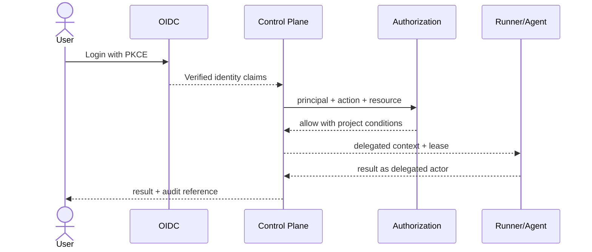

# 角色、委托身份与核心场景

## 1. 目标与非目标

`ROLE-REQ-001` 定义所有人类与服务主体的职责、授权边界和职责分离。`ROLE-REQ-002` Agent MUST 使用可追溯的委托身份，不能成为独立管理员。本文不定义 OIDC 协议字段或存储表结构，分别由安全与技术规范负责。

## 2. 参与者、角色、权限和信任边界

| 主体 | 允许能力 | 明确禁止 |
| --- | --- | --- |
| `platform_admin` | OIDC/GitLab Instance、公司策略、安全应急 | 不因平台角色自动读取项目源码 |
| `project_admin` | 项目成员、仓库、Runner、强化项目策略 | 自批豁免、弱化公司基线 |
| `coordinator` | 创建、派发、取消、重试 WorkItem | 改质量基线、合并代码 |
| `developer` | 领取、执行、提交、上报阻塞 | 验证自己的变更 |
| `verifier` | 查看 Evidence、通过或驳回 | 审核自己或自己触发的 Agent 变更 |
| `viewer` | 授权范围只读 | 触发状态变化 |
| delegated Agent | 委托用户、项目、Runner 能力的交集 | 管理权限、Secret、豁免、合并 |
| Runner device | 领取 Lease、执行批准 Profile、回传结果 | 跨项目/任意命令/入站控制 |
| GitLab Bot | 最小 API/Webhook 同步 Scope | 推送或合并保护分支 |
| background service | 固定服务账户执行对账/消费 | 冒充用户或扩大资源范围 |

人、设备和服务凭据属于不同信任域，MUST NOT 相互兑换。

## 3. 触发条件、输入和前置条件

登录、项目邀请、Runner 注册、MCP 调用、任务领取、验证、豁免和应急操作触发授权。前置条件包括有效主体、激活成员关系、项目可见性、请求动作及资源当前状态。请求中的 `role/project_id/session_id` 仅可作资源定位提示，不可成为授权依据。

## 4. 正常交互及时序图

## 5. 失败、取消、超时、重试、恢复和用户提示

未认证返回 `401`；已认证但无动作权限返回 `403`；无项目可见性返回 `404`。成员/Runner 撤销 MUST 使新请求立即失败，并在最多 60 秒内终止未开始的 Lease。身份提供方不可用时不得新授权；已有短期会话仅按配置进入只读。提示不得泄漏资源是否存在。

## 6. 状态机、规则和不可变式

成员关系：`invited → active → suspended → removed`；Runner 身份采用 `pending_approval/approved/online/suspect/offline/draining/revoked`；委托会话：`issued → active → expired/revoked`。`ROLE-RULE-001` 默认拒绝；`ROLE-RULE-002` 申请人与豁免审批人不同；`ROLE-RULE-003` 开发者与其变更验证者不同；`ROLE-RULE-004` 权限只能由服务端上下文导出。

## 7. 字段、配置和格式校验

角色值 MUST 来自权限 Schema；成员关系键为 `(team_id, project_id, principal_id)`；委托上下文至少含 `delegator_id/project_id/runner_id/session_id/scopes/issued_at/expires_at` 并签名。禁止 wildcard project、空 scope、过期或未来生效凭据。

## 8. 并发、幂等和一致性

邀请、撤销和角色变更 MUST 使用期望版本。重复邀请同一成员返回既有邀请；不同角色请求复用幂等键冲突。授权缓存键必须包含主体、项目、动作、资源版本，撤销事件 MUST 主动失效缓存。

## 9. 安全、Secret、隐私和审计

会话 Cookie、Runner key、Bot token 不得跨主体复用或进入日志。授权审计 MUST 记录 allow/deny、匹配角色、条件与策略版本；高频 404 可聚合告警但仍保留可关联证据。查看审计本身也需授权与审计。

## 10. 质量门禁、证据与 fail-closed 规则

任何执行、验证、豁免或同步 Gate MUST 先通过统一授权器；授权器不可用或策略无法解析时一律拒绝。权限测试证据绑定权限版本和构建 SHA，不得以 UI 隐藏按钮代替服务端校验。

## 11. 指标、SLO、告警和运维动作

监控登录成功率、授权 P95、deny 比率、跨项目探测、职责分离冲突、撤销传播延迟。授权 P95 目标 < 50ms；撤销传播 P99 < 60s。异常枚举或撤销失败触发凭据吊销 Runbook。

## 12. 验收测试和需求追踪

- `TC-ROLE-001`：各主体逐动作验证 allow/deny/404 语义。
- `TC-ROLE-002`：伪造 role/project/session 不扩大权限并生成审计。
- `TC-ROLE-003`：自审、自批豁免、被撤销 Runner 与跨项目枚举均失败。
- `TC-ROLE-004`：REST、MCP、WebSocket 和后台任务决策一致。

## 13. 数据迁移、兼容、发布与回滚

旧的客户端自报角色和全局 Session 必须迁移为 Principal 与 project-scoped Session。迁移报告列出无法映射成员并默认停用。权限发布先 shadow-evaluate，再切换 enforce；回滚不得恢复默认允许或旧凭据。
