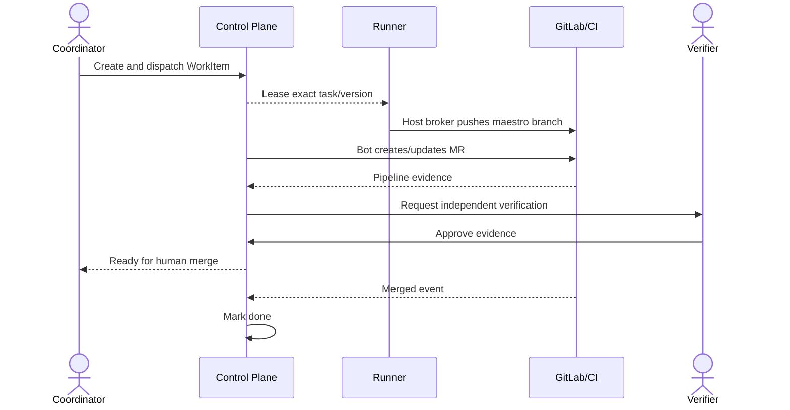
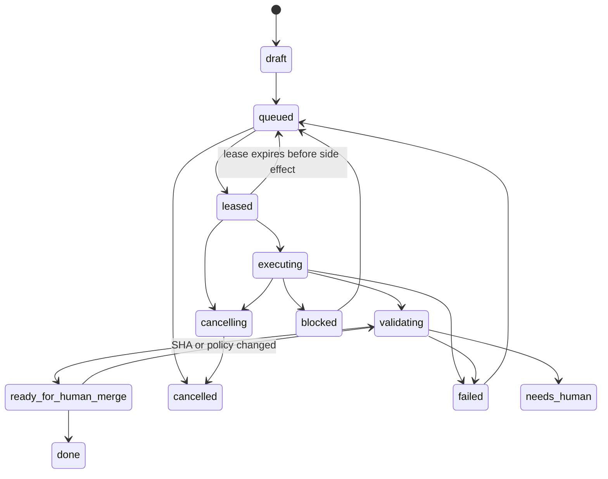

# 任务管理与执行闭环

## 1. 目标与非目标

`TASK-REQ-001` WorkItem MUST 从创建、调度、执行、验证到人工合并形成确定性状态机。`TASK-REQ-002` 每一步 MUST 明确负责人、输入、输出、超时、证据与可恢复动作。任务管理不允许 Agent 自由改写流程，不把 MR 创建或本地测试通过等同于完成。

## 2. 参与者、角色、权限和信任边界

Coordinator 创建/派发/取消/重试；Developer 或 delegated Agent 执行；Verifier 独立验证；Project admin 处理异常；Runner 执行 Lease；GitLab 提供合并真相。创建者、执行者、验证者和合并者的职责 MUST 可区分且可审计。

## 3. 触发条件、输入和前置条件

任务可由人、已验证 Finding 或允许的 Workflow 创建。必填输入：project、title、acceptance criteria、repository、target branch、remote baseline SHA、priority、owner/queue、quality policy；Agent 自动修复还需预算和 `auto_remediable`。前置条件缺失时只可保存 draft。

## 4. 正常交互及时序图

## 5. 失败、取消、超时、重试、恢复和用户提示

取消为协作式：先置 `cancelling`，Runner 确认停止后 `cancelled`；超时无确认则撤销 Lease 并隔离工作区。失败需分类 `user_input/environment/policy/test/security/external/internal`，仅临时且幂等步骤自动重试。恢复后 MUST 核验 task version、Lease epoch、branch SHA 和工作区。UI 显示当前责任方、已耗时、下一动作和证据链接。

## 6. 状态机、规则和不可变式

规范 WorkItem enum 固定为 `draft/queued/leased/executing/validating/ready_for_human_merge/done/blocked/cancelling/cancelled/failed/needs_human`；Markdown、OpenAPI、数据库约束、事件与 UI MUST 使用同一拼写。`TASK-RULE-001` 只有一个 active Lease；`TASK-RULE-002` 旧 epoch 结果无效；`TASK-RULE-003` Required Gate 全通过才可 ready；`TASK-RULE-004` `done` 仅由 merged 事件/对账；`TASK-RULE-005` 任何状态跳转必须验证 expected version。

## 7. 字段、配置和格式校验

标题 1–120 字符；描述最多 20,000 字符；验收条件至少一条且每条可判定；priority 为 `P0..P3`；baseline/source/target SHA 格式有效；预算为正整数；截止时间晚于当前时间。分支由服务端生成 `maestro/<project-key>/<task-id>`，用户不可覆盖。

## 8. 并发、幂等和一致性

创建、派发、取消、重试均需幂等键；领取以 compare-and-swap 更新 state/version 并产生递增 Lease epoch。状态、Lease、Audit 与 Outbox 同事务；MR/Pipeline 通过外部 ID 去重并最终一致。重复结果返回既有处理结论。

## 9. 安全、Secret、隐私和审计

任务文本、Issue 和日志均是不可信输入；不能改变 Tool、网络或 Secret 边界。审计记录状态前后值、actor/delegator、理由、Lease/Runner、MR/Pipeline/SHA；Prompt 不保存未脱敏 Secret 或完整源码。

## 10. 质量门禁、证据与 fail-closed 规则

进入 validating 前要求可重现 diff、命令 Profile、测试输出和 source SHA；进入 ready 要求全部 Required Gate `passed` 或有效 `waived`。Evidence 丢失、解析失败、策略未知、SHA 漂移均回到阻塞，不得自动通过。

## 11. 指标、SLO、告警和运维动作

监控 queue/lease/execution/validation 时长、重试率、取消延迟、陈旧 Lease、ready-to-merge 时长和 reopen 率。Lease 心跳连续丢失触发 Runner offline 流程；P0 blocked 超过 15 分钟告警，其他按项目策略。

## 12. 验收测试和需求追踪

- `TC-TASK-001`：正常状态序列直至 merged 后 done。
- `TC-TASK-002`：并发领取仅一方成功，旧 epoch 结果被拒绝。
- `TC-TASK-003`：取消、超时、崩溃重启不遗留 active Session/Lease。
- `TC-TASK-004`：缺 Evidence、SHA 漂移或 MR 未合并不能 done。

## 13. 数据迁移、兼容、发布与回滚

旧 Task 状态通过显式映射表导入；含歧义状态统一为 `needs_human`，不得猜测 done。补齐 project scope、version、baseline SHA 和审计来源。切换采用双读对账、单写新模型；回滚禁止丢弃新状态或重新启用直接 merge。
