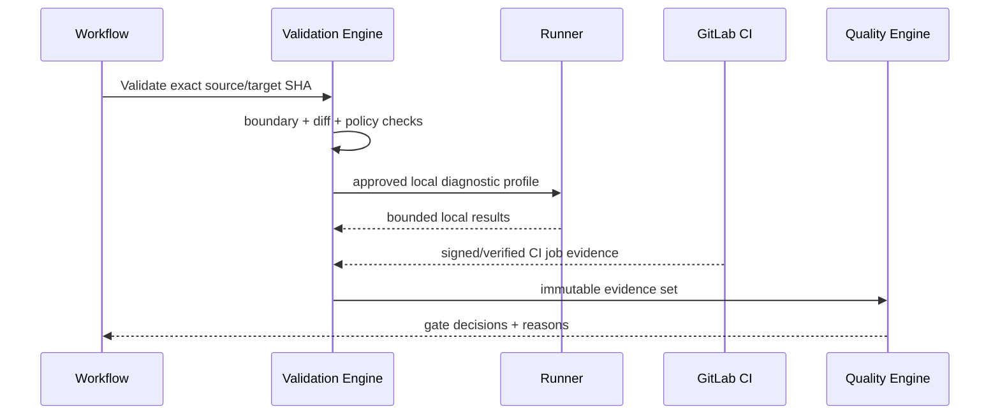

# 验证需求与 fail-closed 语义

> 当前实现说明：M0 已实现本地 Git/worktree/diff/boundary/test/coverage/policy/Profile 校验和 append-only ValidationRun；任一缺失、解析、执行或持久化错误均不通过，失败路径原子回收执行权限。Bearer/Basic、常见云与 GitHub/GitLab Token、URL 凭据、JWT 和 PEM 私钥 canary 证明只以脱敏形式进入 ValidationRun/TaskResult。本地 producer 固定为 `diagnostic/maestro-local`，不能进入 `ready_for_human_merge`；远端 target SHA、GitLab CI `merge_gate` Evidence 与完整 Gate 聚合由 M2 落地。

## 1. 目标与非目标

`VAL-REQ-001` 验证 MUST 证明精确代码版本满足边界、构建、测试、安全与策略要求。`VAL-REQ-002` 缺失、错误、无法解析、超时、跳过或过期证据一律不得通过。验证不等同于运行一条测试命令，不允许用本地 Agent 自报结果替代 CI 权威证据。

## 2. 参与者、角色、权限和信任边界

Developer/Agent 产生候选变更与本地诊断；Runner 执行批准的验证 Profile；GitLab CI 产生合并 Gate 权威 Evidence；Verifier 做独立判定；Quality Engine 做确定性聚合。执行者不能验证自己的变更，Agent 不能自豁免。

## 3. 触发条件、输入和前置条件

提交候选变更、source/target SHA 变化、策略版本变化、重试或人工复核触发验证。输入至少为 project/task/MR、远端 target SHA、source SHA、policy version、change boundary、Command Profile 和预期测试集合；工作区必须 clean、baseline 可达、授权有效。

## 4. 正常交互及时序图

## 5. 失败、取消、超时、重试、恢复和用户提示

错误分类为 `input_missing/policy_invalid/baseline_unavailable/worktree_error/command_error/timeout/output_truncated/parse_error/evidence_mismatch/stale/internal`。取消后当前运行置 `cancelled`，已有证据保留但不能用于新判定。Flaky Test 最多自动重跑一次并保留原失败；仅基础设施错误可按策略重试。提示必须指出失败 Gate、证据 ID、可行动建议和是否需人工。

## 6. 状态机、规则和不可变式

ValidationRun：`pending → collecting → evaluating → passed/failed/error/cancelled/stale`。`VAL-RULE-001` 只有所有 Required Gate 为 `passed` 或有效 `waived` 才 passed；`VAL-RULE-002` source/target/policy 任一变化立即 stale；`VAL-RULE-003` Evidence 不可覆盖；`VAL-RULE-004` 未知/跳过不得映射为成功。

## 7. 字段、配置和格式校验

ValidationRun 必须含 `run_id/project_id/task_id/source_sha/target_sha/policy_version/status/started_at/completed_at`。Evidence 必须含 producer、kind、job/pipeline ID（如适用）、digest、timestamps、parser version、bounded output reference。覆盖率必须区分 changed-lines 与 total delta，解析数值范围为 0–100。

## 8. 并发、幂等和一致性

运行键为 `task + source + target + policy`；同键并发请求合并为单次运行，不同版本并存但旧版本 stale。证据先只追加落库，再事务性计算 Gate snapshot；异步到达的 Evidence 必须重新聚合且以版本号防止旧结果覆盖新状态。

## 9. 安全、Secret、隐私和审计

命令只能引用版本化 Profile，输出限制字节数/行数/时长并脱敏。原始产物存受控 Artifact Store，URL 短期签名。审计记录谁触发/取消/重试、执行 Runner、命令版本、证据 digest、Gate 决策和豁免；禁止记录 Secret 与完整源码。

## 10. 质量门禁、证据与 fail-closed 规则

Required Evidence：remote baseline freshness、change boundary、Git diff、policy integrity、build、unit、lint/typecheck、适用的 integration/contract、coverage、Secret scan；安全策略另增 SAST/dependency/image/license。任一 required 生产者未运行或解析器未知均为阻断。CI Evidence 才可授权 ready-to-merge。

## 11. 指标、SLO、告警和运维动作

监控运行耗时、各 Gate 失败/错误率、missing/stale Evidence、flaky 重跑率、解析器错误和误报申诉。聚合判定 P95 < 2s（不含 CI）；Required Evidence 到齐后 30 秒内更新状态。解析器错误突增立即停止放行并告警。

## 12. 验收测试和需求追踪

- `TC-VAL-001`：成功路径包含所有 Required Evidence 且精确绑定 SHA/策略。
- `TC-VAL-002`：Git、worktree、diff、coverage、policy 任一异常均失败。
- `TC-VAL-003`：缺失、跳过、解析错误、超时、输出截断不通过。
- `TC-VAL-004`：SHA/策略漂移使旧 Evidence stale。
- `TC-VAL-005`：核心验证模块覆盖率至少 80%。

## 13. 数据迁移、兼容、发布与回滚

旧布尔 validation result 迁移为 ValidationRun、Evidence 与 GateDecision；无原始证据的历史 success 标记 `unverified`，不得用于新合并。解析器按版本双跑比较后切换；回滚保留新证据，不得恢复 fail-open 映射。
