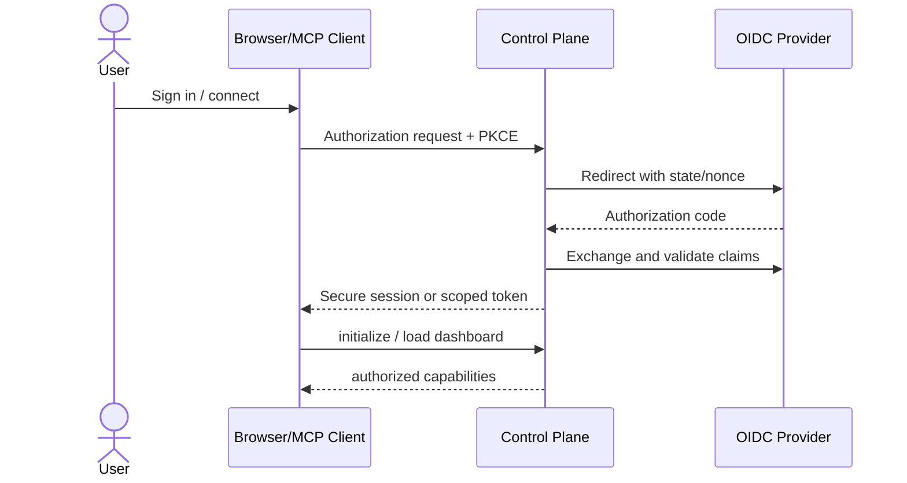
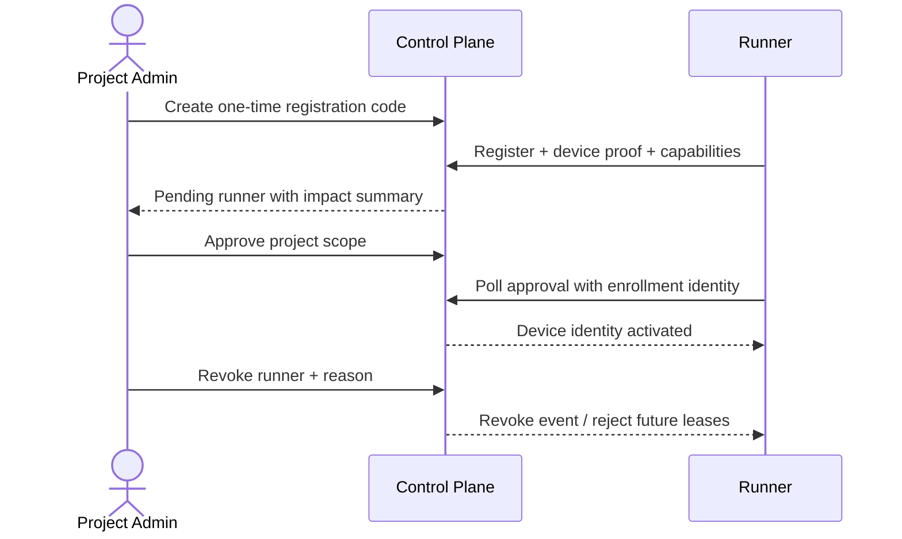
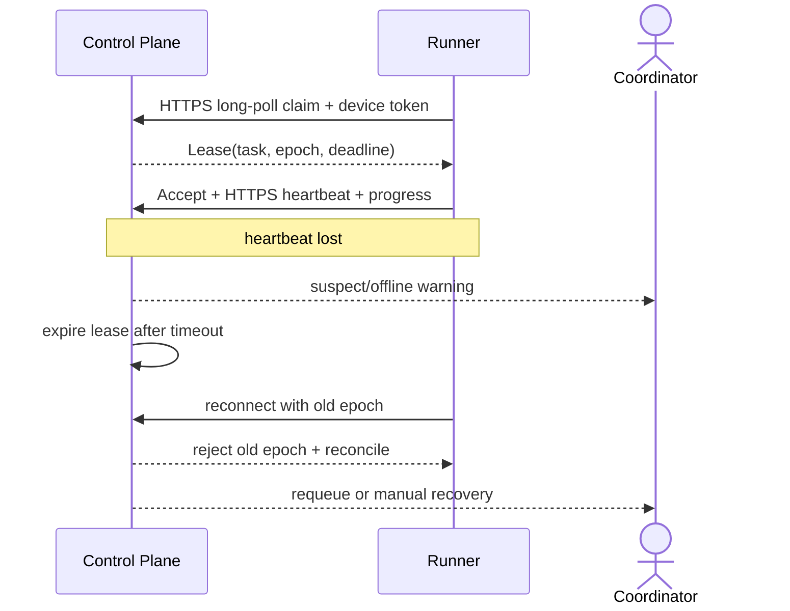
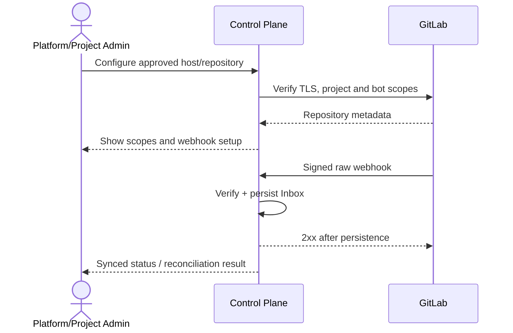
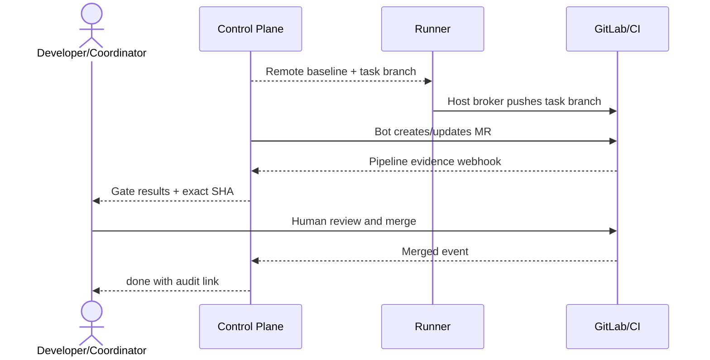
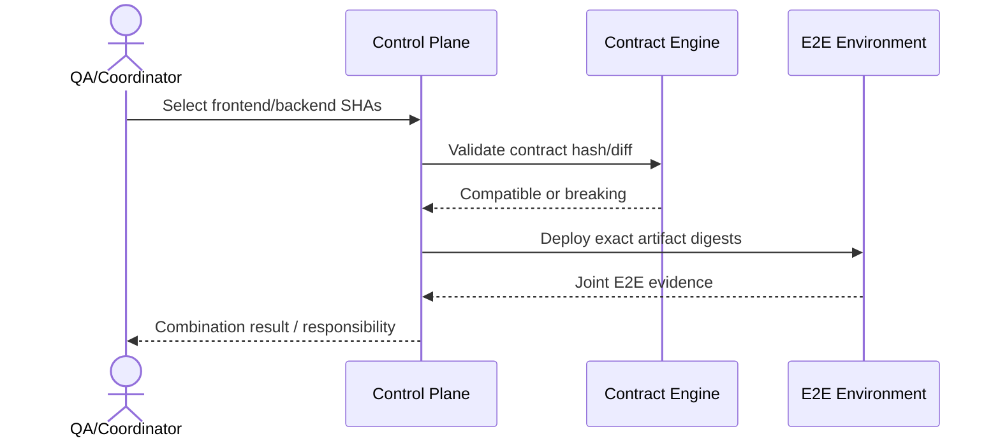
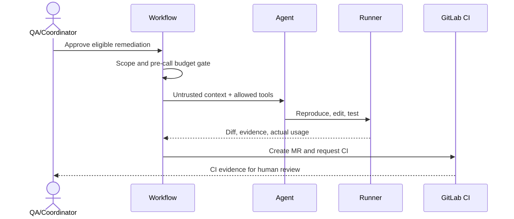
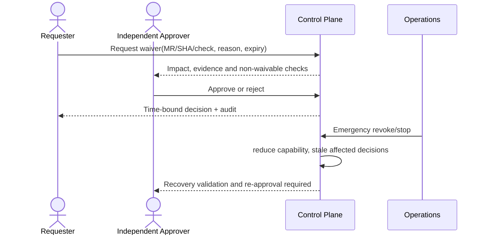

# Web 治理与人工控制台

## 1. 目标与非目标

`UI-REQ-001` 控制台 MUST 让用户看清系统状态、证据、责任方和下一步，并可审批、重试、暂停、取消、撤销 Runner/凭据及申请限时豁免。`UI-REQ-002` Agent 运行 MUST 展示计划、进度、Tool 轨迹摘要、预算与人工接管。非目标：在浏览器中实现 IDE、隐藏后端失败、仅靠隐藏按钮执行授权，或用动态生成原始 UI 取代受控组件库。

## 2. 参与者、角色、权限和信任边界

角色首页按任务而非数据库表组织：platform admin 看实例/安全/运行健康；project admin 看项目/成员/Runner/策略；coordinator 看队列与阻塞；developer 看本人执行；verifier 看待验证/Evidence；viewer 只读。导航为“概览、项目、任务、缺陷、MR/Pipeline、Evidence、Runner、策略、审计、运维”。前端只呈现服务端授权结果，敏感详情需再次鉴权。

## 3. 触发条件、输入和前置条件

OIDC 登录后按 principal 载入可见项目与能力；URL deep link 必须服务端校验。写操作均要求当前资源版本、原因（高风险操作）、幂等键和二次确认所需影响摘要。实时更新通过带 cursor 的事件流，断线显示 last sync 并切只读。

## 4. 正常交互及时序图

### 4.1 OIDC 登录与远程 MCP

### 4.2 Runner 注册、批准与吊销

### 4.3 Lease、心跳、离线与恢复

### 4.4 GitLab 项目接入与 Webhook

### 4.5 任务分支、MR、Pipeline 与人工合并

### 4.6 前后端跨仓联调

### 4.7 Defect 到 Agent 修复

### 4.8 Gate 豁免、撤销与应急恢复

## 5. 失败、取消、超时、重试、恢复和用户提示

每页 MUST 有 loading/empty/error/success/stale/offline/permission-denied 状态。每个写操作显示作用对象、影响范围、不可逆部分、前后 diff 与明确动词；可撤销则优先提供 Undo。`409` 显示服务器新版本与刷新/重新应用选择；超时查询 operation 状态再允许重试。Agent 中断保留已生成结果并标 `stopped`，降级必须显式说明且不得显示虚假成功。

| 操作 | 确认与反馈 | 失败/恢复 |
| --- | --- | --- |
| 审批/驳回 | 展示 Evidence、SHA、职责冲突 | stale 时强制刷新 |
| 重试 | 展示失败类别、次数、预计成本 | 非幂等步骤禁止一键重试 |
| 暂停/取消 | 展示运行中步骤与清理影响 | 超时转人工/隔离 |
| Runner/凭据撤销 | 展示受影响 Lease/项目 | 立即生效，恢复需重新批准 |
| Gate 豁免 | 展示 check、MR/SHA、期限、风险 | 不可豁免项无入口；可撤销 |

## 6. 状态机、规则和不可变式

UI Operation：`idle → confirming → submitting → accepted → completed/failed/conflicted/cancelled`。`UI-RULE-001` 前端状态不是业务真源；`UI-RULE-002` 高风险确认必须展示影响而非通用“确定吗”；`UI-RULE-003` Agent 计划/Tool/预算/证据可见且可停止；`UI-RULE-004` Static component schema 优先，禁止模型生成可执行 DOM/脚本。

## 7. 字段、配置和格式校验

表单使用显式 label、必填/长度/格式就近提示；原因字段 10–2,000 字符；豁免到期不超过 7 天；版本/SHA 只读来自服务端；敏感字段默认遮蔽且不可复制原值。分页、过滤、排序使用白名单；时间同时显示本地值与 UTC tooltip。

## 8. 并发、幂等和一致性

每次提交生成幂等键并携带 expected version；按钮在已受理后禁止重复，但页面刷新可按 operation ID 恢复。事件流按 event ID/cursor 去重，snapshot 带水位线。冲突不得自动覆盖用户或服务端更新，批量操作逐项返回结果。

## 9. 安全、Secret、隐私和审计

浏览器使用 Secure/HttpOnly/SameSite Cookie、CSRF 防护、严格 CSP 和 Origin 校验；不在 localStorage 保存 token。敏感页面防缓存，日志/前端错误上报脱敏。所有写操作、敏感查看、下载与拒绝记录 actor、project、resource、decision、reason、IP/correlation ID。

## 10. 质量门禁、证据与 fail-closed 规则

UI 发布 Gate 包括 RBAC 逐页/逐动作测试、契约测试、可访问性、错误/空态、并发冲突、事件恢复与安全扫描。页面不渲染或 Evidence 拉取失败时不得提供放行/豁免成功路径；最终决定必须显示 policy version 和 exact SHA。

## 11. 指标、SLO、告警和运维动作

监控首屏/交互延迟、操作成功/冲突/撤销、错误恢复、Agent 停止/接管、审批耗时与可访问性回归。100ms 内给操作反馈，长任务持续显示阶段进度。必须满足 WCAG AA：正常文字 4.5:1、全键盘可达、可见焦点、语义/ARIA、reduced motion；关键页无横向滚动。

## 12. 验收测试和需求追踪

- `TC-UI-001`：各角色首页、导航和动作与服务端 RBAC 一致。
- `TC-UI-002`：所有核心页覆盖 loading/empty/error/success/stale/offline/403/404。
- `TC-UI-003`：八个时序场景可从 UI 完成并关联审计/Evidence。
- `TC-UI-004`：冲突、超时、重复点击、断线恢复不产生重复副作用。
- `TC-UI-005`：键盘、读屏、对比度、reduced motion 自动与人工走查通过。
- `TC-UI-006`：Agent 进度/Tool/预算可见，可停止、接管且无静默降级。

## 13. 数据迁移、兼容、发布与回滚

旧 Dashboard 路由提供短期重定向，不迁移浏览器 token。新控制台按角色/项目 feature flag 灰度，先只读再开放写操作；UI 的受权事件流/WebSocket 在兼容窗口内支持前一 minor。这里不指旧 MCP SSE transport，也不改变远程 MCP 使用 Streamable HTTP、Runner 使用出站 HTTPS long-poll 的决策。回滚关闭新写入口并保留 operation/audit，不恢复匿名访问或客户端自报权限。
