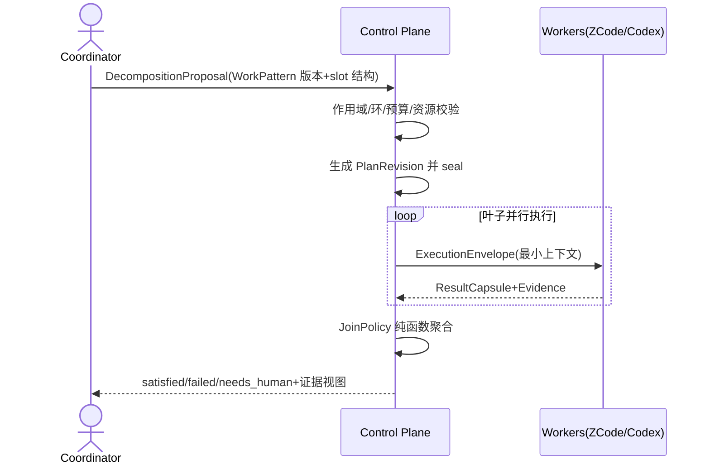
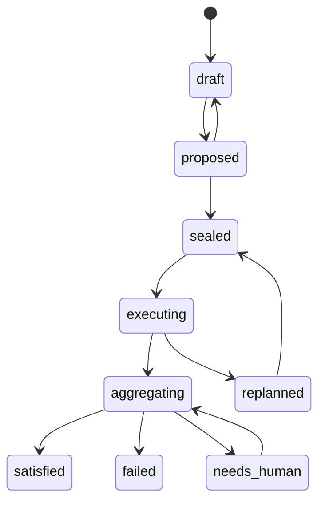

# 工作规划与编排

> 当前实现说明：现有 Feature/Task 为平面队列；Task 的 ParentTaskID 创建时不校验层级语义且无聚合规则，follow-up 创建被禁用；AgentSession 仅是容量与心跳槽位，不含外部会话绑定。本文是 M1 目标设计，未实现。

## 1. 目标与非目标

`WGP-REQ-001`：WorkPlan MUST 以持久化目标表达任务层级，根节点绑定唯一 primary BusinessProblem 与 OutcomeContract，子节点分为结构聚合 WorkPackage 与原子 WorkItem。`WGP-REQ-002`：计划生命周期 MUST 走 DecompositionProposal → 服务端校验 → 不可变 PlanRevision → seal 后才可调度；运行中重规划创建新 Revision。`WGP-REQ-003`：父节点状态 MUST 由子 outcome、JoinPolicy 与 Evidence 纯函数投影，禁止 Agent 直接标记完成。`WGP-REQ-004`：任务推进 MUST 与执行会话持续绑定，恢复只能续接原 ExecutionAttempt。`WGP-REQ-005`：任务间 MUST 只传递带 digest 的结构化产物，默认不共享聊天 transcript。非目标：不定义存储 Schema、排序算法或 wire shape；不把业务目标完成等价于某个 MR 已合并。

## 2. 参与者、角色、权限和信任边界

Coordinator（人或 Codex 编排会话）提出拆分与重规划；product_owner 批准聚合策略与目标语义；qa_owner 批准 Gate/Evaluation 节点要求；Control Plane 独占封板、调度与状态投影；ZCode/Codex Worker 只能看到自身 ContextSet。业务问题与能力域是多对多关系：Problem 可涉及多个 Capability，Capability 可服务多个 Problem；叶子 WorkItem 有唯一 owning capability，可再关联 affected capabilities。ExecutionRole 仅用于执行路由，不得充当业务能力分类。

## 3. 触发条件、输入和前置条件

触发：目标跨能力域或跨仓库、需要并行 fan-out/join、需要会话续接或独立评价。必填输入：可测量的 BusinessProblem、含指标与验收的 OutcomeContract、primary_problem、WorkPattern 模板版本、预算与截止时间。前置缺失时只可保存 draft；未 seal 的计划不产生任何调度副作用。

## 4. 正常交互及时序图

协调会话"看到子任务"指看到结构化状态、ResultCapsule 与 Evidence，不是注入全部子会话聊天记录。

## 5. 失败、取消、超时、重试、恢复和用户提示

失败按 failure_policy 处理：fail_fast 立即判定父失败、collect_all 收齐结果再判定、needs_human 挂起等待人。取消按 cancel_policy 处理：cascade_required 级联取消必需后代、detach_optional 分离可选后代、none 不传播。重试创建新 ExecutionAttempt，不创建新结构子节点；follow-up/replacement 创建新 WorkNode 并记录血缘。恢复只能续接原 Attempt 绑定的会话与工作区。UI 显示每个节点的责任方、已耗时、下一动作和证据链接。

## 6. 状态机、规则和不可变式

`WGP-RULE-001`：cancelled 绝不满足 required dependency。`WGP-RULE-002`：子节点全部结束不等于父节点通过，还必须有 Integration/Evaluation 证据。`WGP-RULE-003`：sealed Revision 不可原地修改，修改必须产生新 Revision。`WGP-RULE-004`：根节点 root_id 创建后不可变，所有节点与边同 project。`WGP-RULE-005`：聚合必须幂等且事件重放得到相同结果。

## 7. 字段、配置和格式校验

标题 1–120 字符；问题陈述必须可测量；slot_key 使用小写点分格式（如 backend.contract）；success_threshold 取 all/any/quorum(k) 且 k 为正整数；failure_policy 与 cancel_policy 取第 5 节枚举；containment 深度与每父最大子节点数受项目策略上限约束；验收条件至少一条且可判定；预算为正整数；截止时间晚于当前时间。人类可读编号不携带父路径与能力语义，重新归类不改变编号。

## 8. 并发、幂等和一致性

拆分提交、封板、重规划和取消均要求幂等键；封板使用 expected 版本 CAS。同一 WorkPlan 的聚合计算基于同一图快照；父状态、关键路径和 UI 投影均从快照重算。重复提交返回既有结论，不产生重复结构。

## 9. 安全、Secret、隐私和审计

子任务上下文必须包含隔离边界与 token 预算；不同任务的聊天历史不得互相可见。seal、replan、聚合、needs_human 决策和会话绑定变更全部审计，记录 actor、理由、图版本与证据引用。Prompt 与 transcript 不保存未脱敏 Secret。

## 10. 质量门禁、证据与 fail-closed 规则

`WGP-GATE-001`：父节点进入 satisfied 前必须存在未 stale 的 Integration 与 Evaluation 证据。`WGP-GATE-002`：Evidence 缺失、解析失败、digest 不匹配或策略未知时节点回到阻塞，不得自动通过。评价链固定为确定性 Gate → 独立 Evaluator → 可选 LLM Judge → 必要时人工；执行 Agent 不得自审。

## 11. 指标、SLO、告警和运维动作

跟踪拆分到封板时长、fan-out 并发度、join 等待、needs_human 停留、重规划频率和 stale 率。P0 计划 blocked 超过阈值告警；join 长期无进展或聚合重放不一致必须告警并阻断宣称完成。

## 12. 验收测试和需求追踪

- `TC-WGP-001`：正常父子计划：两个独立叶子并行执行，Integration 与 Evaluation 通过后根节点 satisfied。
- `TC-WGP-002`：fail_fast 与 quorum(k) 聚合语义正确，单叶子失败按策略传播或不传播。
- `TC-WGP-003`：cancel 级联与 detach 行为符合 cancel_policy，cancelled 不满足 required 依赖。
- `TC-WGP-004`：中断一个 Worker 会话后，恢复续接原 ExecutionAttempt，不产生新结构子节点。
- `TC-WGP-005`：在子任务上下文注入 canary，验证其他子任务与父会话不可见。
- `TC-WGP-006`：封板后修改必须走新 Revision，旧 Attempt 结果仍绑定旧 digest。

阶段任务与追踪矩阵行待 M1 任务书更新时登记；登记前本文保持 draft。

## 13. 数据迁移、兼容、发布与回滚

Feature 迁为 WorkPlan 并补录 synthetic Problem/Outcome；Task 迁为原子 WorkItem；ParentTaskID 仅在确认结构语义后迁入 containment，其余进入 needs_reconcile。切换采用双读对账、单写新模型；回滚禁止丢弃新状态或恢复无校验父子字段。
