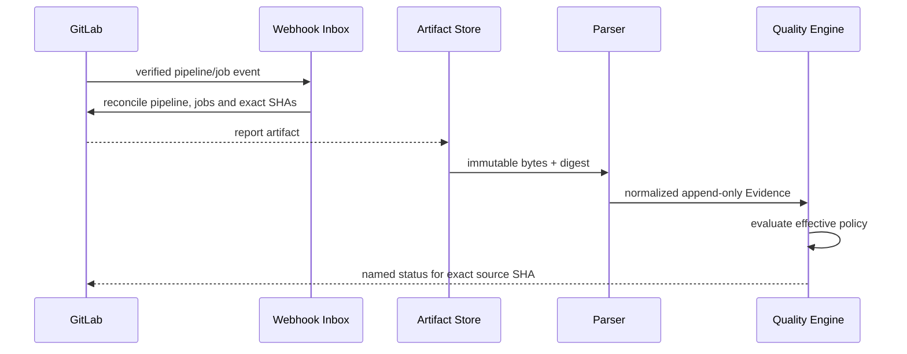

# Gate、Evidence 与 GitLab 事实源

> 本文规定 v3 目标 Evidence 语义，不表示当前仓库已具备 GitLab Pipeline、Evidence Store 或 Gate Engine。

## 1. 目标与非目标

`EVIDENCE-REQ-001`：每个质量结论必须能追溯到不可覆盖的原始 Evidence、精确代码版本、生产者和解析器。`EVIDENCE-REQ-002`：GitLab CI 是合并质量的权威执行源；Runner 本地结果只用于反馈速度和诊断。本文不允许用人工文本“已测试”替代机器 Evidence。

## 2. 参与者、角色、权限和信任边界

GitLab Pipeline/Job 产生权威构建、测试和扫描结果；Webhook Receiver/Connector 验证并摄取元数据；Artifact Store 保存原始报告；Parser 生成规范化 Evidence；Quality Engine 聚合 Gate；Verifier/用户查看理由。CI Job 内容也可能恶意，因此必须验证项目、Pipeline、Job、SHA、Artifact digest 和受保护配置来源。

## 3. 触发条件、输入和前置条件

Pipeline/job webhook、周期对账、Artifact 完成、source/target/policy 变化和人工重评触发聚合。前置条件：GitLab project mapping verified、event authenticated、Pipeline 对应 MR、source/target SHA 精确匹配、Job 名称与 producer allowlist 匹配、Artifact digest 可校验。

### 3.1 control_plane 自证 producer（D1）

三门引擎 oracle（`policy_integrity`/`baseline_freshness`/`boundary`）的自然判定者不是 CI 作业，而是评估引擎自身的确定性判定。每次携带事实的评估对这些门产出 `authority=control_plane` 的 Evidence（producer `type=control_plane`），语义：

- **判定权归引擎**：判定是纯机械函数——`policy_integrity`=effective policy 链装载完整（合并文档 digest 匹配、provenance 各层 digest 与实际装载文档一致、存储行 digest 列与文档重算一致）；`baseline_freshness`=元组钉住的 policy version 等于当前 active 版本（评估中途策略漂移即 failed）；`boundary`=该工作项执行经注册 runner（approved/online）与批准 Command Profile 完成，从 executions/validation 记录机械推导。
- **append-only**：自证 Evidence 与 CI Evidence 同等进入只追加的 evidence 表（EVIDENCE-RULE-001/002 适用）；身份由判定内容确定性派生（同判定同 ID 幂等重放），判定变更=新记录 + attempt 递增，最新 attempt 胜出聚合，历史留档可查。
- **audit 可查**：每条自证记录绑定 project/work item、SHA 元组、policy version、producer 版本与判定理由（summary），经 evidence 查询面与审计导出面可查。
- **平权合成**：自证 producer 与 CI producer 在 EVIDENCE-RULE-003 聚合下平权——同门任一 producer 的 standing failure 均阻断，互不覆盖；`control_plane` authority 仅对三门有效（gate→producer 种类声明冻结于 `quality-policy.schema.json` `$defs.gate_producer_kinds`），CI 门不接受引擎自证。
- **无执行记录不铸证**：工作项不存在任何 executions 记录时，boundary 不产出自证 Evidence（该门交由 CI producer 或保持 pending）；存在执行记录但 runner 未注册或无批准 Profile 时 fail-closed 并在理由中点名缺口。
- **历史元组重演**：携带非空 policy version 的元组按该版本重演评估（重放钉），`baseline_freshness` 判定钉住版本与 active 版本的一致性——漂移 fail-closed，而不是静默重定基线。

### 3.2 capability 门与声明锚（D2）

公司基线 3.1.0 起，Required Gate 分两档（映射冻结于 `quality-policy.schema.json` `$defs.capability_key` 与 `capability_gates` 目录）：

- **core 门（无条件必达）**：`build/unit/secret_scan`（CI pipeline job 生产）+ 三门引擎 oracle（§3.1 控制面自证生产）。core 不可被 overlay 移除（QG-RULE-001）。
- **capability 门（声明才必达）**：`coverage/lint_typecheck/license/sast/dependency/image/integration/contract` 八门。项目 overlay 在 `capabilities` 数组中声明对应 `capability_key` 后才进入 effective 必达集；**每条声明必带 producer 锚（repo + gate 同名 job）——声明能力 = 声明生产者**，无锚声明被 schema 与引擎双重拒绝。这是对"无生产者必达门"（F14 病根）的制度性防御。
- **未声明即不评估**：effective = core ∪ 已声明能力门。未声明的 capability 门不进 gate_snapshots——同名的 CI 证据即使被摄取也只是未被评估的记录，不再形成永不消解的 pending 噪音。
- **声明与门列表一致**：overlay 的 `required_gates` 出现 capability 门 ⇔ 同文档声明对应能力（双向强制）；目录本身（gate↔capability↔producer 种类配对）为公司层冻结契约，overlay 不得携带副本。

## 4. 正常交互及时序图

Maestro 可发布与 source SHA 绑定的命名 commit status；若 GitLab 版本/套餐支持，可增加 External Status Check。通用阻断方式是 required GitLab Pipeline/CI quality-gate job，不能依赖仅 UI 展示的状态。

## 5. 失败、取消、超时、重试、恢复和用户提示

Pipeline `failed/cancelled/skipped/manual`、Job 缺失、Artifact 404、digest 不符、解析错误或超时均形成阻断 Evidence，不转换为 passed。Webhook 遗漏由 Reconciler 拉取远端状态；GitLab 不可用期间只显示带 last_sync 的旧 snapshot，禁止 ready。用户提示必须链接 Pipeline/Job/Artifact，并区分代码失败、基础设施失败、策略失败和 stale。

## 6. 状态机、规则和不可变式

Evidence：`observed → verified → parsed → accepted/rejected → stale`；GateSnapshot：`collecting → blocked/ready → stale`。

- `EVIDENCE-RULE-001`：Evidence 只追加，不修改或覆盖；更正通过新 Evidence 和 supersedes 引用。
- `EVIDENCE-RULE-002`：每项 Evidence 绑定 project、MR、source SHA、target SHA、pipeline/job、policy digest、producer/parser version 和 content digest。
- `EVIDENCE-RULE-003`：相同 Gate 多个 Required producer 必须全部满足；禁止“最后一个成功覆盖先前失败”。
- `EVIDENCE-RULE-004`：source/target SHA 或策略变化使全部不匹配 Evidence stale。
- `EVIDENCE-RULE-005`：WorkItem done 只由 GitLab merged 事实确认，Gate ready 不等于 merged。

## 7. 字段、配置和格式校验

Evidence 必填 `evidence_id/kind/authority/project_id/source_sha/target_sha/pipeline_id/job_id/status/producer/version/content_digest/observed_at/parsed_at/policy_digest`；本地结果必须 `authority=diagnostic`；三门引擎 oracle 的自证判定必须 `authority=control_plane`（无 pipeline/job 身份、仅限三门，条件规则冻结于 evidence.schema.json）。状态只接受 `passed/failed/error/cancelled/skipped`，不得省略。覆盖率、JUnit、SARIF、依赖/License 报告按固定 parser version 解析；未知 schema/version 一律 error。

## 8. 并发、幂等和一致性

Webhook event ID、GitLab object ID 与 Artifact digest 分层去重。Pipeline 重试产生新 pipeline/job ID 和新 Evidence，不覆盖旧失败；Gate Engine 按事务快照读取完整集合并以 snapshot version compare-and-swap。乱序事件以远端对象版本和对账结果收敛，不能只相信接收顺序。

## 9. 安全、Secret、隐私和审计

Artifact 使用服务端下载和短期授权链接，禁止把 GitLab Token 下发浏览器。报告入库前扫描 Secret 并按最小保留保存；原始日志不进入 Gate reason。审计事件摄取、验证、解析、拒绝、stale、重算、状态发布和人工查看敏感 Artifact，记录 digest 而非内容。

## 10. 质量门禁、证据与 fail-closed 规则

core 门（baseline、boundary、policy integrity、build、unit、secret_scan）与项目已声明能力对应的 capability 门（§3.2；含 lint/typecheck、coverage、integration/contract/security 扫描族）必须各有权威 Evidence。未声明能力的门不参与评估，也不得以其他门的 Evidence 顶替。Job 允许失败、条件规则未创建 Job、Pipeline 来源不符合 MR 规则、状态发布到错误 SHA 或 status API 冲突未解决均阻断。External Status Check 若启用，只作为同一 Evidence 的附加执行点，不形成第二事实源。

## 11. 指标、SLO、告警和运维动作

监控 ingest/parse/evaluate 延迟、missing/error/stale Evidence、Artifact 下载/校验错误、Webhook 与 Reconcile 差异、commit status 冲突和 Gate 翻转。事件正常到达后 60 秒内收敛，Evidence 到齐后 30 秒内计算。DLQ、解析错误突增或 ready 后变 stale 触发告警。

## 12. 验收测试和需求追踪

- `TC-EVIDENCE-001`：真实 MR Pipeline 报告可追踪到 SHA、Job、Artifact digest 和 parser。
- `TC-EVIDENCE-002`：重复、乱序、重试 Pipeline 不覆盖失败且最终一致。
- `TC-EVIDENCE-003`：Artifact 缺失/篡改、schema 未知和 source/target 漂移均阻断。
- `TC-EVIDENCE-004`：Runner diagnostic Evidence 无法使 Required Gate 通过。
- `TC-EVIDENCE-005`：Webhook 丢失后 Reconcile 恢复且无重复业务效果。

## 13. 数据迁移、兼容、发布与回滚

旧 `validation_result` 只能导入为 `authority=legacy, status=unverified`。先并行摄取 GitLab 元数据与 Artifact，比较 Gate 但不发布 status；稳定后按项目切换。Parser 升级双跑并保留两版结果。回滚保留所有 Evidence、Inbox 水位与 stale 关系，不重新信任 legacy 或 local Evidence。
