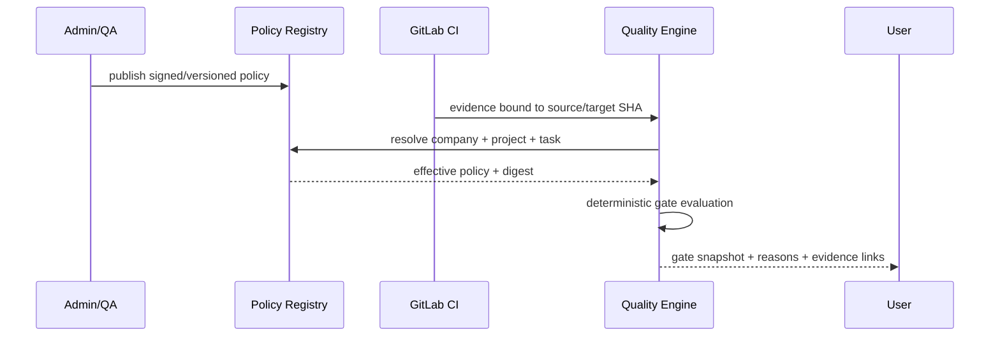

# 质量策略、阈值与豁免

> 本文定义 v3 目标质量策略，不表示当前验证代码已经实现。当前缺失覆盖率可通过、Git 错误退化为空变更等行为必须在实施时移除。

## 1. 目标与非目标

`QG-REQ-001`：对每个精确 source/target SHA 使用可复现、版本化且只能逐级加强的质量策略。`QG-REQ-002`：Required Gate 的缺失、错误、跳过、超时、解析失败或过期均不能视为通过。质量策略不替代 GitLab Protected Branch、CODEOWNERS 或人工评审。

## 2. 参与者、角色、权限和信任边界

Company QA Owner 管公司基线；Security Owner 管安全 Gate；Project Admin 只能强化项目策略；Coordinator/Developer 可查看但不能修改；Verifier 独立确认；Quality Engine 确定性计算 effective policy；GitLab CI 产生权威 Evidence。Agent、Runner 本地输出和 MR 描述均不是策略权威源。

## 3. 触发条件、输入和前置条件

公司/项目策略发布、WorkItem 创建、目标/源 SHA 变化、MR Pipeline 到达、Evidence 更新或豁免申请触发评估。输入必须含 company policy、可选 project/task overlay、project/MR、source SHA、target SHA、pipeline ID 和适用性清单。无法解析继承链、版本或 digest 时不得运行 Gate。

## 4. 正常交互及时序图

## 5. 失败、取消、超时、重试、恢复和用户提示

策略无效时评估状态为 `error` 并阻断；GitLab Pipeline/Job 的外部 `canceled` 状态按 Check 语义映射为 Gate `failed` 或 `error`，同时保留 provider 原状态，不得引入新的 Gate 状态或沿用旧结果。Flaky 测试只允许自动重跑一次，初始失败和重跑结果都保留；仅明确的基础设施错误可由 GitLab 重试策略重跑。提示必须列出 Gate、状态、Evidence ID、失败分类、阈值差异与下一责任人。

## 6. 状态机、规则和不可变式

Policy：`draft → review → active → superseded/revoked`；Gate：`pending → running → passed/failed/error/stale/waived`；Waiver：`requested → approved/rejected → active → expired/revoked`。

- `QG-RULE-001`：优先级为 company → project → task，下层只能增加 Gate、提高覆盖率或扩大阻断严重度，不能放宽上层。
- `QG-RULE-002`：effective policy 由标准化 JSON 计算 digest；相同输入必须产生相同结果。
- `QG-RULE-003`：source SHA、target SHA、policy version/digest 或 Evidence producer contract 变化，旧 snapshot 立即 stale。
- `QG-RULE-004`：只有所有 Required Gate 为 `passed` 或有效 `waived` 才可 ready；Gate 的 `pending/running/failed/error/stale` 以及聚合原因 `missing/skipped/unknown` 均阻断。
- `QG-RULE-005`：身份隔离、SHA 完整性、策略完整性、Webhook 真实性不可豁免。

## 7. 字段、配置和格式校验

策略必须符合 `quality-policy.schema.json`。公司默认 Required Gate 为 `baseline_freshness/boundary/policy_integrity/build/unit/lint_typecheck/coverage/secret_scan/sast/dependency/image/license`；涉及服务集成时增加 `integration`，接口变更增加 `contract`。changed-lines coverage 最低 80%，总覆盖率最多下降 0.5 个百分点。默认阻断 critical/high 安全发现；项目可增加 medium/low。License denylist 由公司策略维护。

## 8. 并发、幂等和一致性

策略发布使用语义版本和 expected current version；同版本不同内容拒绝。评估唯一键为 `(project, source_sha, target_sha, policy_digest)`，重复触发复用同一运行；Evidence 只追加，Gate snapshot 用版本化事务重算，旧计算不得覆盖新 SHA。active 策略切换与审计事件同事务提交。

## 9. 安全、Secret、隐私和审计

策略不得包含 Secret 或任意可执行命令，只引用批准的 Profile/Scanner ID。审计创建、评审、激活、撤销、继承解析、每次 Gate 决策与 Waiver；记录申请人、审批人、理由、范围、到期、策略和 Evidence digest。测试输出通过受控 Artifact link 提供，不复制敏感内容到 Gate reason。

## 10. 质量门禁、证据与 fail-closed 规则

Waiver 最长 7 天，只能针对明确 project/MR/source SHA/Gate，由不同主体审批，并给出补救工单和到期时间；source SHA 或策略变化立即使其失效。安全 Gate 的豁免需 security_owner，其他 Gate 需 qa_owner；申请人、变更作者、Agent 和 Verifier 均不能批准自身相关豁免。扫描器或解析器错误不得通过 Waiver 伪装为成功。

## 11. 指标、SLO、告警和运维动作

监控 Gate pass/fail/error/stale、policy resolution error、coverage 趋势、flaky、Waiver 数量/年龄/到期和误报申诉。Evidence 到齐后 30 秒内更新 Gate；过期 Waiver 在 60 秒内失效。策略解析错误或不可豁免 Gate 异常通过立即触发发布冻结。

## 12. 验收测试和需求追踪

- `TC-QG-001`：company/project/task 合并只增强且 digest 稳定。
- `TC-QG-002`：缺失、跳过、解析错误、超时和 unknown Evidence 全部阻断。
- `TC-QG-003`：覆盖率 80%/0.5 边界值及安全严重度正确评估。
- `TC-QG-004`：Waiver 职责分离、7 天上限、SHA/策略失效和不可豁免规则有效。
- `TC-QG-005`：并发 Evidence 与策略切换不会发布旧 Gate snapshot。

## 13. 数据迁移、兼容、发布与回滚

旧项目验证配置先转换为 draft policy；无法证明的旧 success 标记 `unverified`，不参与新 MR。新引擎先 shadow 计算并对比，再按项目启用；任何差异以更严格决策为准。回滚保留 active policy、Waiver、Evidence 和 stale 状态，不恢复缺失覆盖率通过或测试失败忽略。
