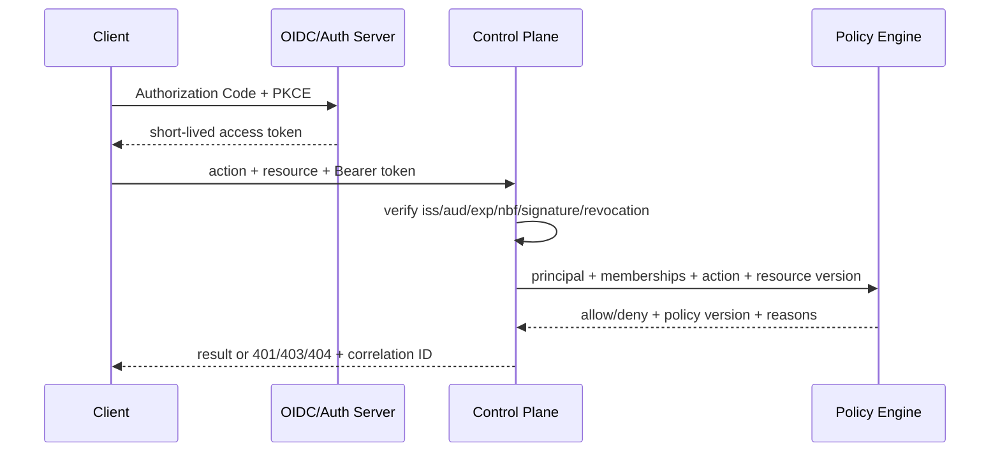

# 身份、RBAC 与项目隔离

> 本文定义 v3 目标规则。当前可选全局 Bearer Token、自报 Session Role 和未绑定 Principal 的 MCP 工具不满足这些规则。

## 1. 目标与非目标

`AUTH-REQ-001`：所有远程请求必须由可撤销的人类、服务或设备身份认证，并在服务端按项目和资源授权。`AUTH-REQ-002`：浏览器、MCP、REST、WebSocket、后台 Worker 使用一致的策略语义。平台管理员不因平台角色自动获得项目源码或业务数据访问权；本文不把 GitLab Token 当作 Maestro 身份 Token。

## 2. 参与者、角色、权限和信任边界

权威角色与动作以 `specs/rbac/permissions.yaml` 为准：`platform_admin/project_admin/coordinator/developer/verifier/viewer`。服务账户和 Runner Device 不继承人类角色。认证中间件构造 `PrincipalContext`，业务请求中的 `role/team_ids/project_memberships/delegator_id` 不参与授权。

| 主体 | 认证 | 资源边界 |
| --- | --- | --- |
| Browser | OIDC Authorization Code + PKCE，BFF 安全 Cookie | 当前成员项目 |
| Remote MCP/REST | OAuth 2.1 access token，Maestro audience | Token scope ∩ 成员关系 |
| stdio MCP | 本机宿主注入短期委托上下文 | 单用户、单项目启动配置 |
| Runner | 独立设备密钥和短期通道凭据 | 批准的 project/runner capability |
| Background Service | 独立服务身份 | 固定动作和项目集合 |

## 3. 触发条件、输入和前置条件

登录、Token 刷新、成员邀请/变更/撤销、Runner 批准、每次 Tool/API/资源读取及后台操作都触发授权。前置条件为允许的 issuer/audience/算法、有效时间、未撤销 Token、active 成员关系、可见项目、明确 action/resource/version；缺一即拒绝。

## 4. 正常交互及时序图

MCP Remote HTTP 必须发布 Protected Resource Metadata，返回标准 `WWW-Authenticate`，验证资源 audience；入站 Token 不得转发给 GitLab 或 Runner。

## 5. 失败、取消、超时、重试、恢复和用户提示

未认证/失效 Token 返回 401；已认证但无动作权限返回 403；无资源发现权返回 404。OIDC/JWKS 暂时失败时仅允许验证缓存中尚有效的密钥和既有短期 Token，不得延长会话或新授权；策略引擎、成员库或撤销表不可用时写请求拒绝。重复登录或刷新按 OAuth 语义处理，不以旧 Token 兜底。

## 6. 状态机、规则和不可变式

成员关系：`invited → active → suspended → removed`；委托：`issued → active → expired/revoked`；Token：`issued → active → expired/revoked`。

- `AUTH-RULE-001`：默认拒绝，生产环境不存在 auth disabled。
- `AUTH-RULE-002`：权限是主体角色、项目成员关系、资源状态、委托 scope 与策略条件的交集。
- `AUTH-RULE-003`：Verifier 不能验证本人、变更作者或修复请求者的变更；申请人不能批准自身豁免。
- `AUTH-RULE-004`：Maestro 不具有最终 merge 权限，最终合并在 GitLab 由人完成。
- `AUTH-RULE-005`：平台级权限与项目级权限分离；跨项目查询必须逐项目授权。

## 7. 字段、配置和格式校验

Token 必须校验签名算法 allowlist、`iss/aud/exp/nbf/iat/jti/sub`；允许时钟偏差最多 60 秒，访问 Token TTL 目标 15 分钟。浏览器 Cookie 使用 `Secure/HttpOnly/SameSite=Lax`，状态变化请求验证 CSRF。Origin 必须精确匹配 HTTPS allowlist，禁止前缀或通配域名判断。Principal、Team、Membership、Delegation 和 Service Account 使用服务端 ID，外部 claim 需显式映射。

## 8. 并发、幂等和一致性

成员/角色变更使用 expected version；重复邀请返回既有结果，不同 payload 复用幂等键返回冲突。授权缓存键含 `principal/project/action/resource/version/policy_version`，TTL 不超过 60 秒；撤销事件主动失效缓存。长操作在开始、发 Lease、提交结果和高风险状态转换前重新授权。

## 9. 安全、Secret、隐私和审计

仅保存 Token ID/JTI 的哈希和必要 claims，不保存 access/refresh token 明文。审计记录认证结果、主体、项目、动作、资源、allow/deny、匹配条件、策略版本、委托链、Token 哈希和 correlation ID；不得记录 Cookie、Token 或完整个人 claims。成员目录仅向有管理权主体暴露必要字段。

## 10. 质量门禁、证据与 fail-closed 规则

`GATE-M1-AUTH` 要求：所有入口具有认证测试，所有业务动作映射到权限，跨项目 IDOR 测试通过，撤销传播 P99 < 60 秒，自审/自批/合并禁令有效。未知 action、缺少项目 scope、策略解析错误或后台任务无服务主体时必须拒绝。

## 11. 指标、SLO、告警和运维动作

监控登录/刷新成功率、JWT 验证错误、授权 P95、deny/404 比率、跨项目探测、职责分离冲突、缓存失效和撤销延迟。授权 P95 < 50ms；撤销 P99 < 60s。异常枚举、泄漏或撤销失败触发应急停机与凭据吊销 Runbook。

## 12. 验收测试和需求追踪

- `TC-RBAC-001`：权限矩阵每个 allow/deny/condition 都有正反测试。
- `TC-RBAC-002`：伪造 role、project、session、delegator 和 Token audience 均不能扩权。
- `TC-RBAC-003`：REST、MCP、WS 和后台 Worker 对同动作决策一致。
- `TC-RBAC-004`：成员、Token、Runner 撤销在 SLO 内生效并阻断未开始工作。
- `TC-RBAC-005`：资源隐藏返回 404 且不造成可枚举时序差异。

## 13. 数据迁移、兼容、发布与回滚

旧全局 Token 和自报 Session 映射为显式 Principal/ProjectMembership；无法确定 Owner 的记录默认不可访问并进入人工清单。先 shadow 比较旧/新决策，再切 enforce；安全差异必须以更严格结果为准。回滚保留新身份表、撤销表与审计，禁止恢复 auth disabled 或默认允许。
