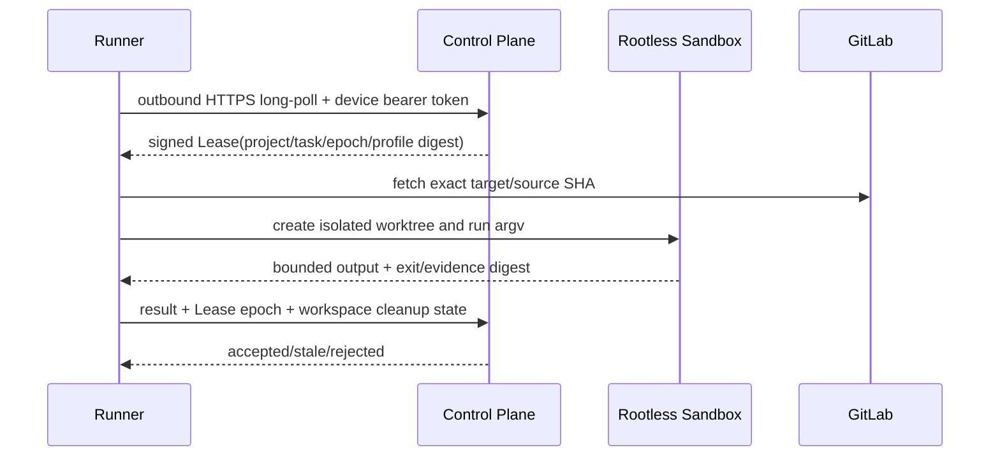

# Runner、Lease 与执行沙箱安全

> 本文描述 v3 Runner 目标约束。M0 已提供本地 stdio Runner、版本化且 digest 固定的 Command Profile、canonical path/边界校验、超时、输出硬上限和 Secret canary 脱敏，并把本地 Evidence 固定为 diagnostic；宿主诊断执行默认关闭，启用时显著告警，远程写默认关闭。stdio Runner 不是 SQLite maintenance owner，只验证精确 schema catalog 与完整性，不能触发迁移、全库恢复或 GC。HTTP 默认不信任转发代理，公开错误不含内部细节，日志使用路由模板并过滤 query/path/header/body Secret；排空后拒绝新工作，SQLite URI/参数化路径被拒绝。设备身份、出站控制面通道、Keychain、rootless OCI、cgroup/网络隔离和宿主 Git broker 尚未实现，因此不得把 M0 host executor 称为沙箱。

## 1. 目标与非目标

`RUNNER-REQ-001`：所有源码和工具执行必须在成员侧 Runner 的隔离沙箱中完成；被攻陷的任务不能控制宿主、其他任务或其他项目。`RUNNER-REQ-002`：Runner 只执行服务端批准、版本化、digest 固定的 Command Profile。Runner 的本地结果用于快速诊断，不替代 GitLab CI 合并证据。

## 2. 参与者、角色、权限和信任边界

Project Admin 批准/撤销 Runner；Control Plane 签发 project/task-scoped Lease；Runner Agent 管设备通道和沙箱；OCI Runtime 执行 Profile；GitLab 提供远端仓库。Agent、仓库内容、依赖脚本和命令输出均不可信；Runner 宿主及 OS Keychain 是需要加固的独立边界。

## 3. 触发条件、输入和前置条件

Runner 注册使用单次、10 分钟过期 enrollment code，随后必须由 Project Admin 批准。发 Lease 前验证设备未吊销、项目绑定、Runner capability、版本、时钟偏差、容量、Profile digest 和 WorkItem 当前 version。Profile 未批准或镜像 digest 不可解析时不得执行。

## 4. 正常交互及时序图

Control Plane 不得主动拨入成员机器；Runner 只通过出站 HTTPS long-poll/heartbeat/result API 与控制面通信，使用 TLS 与短期设备 bearer token，不定义自定义 WebSocket/mTLS 通道。

## 5. 失败、取消、超时、重试、恢复和用户提示

心跳默认 15 秒，45 秒进入 suspect，90 秒 offline；Lease 到期后才可安全重派。取消先将 WorkItem 标记为 `cancelling`，Runner 终止整个 cgroup/进程树并回传 cleanup；无确认则撤销 Lease、隔离工作区并禁止其结果推进状态。基础设施错误可按同一幂等执行 ID 重试；测试失败和策略拒绝不得自动换环境规避。

## 6. 状态机、规则和不可变式

Runner canonical enum 为 `pending_approval/approved/online/suspect/offline/draining/revoked`：注册后待批，批准后首次有效 long-poll 进入 online，心跳丢失依次 suspect/offline，维护进入 draining，撤销为不可恢复终态 revoked。M1 dispatch offer/accept 是协议阶段；持久化 Task Lease 统一使用 `active/completed/released/expired/cancelled`，不得创建第二套冲突 enum。Workspace 使用 `TECH-WT-001` 的 `allocated/active/sealed/submitted/stale/merged/abandoned/quarantined/cleanup_pending`。

- `RUNNER-RULE-001`：同一 WorkItem 同时只有一个 active Lease epoch。
- `RUNNER-RULE-002`：旧、过期、撤销或项目不匹配的 Lease 结果只保存为 late evidence。
- `RUNNER-RULE-003`：禁止 shell 字符串；只能执行 Profile 的 argv 数组，用户不能覆盖 executable、image、network 或资源限额。
- `RUNNER-RULE-004`：沙箱非 privileged、非 root，无 host PID/IPC/network、Docker Socket、宿主 SSH 或其他 workspace mount。
- `RUNNER-RULE-005`：任务结束必须清理或隔离 workspace；清理失败不能删除唯一状态记录。

## 7. 字段、配置和格式校验

Lease 至少含 `lease_id/execution_id/project_id/work_item_id/runner_id/epoch/profile_id/profile_version/profile_digest/source_sha/target_sha/not_before/expires_at` 并完整性保护。Command Profile 严格遵循 Schema：镜像必须 `sha256` digest；工作目录相对且无 `..`；网络为 none 或 host allowlist；CPU、内存、磁盘、PID、输出和超时不可被任务提高。环境变量名和值分别做 allowlist 与长度限制，Secret 通过短期文件/句柄注入。

## 8. 并发、幂等和一致性

Lease 接受和结果提交使用 compare-and-swap epoch；`execution_id` 全局唯一，重复结果返回第一次决策。Runner 新 connection generation 使旧进程失效。工作区锁由 `(runner, project, work_item)` 唯一约束；Git 操作始终验证远端 SHA，任务分支 push 使用预期 old SHA 防覆盖。推送由沙箱外的宿主 Git broker 执行，broker 固定 Instance、numeric project、`maestro/<project-key>/<task-id>` 与 expected old SHA；Agent 不能传 remote、refspec 或 credential。

## 9. 安全、Secret、隐私和审计

设备私钥与成员既有 GitLab 凭据只存 OS Keychain，注册 code、私钥和 GitLab credential 不可回显。GitLab credential 仅由宿主 Git broker 使用，不进入 OCI mount、环境、Git config、命令行、日志、Prompt 或 Artifact；中央 Control Plane/Bot 不能取得该 credential。日志按流式字节上限截断前先脱敏；审计注册/批准/撤销、连接、Lease、Profile、broker push 意图与结果、沙箱参数、网络策略、结果 digest 和 cleanup。

## 10. 质量门禁、证据与 fail-closed 规则

`GATE-M1-RUNNER` 要求：rootless 隔离、资源/网络限制、Profile Schema、恶意仓库逃逸测试、撤销与旧 epoch 测试全部通过。沙箱能力探测失败、输出超限、进程树无法终止、workspace 边界不明确或 cleanup 失败时运行不得标记成功。Runner Evidence 标记 `diagnostic`，不能单独满足 required merge Gate。

## 11. 指标、SLO、告警和运维动作

监控 online/suspect/offline、Lease queue/expiry、沙箱启动、资源 kill、输出截断、网络拒绝、cleanup/quarantine 和版本分布。Runner 离线检测在 90 秒内；撤销后不得再获得 Lease。单 Runner 离线执行 `runner-offline`，批量离线升级为平台事件。

## 12. 验收测试和需求追踪

- `TC-RUNNER-001`：注册、批准、执行、取消、重连、撤销全链路。
- `TC-RUNNER-002`：shell 注入、路径穿越、symlink、恶意 Git hook 和环境变量注入均失败。
- `TC-RUNNER-003`：容器不能访问宿主、其他 workspace、其他项目 Secret 或保护分支。
- `TC-RUNNER-004`：超时/取消杀死完整进程树，输出与资源上限有效。
- `TC-RUNNER-005`：旧 epoch、重复/乱序结果不会推进 WorkItem。

## 13. 数据迁移、兼容、发布与回滚

现有进程内执行入口先默认关闭，再只读 shadow Runner 结果，最后删除旧入口。旧字符串命令不得自动迁移；管理员必须创建并批准 Command Profile。Runner 协议兼容当前和前一 minor，不满足安全 capability 的旧 Runner 拒绝 Lease。回滚保留设备撤销、Lease epoch 和 quarantine，不恢复宿主执行。
