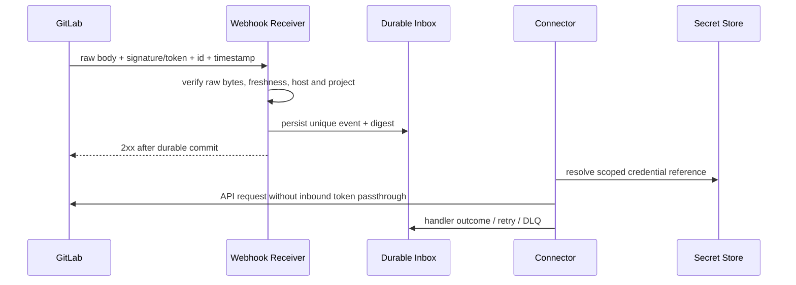

# Secret、Webhook 与软件供应链安全

> 本文是 v3 目标安全规范，不表示当前明文配置 Token、Webhook 或制品链已经完成。

## 1. 目标与非目标

`SECRET-REQ-001`：Secret 从创建、引用、使用、轮换到吊销均不得以明文进入配置、数据库、日志或制品。`WEBHOOK-REQ-001`：仅真实、时效内、项目匹配且幂等的 GitLab 事件能改变状态。`SUPPLY-REQ-001`：发布物必须可追溯、可扫描并固定依赖。本文不把 masked CI variable 视为抵御恶意脚本的完整秘密边界。

## 2. 参与者、角色、权限和信任边界

Security Owner 管策略与应急；Platform Admin 配 Secret reference 和 GitLab Instance；Project Admin 绑定项目但不能读取 Token；Secret Store 返回受限 Secret；Webhook Receiver 验证外部事件；CI/Registry 产生和保存制品。MCP 入站身份 Token、浏览器会话、Runner 设备凭据、GitLab API Token、Webhook Secret 和制品签名 Key 必须分别签发和轮换。

## 3. 触发条件、输入和前置条件

创建 GitLab 连接、部署、Webhook 到达、CI 构建、Token 临期/泄漏、依赖或基础镜像更新时触发。前置条件：批准的 HTTPS Host、证书验证、最小 scope 机器身份、Secret Store 可用、算法版本受支持、构建源提交和依赖锁文件明确。Secret Store 不可用时不得使用缓存明文或默认凭据。

## 4. 正常交互及时序图

## 5. 失败、取消、超时、重试、恢复和用户提示

无效签名/Token、时间戳超窗、Host/项目不匹配在解析业务前拒绝。有效事件必须先持久化再快速 2xx；处理失败指数退避+jitter，超过预算进入 DLQ。GitLab API 超时先查询远端事实后使用同一幂等 identity 重试。Secret 疑似泄漏立即停用受影响连接、吊销并轮换，不等待确认。

## 6. 状态机、规则和不可变式

Secret：`provisioned → active → rotating → revoked/destroyed`；Webhook：`received → verified → persisted → processing → applied/duplicate/failed/dlq`；Artifact：`built → scanned → attested → signed → promoted/rejected`。

- `SECRET-RULE-001`：数据库只保存 provider、reference、version 和非敏感元数据。
- `SECRET-RULE-002`：入站 Maestro Token 永不转发 GitLab；`CI_JOB_TOKEN` 只在 CI Job 生命周期内使用。
- `WEBHOOK-RULE-001`：支持时使用 HMAC signature 与 timestamp，默认 freshness 窗口 5 分钟；GitLab CE（自建基线，S4 实测确认）只提供静态共享 `X-Gitlab-Token`，无 HMAC 与 `X-Gitlab-Timestamp` 头——防护为高熵 token 常量时间比较 + TLS 强制 + received_at 短窗 + Event-UUID 去重，payload 一律不可信（I2 契约吸收 S4 验证偏差 2）。
- `WEBHOOK-RULE-002`：以 GitLab webhook/event ID 去重；缺失 ID 时用 instance、project、event type、payload digest 组合，且必须告警兼容模式。
- `SUPPLY-RULE-001`：基础镜像与运行镜像固定 digest，依赖锁定；生产制品不可在部署阶段重新构建。

## 7. 字段、配置和格式校验

Secret reference 格式由受支持 provider 定义，禁止 `secret/value/password/token` 明文字段。Webhook 必须校验 Content-Type、body 上限、event type、instance、numeric project ID、event ID、timestamp、算法和原始 bytes 签名；未知事件只归档不执行业务。GitLab URL 禁止跨 Host redirect 和用户提供任意代理 URL。Artifact 必须含 source SHA、builder、build time、SBOM digest、scan result、provenance 和 signature identity。

## 8. 并发、幂等和一致性

Secret 轮换采用双版本窗口：新版本验证成功后切 active，旧版本最迟 24 小时内吊销；读取禁止无界缓存。Webhook Inbox 唯一键保证一次业务效果，事件处理以对象 `updated_at`、pipeline ID 和 SHA 防乱序覆盖。制品 promotion 对 digest 做 compare-and-swap，标签不得成为发布身份。

## 9. 安全、Secret、隐私和审计

日志脱敏覆盖 Header、Cookie、URL query、环境、命令、Git remote 与错误链；测试使用 canary Secret 验证不会泄漏。Secret 读取只在使用时发生并记录主体、reference、用途和结果，不记录值。Webhook 原始 body 加密、最小权限访问并按数据分类保留；审计轮换、吊销、重放、DLQ、制品签名与 promotion。

## 10. 质量门禁、证据与 fail-closed 规则

发布必须通过 Secret scan、SAST、依赖/License、容器扫描、SBOM、provenance 与签名验证；critical/high 漏洞按公司策略阻断。Webhook 真实性、项目映射、SHA 完整性不可豁免。未固定 action/image 版本、未锁依赖、扫描器错误或 Evidence 缺失均不得 promotion。

## 11. 指标、SLO、告警和运维动作

监控 Secret 读取/失败/临期、轮换滞后、Webhook 验证失败/重放/Inbox lag/DLQ、依赖风险和签名失败。Webhook 持久化 P95 < 2 秒，正常事件 60 秒内应用；DLQ 非零、签名失败突增、Token 临期 14/7/1 天告警。故障按 webhook 或 emergency-stop Runbook 处理。

## 12. 验收测试和需求追踪

- `TC-SECRET-001`：配置、数据库、日志、trace、Artifact 和崩溃输出均无 canary Secret。
- `TC-SECRET-002`：轮换与吊销无越权窗口，旧凭据在期限后失效。
- `TC-GL-WEBHOOK-001`：签名、timestamp、项目、重复、乱序、重放和 DLQ 全覆盖。
- `TC-SUPPLY-001`：从 source SHA 到镜像 digest、SBOM、provenance、签名可验证。
- `TC-SUPPLY-002`：未锁依赖、严重漏洞、扫描器错误或签名错误阻断发布。

## 13. 数据迁移、兼容、发布与回滚

发现于 YAML/环境/数据库的旧 Token 必须先迁移 Secret Store reference，再轮换旧值；迁移日志不能记录原值。Webhook 新旧验签可短期并行 shadow，enforce 后不得降级为无验证。供应链门禁先对现有镜像盘点，未能生成可信 provenance 的历史制品禁止提升。回滚保留撤销状态、Inbox、SBOM 和签名证据。
