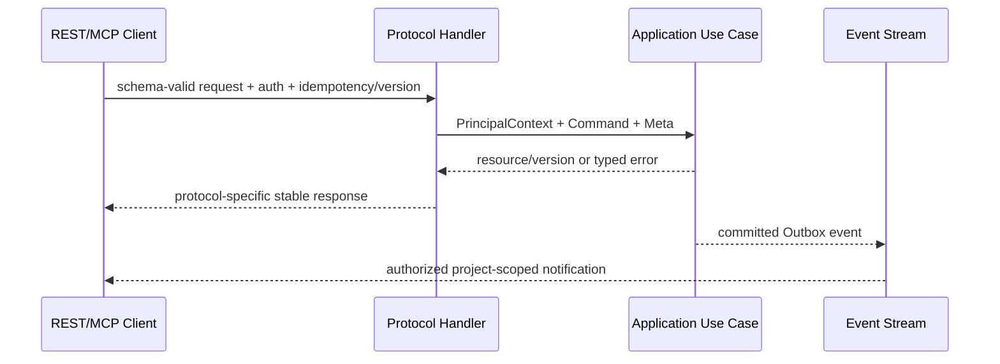

# API 语义与机器规范映射

> 当前实现说明：M0 已将非健康入口改为强制本地 bearer、关闭远程写默认值、移除公开 `merge_task`/批量领取/强制释放，并为核心 Lease/Heartbeat/状态写入补充 CAS、幂等和稳定错误码。兼容的 `ConfirmMergedFact` 也固定返回 `OPERATION_DISABLED`，schema v5 禁止本地构造 `done`；M2 必须以已验签 Inbox/对账事实重新引入该转换。现有本地兼容 Tool 仍允许显式传入 project/session/role，且目录名称/shape 尚未迁移到权威 v3 Schema；这些参数只在本地持久状态中二次校验，不能作为 M1 远程授权上下文。

## 1. 目标与非目标

- `API-REQ-001`：wire shape、字段、状态码以 OpenAPI/AsyncAPI/JSON Schema 为唯一机器事实源；本文定义跨协议语义与失败行为。
- `API-REQ-002`：所有写 API MUST 定义授权 action、Idempotency-Key、expected version、审计事件与稳定错误码。
- `API-REQ-003`：REST、MCP Tool/Resource、WebSocket/Event 对同一 use case MUST 具有一致 project scope 与状态语义。
- 非目标：不保留 v2 调用方自报可信身份字段；不提供公开 `merge_task`；WebSocket 不作为命令写入口。

## 2. 参与者、角色、权限和信任边界

Browser 使用 OIDC session Cookie+CSRF；远程 MCP/REST 使用 OAuth access token；stdio 使用本地 Runner/用户已授权上下文；Runner 使用设备身份；GitLab 使用验签 Webhook。Handler 只信认证中间件生成的 PrincipalContext。权限矩阵在 `specs/rbac/permissions.yaml`，机器 schema 不能替代运行时授权。

## 3. 触发条件、输入和前置条件

所有请求需要 `X-Correlation-ID`（可由服务生成）；写请求需要 `Idempotency-Key` 与 `If-Match: \"<version>\"`，创建可用 `If-None-Match: *`。Content-Type 必须精确支持；body 默认 <=1MiB，Webhook/Artifact 走专门上限。project 从 scoped route/connection 得出，payload 同名可信字段拒绝。

## 4. 正常交互及时序图



资源族：identity/session、teams/projects/memberships、runners/leases/executions、work-items、GitLab mappings/MR/pipeline/jobs、policies/evidence/gates/waivers、findings/defects/workflows、audit/operations。具体 path/operationId 见 OpenAPI，不在 Markdown 复制 wire shape。

## 5. 失败、取消、超时、重试、恢复和用户提示

统一 Problem：

```json
{
  "type": "urn:maestro:error:CONCURRENT_CONFLICT",
  "title": "Resource version conflict",
  "status": 409,
  "code": "CONCURRENT_CONFLICT",
  "correlation_id": "...",
  "retryable": false,
  "details": [{"field": "If-Match", "reason": "expected version 3, current 4"}]
}
```

固定语义：401 未认证；403 已认证但明确无动作权限；404 不可见/不存在；409 状态/版本/幂等冲突；412 前置/Gate；422 语义验证；429 限流；503 依赖不可用。安全错误 `details` 不泄露目标。自动重试只对响应明确 `retryable=true` 且方法/幂等键安全的 429/503/超时。

长任务返回 202+operation/workflow resource，不保持长 HTTP；取消使用独立幂等 command。MCP cancellation 映射 context cancel，但若业务 commit 已完成则返回/可查询原结果。

## 6. 状态机、规则和不可变式

- `API-INV-001`：响应资源含 `id, project_id(仅展示), version, created_at, updated_at`；可信 scope 不从这些字段反推。
- `API-INV-002`：写成功后必有审计与可关联 event；event 不得早于事务 commit。
- `API-INV-003`：删除采用显式 archive/revoke/cancel，不提供广泛 hard DELETE。
- `API-INV-004`：`done`、Gate pass、waiver 等高风险状态不能由通用 PATCH 直接设置。

## 7. 字段、配置和格式校验

OpenAPI 3.1/JSON Schema 2020-12 开启 unknown-field rejection；时间 RFC3339 UTC，duration ISO-8601 或明确毫秒字段，UUID/URL/SHA/digest 有 format。分页 cursor 不透明、签名且含 scope/filter/version，默认 50 最大 200；排序字段 allowlist。查询 filter 重复/未知拒绝。MCP Tool 输入/输出由 `tools.schema.json`，资源 URI 必须 project-scoped；`merge_task` 不得注册。

Event Envelope 至少：`event_id,event_type,event_version,source,project_id,subject,occurred_at,correlation_id,causation_id,payload_digest,sensitivity,payload`，精确 wire shape 以 `event-envelope.schema.json` 与 AsyncAPI 为准。消费者遇未知 major 拒绝/DLQ；未知向后兼容 optional 字段可忽略。

## 8. 并发、幂等和一致性

同 Idempotency-Key+相同 canonical request 返回原 status/body/location；不同 request hash 返回 409。资源修改使用 If-Match，缺失返回 428。批量操作每项独立幂等/结果，除非 operation 明示原子。事件至少一次且可能乱序，消费者以 event ID/aggregate version 幂等；读模型返回 `observed_at` 与 consistency/stale 标记。

## 9. 安全、Secret、隐私和审计

Bearer token 不放 query；Cookie Secure/HttpOnly/SameSite 且 Browser 写入验证 CSRF/Origin。CORS 精确 allowlist，不反射任意 Origin；WS/Streamable HTTP 同样鉴权与 Origin 校验。限流按 principal/project/action，不暴露高基数敏感 label。错误/日志不含 token、Cookie、Secret、源码。所有 deny、写入、导出与管理读取审计。

## 10. 质量门禁、证据与 fail-closed 规则

- `API-GATE-001`：OpenAPI/AsyncAPI/JSON Schema lint、示例验证、breaking diff Required。
- `API-GATE-002`：每个写 operation 必须声明 security、permission、idempotency、If-Match、error responses 与 audit event 扩展。
- `API-GATE-003`：REST/MCP 真协议 contract test；不得用 REST equivalent 冒充 MCP。
- `API-GATE-004`：未认证、越权、不可见资源、Origin/CSRF/limit/unknown field fuzz 全部 fail-closed。

## 11. 指标、SLO、告警和运维动作

按 operation/result/status 记录 request rate/latency/error、idempotency hit/conflict、version conflict、auth deny、WS/MCP connections/backpressure。普通 API P95 <500ms；Webhook 持久化 P95 <2s。5xx >1%、授权依赖失败、event backlog、schema violation 激增告警。

## 12. 验收测试和需求追踪

| 测试 ID | 场景 |
| --- | --- |
| `TC-API-001` | OpenAPI 正/反例、错误模型与 401/403/404 语义 |
| `TC-API-002` | 幂等键相同/不同 body、If-Match 并发冲突 |
| `TC-API-003` | MCP initialize/tools/list/call/cancel 真实 transport |
| `TC-API-004` | Event envelope、重复/乱序、project subscription 隔离 |
| `TC-API-005` | `merge_task` 缺失且通用 PATCH 无法设置高风险状态 |

机器规范、权限矩阵、实现 Handler 和追踪矩阵 operationId MUST 一一对应。

## 13. 数据迁移、兼容、发布与回滚

v3 是破坏性 API：新 `/api/v3`/MCP tool schema 并行只读观测期，v2 写默认关闭；客户端迁移后删除请求自报身份与 `merge_task`。兼容遵循 additive minor、breaking major；弃用返回 Sunset/Deprecation 和迁移链接。事件新 major 使用新 type/version。回滚只能回到仍拒绝旧不安全写入的兼容版本，不能重新开放匿名/自报 scope/local merge。
