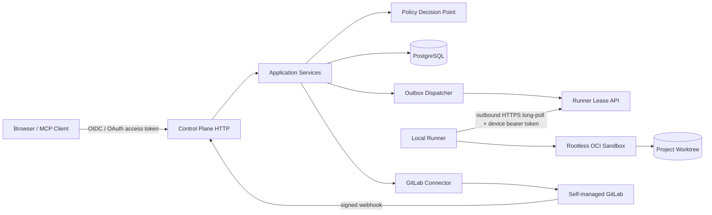
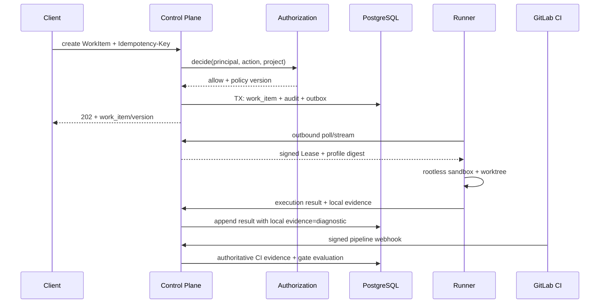

# Maestro v3 系统架构

> 当前实现说明：M0 已有真实可执行入口和单一 composition root，将 REST、stdio/Streamable HTTP MCP、Web、WebSocket 与 SQLite Application Service 装配起来。HTTP server 是持内核锁的唯一 maintenance owner，负责恢复/扫描/GC；并发第二 server 被拒绝，stdio Runner 只装配本地 MCP 所需服务，不能恢复仍在线的 server 状态。该本地开发基线不等于目标部署：Control Plane/Runner 物理拆分、PostgreSQL、OIDC、Runner 出站设备通道和 GitLab 集成仍属于 M1/M2，本文件因此保持 `partial/unverified`。

## 1. 目标与非目标

- `ARCH-REQ-001`：系统 MUST 拆分为中央 Control Plane 与成员侧 Runner；Control Plane 管身份、状态、策略、审计和集成，Runner 只在授权项目的隔离工作区执行代码操作。
- `ARCH-REQ-002`：中央服务 MUST NOT 挂载、缓存或直接读取项目源码；源码、Git 凭据与构建临时文件只进入 Runner 沙箱或 GitLab CI。
- `ARCH-REQ-003`：REST、MCP、WebSocket、Webhook 与后台 Worker MUST 复用同一 Application Service、授权决策、幂等与审计语义。
- 非目标：v3 不提供跨组织 SaaS、公网匿名 MCP、平台自动合并保护分支，也不把本地 Runner Evidence 作为合并事实源。

### 逻辑架构

## 2. 参与者、角色、权限和信任边界

| 边界/主体 | 信任级别 | 允许 | 禁止 |
| --- | --- | --- | --- |
| Browser/MCP Client | 不可信输入 | 以服务端 Principal 请求业务动作 | 自报 role、project、session 获权 |
| Control Plane | 高信任控制域 | 决策、持久化、审计、签发 Lease | 读取项目源码、执行仓库命令 |
| Runner | 已注册设备、可被攻陷 | 拉取精确 Lease，在沙箱执行 profile；由宿主 Git broker 只推送任务分支 | 接收任意命令、访问其他项目、把 Git 凭据交给沙箱或更新保护分支 |
| GitLab Bot | 外部机器身份 | 最小 scope 查询、创建/更新 MR、同步 Pipeline/Job/状态 | 推送任何源码分支、merge、保护分支写入、用户 token passthrough |
| Agent | 委托主体 | 用户∩项目∩Runner∩Tool 权限交集 | 独立管理员权限、自审、自豁免、自合并 |

授权上下文 `PrincipalContext` MUST 由认证中间件构造，包含 `principal_id`、`team_ids`、`project_memberships`、`delegation_id`、`token_id_hash`，业务 payload 中同名字段 MUST 被拒绝或忽略且记录审计。

## 3. 触发条件、输入和前置条件

- 外部入口：OIDC 登录、REST/MCP 请求、Runner 心跳/结果、GitLab Webhook、对账计划任务。
- 写请求前置：已认证 Principal、可见项目、明确 action/resource、`Idempotency-Key`、资源 `version`、有效策略版本。
- Runner 执行前置：设备未吊销、Lease 未过期、Command Profile digest 匹配、workspace 与 project mapping 匹配。
- GitLab 同步前置：Instance 处于 active、凭据可用、目标 Host 与 project numeric ID 固定、原始 Webhook 已验签并入 Inbox。

## 4. 正常交互及时序图

请求流 MUST 使用 `correlation_id`；代码流 MUST 是 `remote target SHA → maestro/<project>/<task> → MR`；证据流 MUST 绑定精确 source/target SHA、pipeline/job、policy version 与 digest。

## 5. 失败、取消、超时、重试、恢复和用户提示

| 场景 | 服务行为 | 用户提示/重试 |
| --- | --- | --- |
| Control Plane DB 不可用 | readiness 失败，所有写入拒绝 | `DEPENDENCY_UNAVAILABLE`，不自动推断成功 |
| Runner 离线 | Lease 到期后回收，Execution 标记 interrupted | 展示最后心跳、可安全重派时间 |
| GitLab 不可用 | 只读已标时间戳缓存，不新授权、不标 done | `GITLAB_UNAVAILABLE`，幂等读取可退避重试 |
| 取消执行 | WorkItem 先写 `cancelling`，再发 Runner cancel | 显示“取消中”；Runner ack/Lease 到期后 `cancelled` |
| 事件投递失败 | Outbox 指数退避+jitter，超限进入 DLQ | 告警并提供受权重放，不丢事务事实 |

只有标记为幂等的操作 MAY 自动重试；客户端超时后 MUST 使用同一 Idempotency-Key 查询原结果。

## 6. 状态机、规则和不可变式

架构级状态为 `requested → authorized → persisted → dispatched → observed → reconciled`。任何阶段失败不得跳过前序事实。

- `ARCH-INV-001`：业务状态、审计事件与 Outbox MUST 在同一 PostgreSQL 事务提交。
- `ARCH-INV-002`：Runner 结果不直接令 Task `done`；仅 GitLab `merged` Webhook 或对账可确认 `done`。
- `ARCH-INV-003`：安全依赖异常 MUST 减少能力；不得降级为匿名、跳过 Gate 或本地合并。
- `ARCH-INV-004`：每个跨边界消息 MUST 带 schema version、project、correlation/causation ID 和 digest。

## 7. 字段、配置和格式校验

- ID 使用 UUIDv7 或服务端生成的不可猜测 ID；外部 GitLab numeric ID 单独存储，不复用内部主键。
- `project_key` MUST 匹配 `^[a-z][a-z0-9-]{2,31}$`；SHA MUST 是 40/64 位十六进制且从 GitLab/Runner 事实源获取。
- URL MUST 为 HTTPS，GitLab Host 仅 platform admin 可配置，禁止跨 Host redirect。
- 消息必须通过对应 OpenAPI/AsyncAPI/JSON Schema；未知必需 enum、版本或字段类型 MUST 拒绝。

## 8. 并发、幂等和一致性

- PostgreSQL 为控制面唯一事务事实源；采用行版本 `version BIGINT` 与 `If-Match`/expected version 防丢更新。
- 写 API 唯一键为 `(principal_id, project_id, operation, idempotency_key)`，保留至少 24 小时并缓存状态码与响应摘要。
- Runner Lease 采用 compare-and-swap：一次只有一个 active lease；过期结果保存为 late evidence，但不得推进状态。
- Inbox/Outbox 至少一次投递，消费端依赖 event ID 唯一约束实现恰好一次业务效果。

## 9. 安全、Secret、隐私和审计

- TLS 为所有远程链路强制项；Runner 通过出站 HTTPS long-poll 领取 Lease，并使用短期、可吊销的设备 bearer token。M1 不引入自定义 WebSocket/mTLS Runner 协议。
- Secret 只以 secret reference 存入数据库；日志、事件、错误 detail 不得包含 token、Cookie、源码或原始 Prompt。
- 每次认证、拒绝、状态变更、Runner/策略/凭据操作 MUST 生成结构化 AuditEvent。
- Control Plane 与 Runner 分别使用最小 Linux/容器权限；中央容器没有 Docker Socket 与 workspace mount。

## 10. 质量门禁、证据与 fail-closed 规则

- `ARCH-GATE-001`：中央镜像挂载项目目录、Docker Socket 或 SSH 目录时部署检查 MUST 失败。
- `ARCH-GATE-002`：任一写入口绕过统一授权/审计/幂等装饰器时架构测试 MUST 失败。
- `ARCH-GATE-003`：无签名 Webhook、过期 Lease、本地 Evidence、SHA 不匹配均不得推进 Required Gate。
- 架构变更 MUST 同步 ADR、机器规范、威胁模型、集成测试与追踪矩阵。

## 11. 指标、SLO、告警和运维动作

核心指标：`http_request_duration`、`authorization_denied_total`、`runner_online`、`lease_expired_total`、`inbox_lag_seconds`、`outbox_lag_seconds`、`gate_stale_total`。普通 API P95 < 500ms，Webhook 持久化 P95 < 2s。Outbox P95 延迟 > 30s、Runner 池无容量 5 分钟、DB readiness 失败 MUST 告警。

## 12. 验收测试和需求追踪

| 测试 ID | 覆盖 |
| --- | --- |
| `TC-ARCH-001` | 中央容器不存在源码挂载且无法读 Runner 工作区 |
| `TC-ARCH-002` | REST/MCP/WS/后台操作给出一致授权决策与审计 |
| `TC-ARCH-003` | Outbox 重复/乱序投递只产生一次状态变化 |
| `TC-ARCH-004` | GitLab/Runner/DB 故障时系统 fail-closed 并可恢复 |

需求、Gate、测试和代码子系统 MUST 登记在 `governance/traceability-matrix.csv`；当前验证状态保持 `unverified`，直至真实部署测试通过。

## 13. 数据迁移、兼容、发布与回滚

先修复 M0 单进程可执行基线，再以 shadow mode 引入 PostgreSQL/Outbox，最后启用 Runner。v2 SQLite 只读导入，禁止双主写；新旧 ID 建映射表。发布采用 `expand → backfill → dual-read-compare → cutover → contract`，回滚只切回上一个兼容二进制，不回写已提升的 schema。Control Plane/Runner 协议至少兼容当前与前一 minor；不兼容 Runner 必须拒绝 Lease 而非猜测执行。
